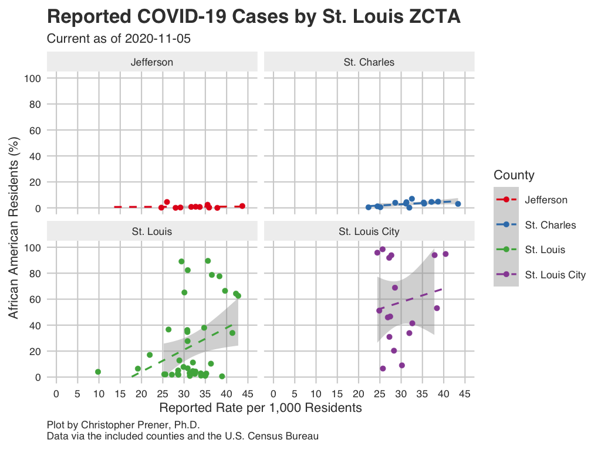
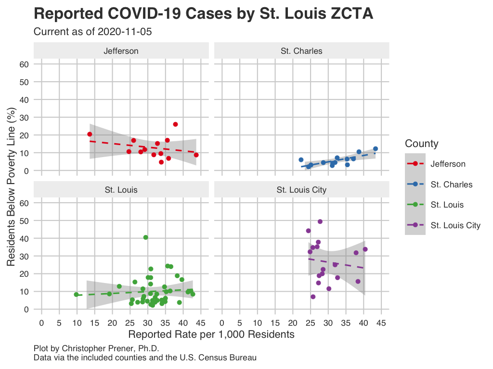

```{r setup, include=FALSE}
knitr::opts_chunk$set(echo = TRUE)

# dependencies
library(dplyr)
library(readr)
library(sf)

# load data
state_data <- read_csv(here::here("data", "MO_HEALTH_Covid_Tracking", "data", "individual", "mo_race_rates.csv"))
stl_race <- read_csv(here::here("data", "MO_HEALTH_Covid_Tracking", "data", "individual", "stl_race_rates.csv"))
stl_race_gender <- read_csv(here::here("data", "MO_HEALTH_Covid_Tracking", "data", "individual", "stl_race_gender_rates.csv"))
zip_snapshot <- st_read(here::here("data", "MO_HEALTH_Covid_Tracking", "data", "zip", "daily_snapshot_city_county.geojson")) %>%
  filter(is.na(cases) == FALSE)
st_geometry(zip_snapshot) <- NULL
```

One striking facet of the COVID-19 outbreak is the effect it has had on communities that have been historically been marginalized in the United States, including African Americans, indigenous nations (the Navajo Nation has one of the <a href="https://www.npr.org/2020/04/24/842945050/navajo-nation-sees-high-rate-of-covid-19-and-contact-tracing-is-a-challenge" target="_blank">highest infection rates in country</a>), and people incarcerated in jails/prisons. What ties these groups together is not inherent biological risk. Rather, disinvestment at the community level means the agencies and organizations that serve these communities often lack the resources needed to prevent the spread of infectious disease. This is long-standing social and health disparities that potentially leave individuals more susceptible to severe illness.

## Statewide {.tabset .tabset-fade .tabset-pills .padtop}
These plots show patterns in infections and mortality by race and ethnicity for the entirety of Missouri.

### Infections

```{r mo-infections, echo=FALSE, out.width = '100%'}
knitr::include_graphics("img/mo_individual/a_race_case.png")
```

Download: [<a href="https://raw.githubusercontent.com/slu-openGIS/covid_daily_viz/master/results/high_res/mo_individual/a_race_case.png" target="_blank">High-res</a>] [<a href="https://raw.githubusercontent.com/slu-openGIS/covid_daily_viz/master/results/low_res/mo_individual/a_race_case.png" target="_blank">Low-res</a>]

### Mortality

```{r mo-mortality, echo=FALSE, out.width = '100%'}
knitr::include_graphics("img/mo_individual/b_race_mortality.png")
```

Download: [<a href="https://raw.githubusercontent.com/slu-openGIS/covid_daily_viz/master/results/high_res/mo_individual/b_race_mortality.png" target="_blank">High-res</a>] [<a href="https://raw.githubusercontent.com/slu-openGIS/covid_daily_viz/master/results/low_res/mo_individual/b_race_mortality.png" target="_blank">Low-res</a>]

### Data Table

```{r state-table, echo=FALSE, out.width = '100%'}
state_data %>%
  select(value, cases_est, case_rate, deaths_est, mortality_rate) %>% 
  mutate(
    cases_est = round(cases_est, digits = 0), 
    case_rate = round(case_rate, digits = 2),
    deaths_est = round(deaths_est, digits = 0),
    mortality_rate = round(mortality_rate, digits = 2)
  ) %>%
  rename(
    Identity = value,
    `Estimated Cases` = cases_est, 
    `Cases Per Capita` = case_rate,
    `Estimated Deaths` = deaths_est,
    `Deaths Per Capita` = mortality_rate
  ) -> data_table

DT::datatable(data_table, rownames= FALSE)
```

### Notes

  * The underlying data for these plots are available from [GitHub](faq.html#How_Do_I_Download_Your_Data) in the `mo_race_rates.csv` table, which is assembled from data provided by the [State of Missouri](faq.html#Where_Do_These_Data_Come_From).
  * The FAQ contains a short explanation of [per-capita rates](faq.html#What_are_Per_Capita_Rates). Note that the rates presented for statewide data are per 100,000 individuals.
  * The State of Missouri does not release actual counts for individuals, so these rates are estimated using the current number of positive cases and the percentages provided by the State on their dashboard.
  * Rates for other racial identities are combined into an 'other' category, which cannot be easily converted to a rate and so is not included here.
  * The Latino category is not exclusive of the racial identities shown.
  * There is a significant amount of missing data, typically around 16% to 20% on a given day.

## St. Louis {.padtop}
Within the St. Louis region, I am currently tracking disparities data only for St. Louis City and County.

### Race {.tabset .tabset-fade .tabset-pills .padtop}
These plots show patterns in infections and mortality by race and ethnicity for St. Louis City and County. Data for St. Louis City and County are not displayed jointly, and so these plots are unique in their comparative presentation of disparities between St. Louis City and County.

#### Infections

```{r stl-race-infections, echo=FALSE, out.width = '100%'}
knitr::include_graphics("img/stl_individual/a_race_case.png")
```

Download: [<a href="https://raw.githubusercontent.com/slu-openGIS/covid_daily_viz/master/results/high_res/stl_individual/a_race_case.png" target="_blank">High-res</a>] [<a href="https://raw.githubusercontent.com/slu-openGIS/covid_daily_viz/master/results/low_res/stl_individual/a_race_case.png" target="_blank">Low-res</a>]

#### Mortality

```{r stl-race-mortality, echo=FALSE, out.width = '100%'}
knitr::include_graphics("img/stl_individual/b_race_mortality.png")
```

Download: [<a href="https://raw.githubusercontent.com/slu-openGIS/covid_daily_viz/master/results/high_res/stl_individual/b_race_mortality.png" target="_blank">High-res</a>] [<a href="https://raw.githubusercontent.com/slu-openGIS/covid_daily_viz/master/results/low_res/stl_individual/b_race_mortality.png" target="_blank">Low-res</a>]

#### Data Table

```{r stl-race-table, echo=FALSE, out.width = '100%'}
stl_race %>%
  select(county, value, cases, case_rate, deaths, mortality_rate) %>%
  mutate(
    case_rate = round(case_rate, digits = 2),
    mortality_rate = round(mortality_rate, digits = 2)
  ) %>%
  rename(
    County = county,
    Identity = value,
    `Cumulative Cases` = cases,
    `Cases Per Capita` = case_rate,
    `Cumulative Deaths` = deaths,
    `Deaths Per Capita` = mortality_rate
  ) -> data_table

DT::datatable(data_table, rownames= FALSE)
```

#### Notes

  * The underlying data for these plots are available from [GitHub](faq.html#How_Do_I_Download_Your_Data) in the `stl_race_rates.csv` table, which is assembled from data provided by the [City of St. Louis and St. Louis County](faq.html#Where_Do_These_Data_Come_From).
  * The FAQ contains a short explanation of [per-capita rates](faq.html#What_are_Per_Capita_Rates).

### Race and Gender {.tabset .tabset-fade .tabset-pills .padtop}
These plots show patterns in infections and mortality by race and gender for St. Louis City.

#### Infections

```{r stl-race-gender-infections, echo=FALSE, out.width = '100%'}
knitr::include_graphics("img/stl_individual/c_race_sex_case.png")
```

Download: [<a href="https://raw.githubusercontent.com/slu-openGIS/covid_daily_viz/master/results/high_res/stl_individual/c_race_sex_case.png" target="_blank">High-res</a>] [<a href="https://raw.githubusercontent.com/slu-openGIS/covid_daily_viz/master/results/low_res/stl_individual/c_race_sex_case.png" target="_blank">Low-res</a>]

#### Mortality

```{r stl-race-gender-mortality, echo=FALSE, out.width = '100%'}
knitr::include_graphics("img/stl_individual/d_race_sex_mortality.png")
```

Download: [<a href="https://raw.githubusercontent.com/slu-openGIS/covid_daily_viz/master/results/high_res/stl_individual/d_race_sex_mortality.png" target="_blank">High-res</a>] [<a href="https://raw.githubusercontent.com/slu-openGIS/covid_daily_viz/master/results/low_res/stl_individual/d_race_sex_mortality.png" target="_blank">Low-res</a>]

#### Data Table

```{r stl-race-gender-table, echo=FALSE, out.width = '100%'}
stl_race_gender %>%
  select(county, sex, value, cases, case_rate, deaths, mortality_rate) %>%
  mutate(
    case_rate = round(case_rate, digits = 2),
    mortality_rate = round(mortality_rate, digits = 2)
  ) %>%
  rename(
    County = county,
    Gender = sex,
    Identity = value,
    `Cumulative Cases` = cases,
    `Cases Per Capita` = case_rate,
    `Cumulative Deaths` = deaths,
    `Deaths Per Capita` = mortality_rate
  ) -> data_table

DT::datatable(data_table, rownames= FALSE)
```

#### Notes

  * The underlying data for these plots are available from [GitHub](faq.html#How_Do_I_Download_Your_Data) in the `stl_race_gender_rates.csv` table, which is assembled from data provided by the [City of St. Louis](faq.html#Where_Do_These_Data_Come_From).
  * The FAQ contains a short explanation of [per-capita rates](faq.html#What_are_Per_Capita_Rates).

### Disparities by ZCTA (Zip Code) {.tabset .tabset-fade .tabset-pills .padtop}
These plots show relationships between cases and demographics in ZIP Code Tabulation Areas (ZCTA) in St. Louis. Check the interactive map on the [St. Louis page](stl.hml) to see where zip codes are located, or are missing case data.

#### African American Population

```{r stl-zip-race, echo=FALSE, out.width = '100%'}

```

Download: [<a href="https://raw.githubusercontent.com/slu-openGIS/covid_daily_viz/master/results/high_res/stl_zip/c_race_plot.png" target="_blank">High-res</a>] [<a href="https://raw.githubusercontent.com/slu-openGIS/covid_daily_viz/master/results/low_res/stl_zip/c_race_plot.png" target="_blank">Low-res</a>]

#### Population Below Poverty Line

```{r stl-zip-poverty, echo=FALSE, out.width = '100%'}

```

Download: [<a href="https://raw.githubusercontent.com/slu-openGIS/covid_daily_viz/master/results/high_res/stl_zip/b_poverty_plot.png" target="_blank">High-res</a>] [<a href="https://raw.githubusercontent.com/slu-openGIS/covid_daily_viz/master/results/low_res/stl_zip/b_poverty_plot.png" target="_blank">Low-res</a>]

#### Data Table

```{r zip-data-table, echo=FALSE, out.width = '100%'}
zip_snapshot %>%
  select(GEOID_ZCTA, cases, case_rate, pvty_pct, blk_pct) %>%
  mutate(
    case_rate = round(case_rate, digits = 2),
    pvty_pct = round(pvty_pct, digits = 2),
    blk_pct = round(blk_pct, digits = 2)
  ) %>%
  rename(
    `Zip Code` = GEOID_ZCTA,
    `Cumulative Cases` = cases,
    `Rate per 1,000 Residents` = case_rate,
    `Poverty Rate (%)` = pvty_pct,
    `% African American` = blk_pct
  ) -> data_table

DT::datatable(data_table)
```

#### Notes

  * If a ZCTA straddles the city and the county, and only has reported infection numbers in one entity, its estimated partial population will be displayed. Similarly, estimated partial populations for zip codes that straddle outlying counties are used.
  * ZCTA stands for "<a href="https://www.census.gov/programs-surveys/geography/guidance/geo-areas/zctas.html" target="_blank">ZIP Code Tabulation Area</a>. These are not identical to zip codes, but they are essential for mapping zip codes as regions on a map.
  * The underlying data for these plots are available from [GitHub](faq.html#How_Do_I_Download_Your_Data) in the `zip_stl_city.csv` and `zip_stl_county.csv` tables, which are assembled from data provided by [St. Louis City and County](faq.html#Where_Do_These_Data_Come_From). These data are also available as `.geojson` files for mapping.
  * The FAQ contains a short explanation of [per-capita rates](faq.html#What_are_Per_Capita_Rates).
  