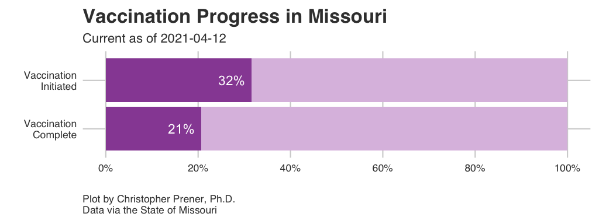
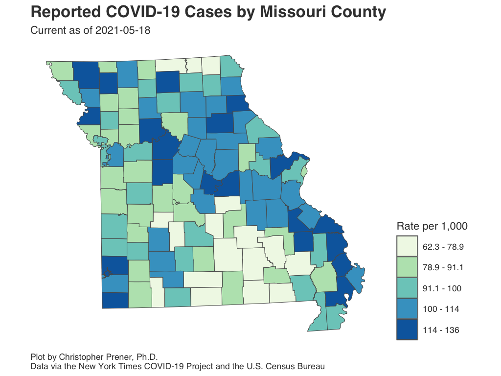
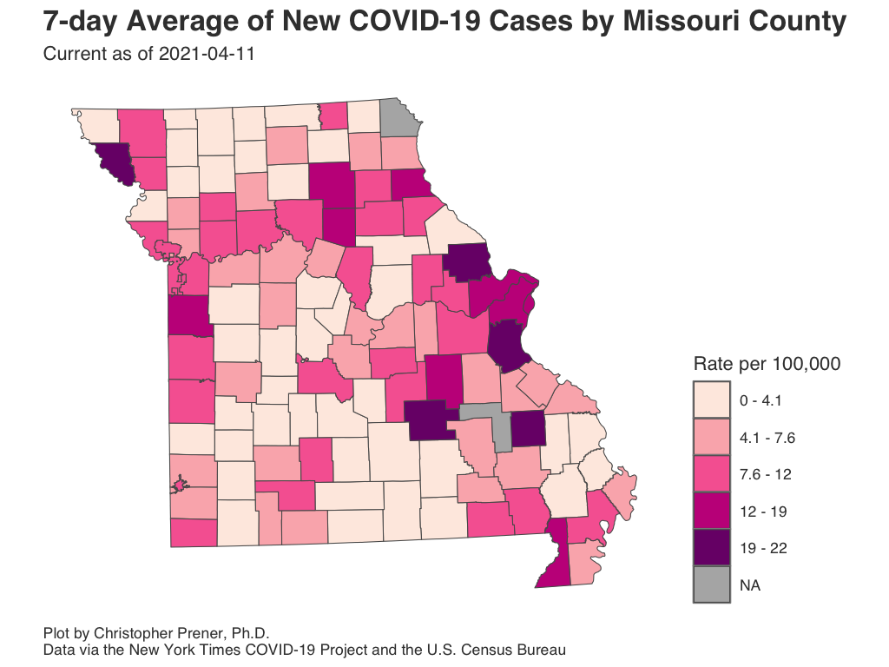
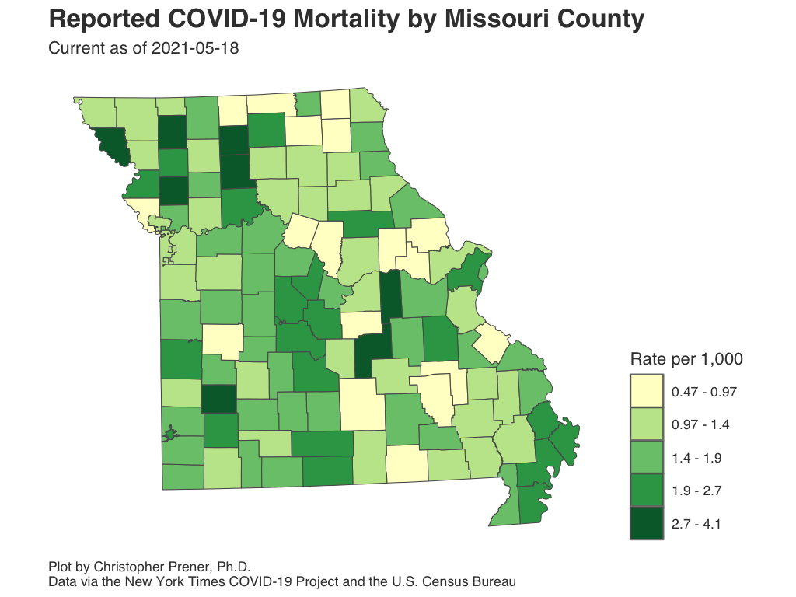

```{r setup, include=FALSE}
knitr::opts_chunk$set(echo = TRUE)

# dependencies
library(fontawesome)

library(dplyr)
library(leaflet)
library(readr)
library(sf)

library(ggplot2)

# functions
source(here::here("source", "functions", "map_breaks.R"))
source(here::here("source", "functions", "round_any.R"))

# build dates
params <- list(
  date = paste0("Last updated on ", as.character(Sys.Date()-1)),
  date_val = as.character(Sys.Date()-1),
  prior_date_val = as.character(Sys.Date()-8)
)

# load data
state_data <- read_csv(here::here("data", "MO_HEALTH_Covid_Tracking", "data", "state", "state_full.csv")) %>%
  filter(state == "Missouri") %>%
  filter(report_date >= "2020-03-07") %>%
  arrange(desc(report_date))

state_test_data <- read_csv(here::here("data", "MO_HEALTH_Covid_Tracking", "data", "state", "state_testing.csv"))

stl_metro_data <- read_csv(here::here("data", "MO_HEALTH_Covid_Tracking", "data", "metro_all", "metro_full.csv")) %>%
  filter(short_name == "St. Louis") %>%
  filter(report_date >= "2020-03-07") %>%
  arrange(desc(report_date))

kc_metro_data <- read_csv(here::here("data", "MO_HEALTH_Covid_Tracking", "data", "metro_all", "metro_full.csv")) %>%
  filter(short_name == "Kansas City") %>%
  filter(report_date >= "2020-03-07") %>%
  arrange(desc(report_date))

stl_city_data <- read_csv(here::here("data", "MO_HEALTH_Covid_Tracking", "data", "county", "county_full.csv")) %>%
  filter(geoid == "29510") %>%
  filter(report_date >= "2020-03-18") %>%
  arrange(desc(report_date))

stl_county_data <- read_csv(here::here("data", "MO_HEALTH_Covid_Tracking", "data", "county", "county_full.csv")) %>%
  filter(geoid == "29189") %>%
  filter(report_date >= "2020-03-07") %>%
  arrange(desc(report_date))

kc_city_data <- read_csv(here::here("data", "MO_HEALTH_Covid_Tracking", "data", "county", "county_full.csv")) %>%
  filter(geoid == "29511") %>%
  filter(report_date >= "2020-03-20") %>%
  arrange(desc(report_date))

snapshot <- st_read(here::here("data", "MO_HEALTH_Covid_Tracking", "data", "county", "daily_snapshot_mo_xl.geojson"), crs = 4326,
                    stringsAsFactors = FALSE) %>%
  mutate(icu_rate = ifelse(hospitals == 0, NA, icu_rate))

## hospitalization data
load(here::here("data", "MO_HEALTH_Covid_Tracking", "data", "source", "hhs",
                "last_update.rda"))
```

<div class="note">
<b>The site was last updated on `r Sys.Date()`. All county, metro, and state level morbidity and mortality data are current as of `r Sys.Date()-1`. ZIP code, disparity, and St. Louis hospitalization data are all current as of `r Sys.Date()`. Hospitalization data at the regional and metro levels are all current as of `r last_update$last_date`. </b>
</div>
<br>

Welcome to <a href="https://chris-prener.github.io" target="_blank">Chris Prener's</a> tracking site for the SARS-CoV-2 pandemic in Missouri. This site is updated nightly using data from a variety of federal, state, and local data sources as well as the <a href="https://nytimes.com" target="_blank">New York Times'</a> <a href="https://github.com/nytimes/covid-19-data" target="_blank">COVID-19 Project</a>. Chris also posts <a href="https://twitter.com/chrisprener" target="_blank">Twitter</a> threads on Tuesday and Thursday evenings breaking down current trends in Missouri. If you are new to the site, please read the [About page](about.html) for an overview of these data.

Chris also emails out a weekly round-up of COVID-19 trends for Missouri. These weekly newsletters, named "River City Data," also feature some exclusive content, including short interviews with COVID-19 experts, health care providers, and others who have insight into the pandemic. Sign up below:

<iframe src="https://chrisprener.substack.com/embed" width="480" height="320" style="border:1px solid #EEE; background:white;" frameborder="0" scrolling="no"></iframe>

<br>

## Vaccinations

```{r vaccine-progress-static, echo=FALSE, out.width = '100%'}

```

Initiated means individuals have received an initial dose of the Moderna or Pfizer vaccines, or the single dose of the Johnson & Johnson vaccine. Completed means individuals have received *both* doses of the Moderna or Pfizer vaccines, or the single dose of the Johnson & Johnson vaccine.

Additional vaccination maps, plots, and data about Missouri is available on our [dedicated page](vaccinations.html).

## Daily Data {.tabset .tabset-fade .tabset-pills .padtop}
While the [City of St. Louis](https://www.stlouis-mo.gov/covid-19/data/), [St. Louis County](https://stlcogis.maps.arcgis.com/apps/MapSeries/index.html?appid=6ae65dea4d804f2ea4f5d8ba79e96df1), and [Kansas City](https://www.kcmo.gov/city-hall/departments/health/coronavirus-covid-19/covid-19-totals) provide day-by-day tracking of cumulative cases on their respective dashboards, the State of Missouri does not. The following tabs provide daily breakdowns of COVID data as well as additional statistics not included in the existing dashboards. Data are also provided for the wider St. Louis and Kansas City metro areas. Please note that the two average columns for reported cases and deaths are both seven-day rolling averages.

### Missouri

```{r missouri-data-table, echo=FALSE, out.width = '100%'}
state_data %>%
  select(report_date, cases, new_cases, case_avg, deaths, new_deaths) %>%
  mutate(
    case_avg = round(case_avg, digits = 2)
  ) %>%
  rename(
    `Report Date` = report_date,
    `Cumulative Cases` = cases,
    `New Cases` = new_cases,
    `Average New Cases` = case_avg,
    `Cumulative Deaths` = deaths,
    `New Deaths` = new_deaths
  ) -> data_table

DT::datatable(data_table, rownames= FALSE)
```

### St. Louis Metro

```{r metro-stl-data-table, echo=FALSE, out.width = '100%'}
stl_metro_data %>%
  select(report_date, cases, new_cases, case_avg, deaths, new_deaths) %>%
  mutate(
    case_avg = round(case_avg, digits = 2)
  ) %>%
  rename(
    `Report Date` = report_date,
    `Cumulative Cases` = cases,
    `New Cases` = new_cases,
    `Average New Cases` = case_avg,
    `Cumulative Deaths` = deaths,
    `New Deaths` = new_deaths
  ) -> data_table

DT::datatable(data_table, rownames= FALSE)
```

### City of St. Louis

```{r stl-city-data-table, echo=FALSE, out.width = '100%'}
stl_city_data %>%
  select(report_date, cases, new_cases, case_avg, deaths, new_deaths) %>%
  mutate(
    case_avg = round(case_avg, digits = 2)
  ) %>%
  rename(
    `Report Date` = report_date,
    `Cumulative Cases` = cases,
    `New Cases` = new_cases,
    `Average New Cases` = case_avg,
    `Cumulative Deaths` = deaths,
    `New Deaths` = new_deaths
  ) -> data_table

DT::datatable(data_table, rownames= FALSE)
```

### St. Louis County

```{r stl-county-data-table, echo=FALSE, out.width = '100%'}
stl_county_data %>%
  select(report_date, cases, new_cases, case_avg, deaths, new_deaths) %>%
  mutate(
    case_avg = round(case_avg, digits = 2)
  ) %>%
  rename(
    `Report Date` = report_date,
    `Cumulative Cases` = cases,
    `New Cases` = new_cases,
    `Average New Cases` = case_avg,
    `Cumulative Deaths` = deaths,
    `New Deaths` = new_deaths
  ) -> data_table

DT::datatable(data_table, rownames= FALSE)
```

### Kansas City Metro

```{r metro-kc-data-table, echo=FALSE, out.width = '100%'}
kc_metro_data %>%
  select(report_date, cases, new_cases, case_avg, deaths, new_deaths) %>%
  mutate(
    case_avg = round(case_avg, digits = 2)
  ) %>%
  rename(
    `Report Date` = report_date,
    `Cumulative Cases` = cases,
    `New Cases` = new_cases,
    `Average New Cases` = case_avg,
    `Cumulative Deaths` = deaths,
    `New Deaths` = new_deaths
  ) -> data_table

DT::datatable(data_table, rownames= FALSE)
```

### Kansas City

```{r kansas-city-data-table, echo=FALSE, out.width = '100%'}
kc_city_data %>%
  select(report_date, cases, new_cases, case_avg, deaths, new_deaths) %>%
  mutate(
    case_avg = round(case_avg, digits = 2)
  ) %>%
  rename(
    `Report Date` = report_date,
    `Cumulative Cases` = cases,
    `New Cases` = new_cases,
    `Average New Cases` = case_avg,
    `Cumulative Deaths` = deaths,
    `New Deaths` = new_deaths
  ) -> data_table

DT::datatable(data_table, rownames= FALSE)
```

### Notes

  * The underlying data for these maps are available from [GitHub](faq.html#How_Do_I_Download_Your_Data) in the `county_full.csv`, `metro_full.csv`, and `state_full.csv` tables, which are assembled from data provided by the [New York Times](faq.html#Where_Do_These_Data_Come_From).
  * The FAQ contains a short explanation of [per-capita rates](faq.html#What_are_Per_Capita_Rates).
  * All averages presented are 7-day [rolling averages](faq.html#What_are_Rolling_Averages).

## Infection Rates by County {.tabset .tabset-fade .tabset-pills .padtop}
This map shows infections as a rate per 1,000 residents. It is important not to map the raw counts themselves, but if you want to see those data, click on a county.

### Interactive Map

```{r map-infections, echo = FALSE, out.width = '100%', out.height='600px'}
# calculate breaks
bins <- map_bins(snapshot, var = "case_rate", style = "fisher", classes = 5, dig_lab = 2,
                 round = 2)
bins[length(bins)] <- round_any(x = max(snapshot$case_rate), accuracy = .01, f = ceiling)

# create color palette
pal <- colorBin("BuGn", domain = snapshot$case_rate, bins = bins)

# map
leaflet() %>%
  addProviderTiles(providers$CartoDB.Positron) %>%
  addPolygons(
    data = snapshot,
    color = "#444444", 
    weight = 1, 
    opacity = 1.0, 
    smoothFactor = 0.5,
    fillOpacity = 0.75,
    fillColor = ~pal(case_rate),
    highlightOptions = highlightOptions(color = "white", weight = 2, bringToFront = TRUE),
    popup = paste("<b>County:</b> ", snapshot$county, "<br>",
                           "<b>Current Cumulative Count:</b> ", snapshot$cases, "<br>",
                           "<b>Current Cumulative Rate per 1,000:</b> ", round(snapshot$case_rate, digits = 2), "<br>",
                           "<b>Hospital Count:</b> ", snapshot$hospitals, "<br>",
                           "<b>Baseline ICU Beds:</b> ", snapshot$icu_beds)
    )  %>%
    addLegend(pal = pal, values = snapshot$case_rate, opacity = .75, title = "Rate")
```

### Static Map

```{r confirmed-static, echo=FALSE, out.width = '100%'}

```

Download: [<a href="https://raw.githubusercontent.com/slu-openGIS/covid_daily_viz/master/results/high_res/county/a_case_map.png" target="_blank">High-res</a>] [<a href="https://raw.githubusercontent.com/slu-openGIS/covid_daily_viz/master/results/low_res/county/a_case_map.png" target="_blank">Low-res</a>]

### Data Table

```{r confirmed-data-table, echo=FALSE, out.width = '100%'}
snapshot %>%
  select(state, county, cases, case_rate) %>%
  mutate(
    case_rate = round(case_rate, digits = 2)
  ) %>%
  rename(
    State = state,
    County = county,
    `Cumulative Cases` = cases,
    `Rate per 1,000 Residents` = case_rate
  ) %>%
  arrange(State, County) -> data_table

st_geometry(data_table) <- NULL

DT::datatable(data_table)
```

### Notes

  * The underlying data for these maps are available from [GitHub](faq.html#How_Do_I_Download_Your_Data) in the `daily_snapshot_mo_xl.geojson` spatial data set, which is assembled from data provided by the [New York Times](faq.html#Where_Do_These_Data_Come_From).
  * The FAQ contains a short explanation of [per-capita rates](faq.html#What_are_Per_Capita_Rates).

## Average New Cases by County {.tabset .tabset-fade .tabset-pills .padtop}
This map shows a seven-day rolling average of new cases. For this map, this covers `r params$date_val` back through `r params$prior_date_val`. There is not a threshold for what constitutes a high or low average, but the higher the average number of new cases, the more new spread we can infer. For mapping purposes, these are displayed as a rate per 100,000 residents. As with the prior map, additional details are available by clicking on each county or on the data table.

### Interactive Map

```{r map-confirmed-avg, echo = FALSE, out.width = '100%', out.height='600px', warning=FALSE}
# calculate breaks
bins <- map_bins(snapshot, var = "case_avg_rate", style = "fisher", classes = 5, dig_lab = 2,
                 round = 2)
bins[length(bins)] <- round_any(x = max(snapshot$case_avg_rate), accuracy = .01, f = ceiling)

# create color palette
pal <- colorBin("RdPu", domain = snapshot$case_avg_rate, bins = bins)

# map
leaflet() %>%
  addProviderTiles(providers$CartoDB.Positron) %>%
  addPolygons(
    data = snapshot,
    color = "#444444", 
    weight = 1, 
    opacity = 1.0, 
    smoothFactor = 0.5,
    fillOpacity = 0.75,
    fillColor = ~pal(case_avg_rate),
    highlightOptions = highlightOptions(color = "white", weight = 2, bringToFront = TRUE),
    popup = paste("<b>County:</b> ", snapshot$county, "<br>",
                           "<b>Current Cumulative Count:</b> ", snapshot$cases, "<br>",
                           "<b>7-day Average of New Cases:</b> ", round(snapshot$case_avg, digits = 2), "<br>",
                           "<b>Average New Cases per 100,000 Residents:</b> ", round(snapshot$case_avg_rate, digits = 2), "<br>",
                           "<b>Hospital Count:</b> ", snapshot$hospitals, "<br>",
                           "<b>Baseline ICU Beds:</b> ", snapshot$icu_beds)
    )  %>%
    addLegend(pal = pal, values = snapshot$avg_rate, opacity = .75, title = "7-day Average Rate")
```

### Static Map

```{r new-case-static, echo=FALSE, out.width = '100%'}

```

Download: [<a href="https://raw.githubusercontent.com/slu-openGIS/covid_daily_viz/master/results/high_res/county/d_new_case_map.png" target="_blank">High-res</a>] [<a href="https://raw.githubusercontent.com/slu-openGIS/covid_daily_viz/master/results/low_res/county/d_new_case_map.png" target="_blank">Low-res</a>]

### Data Table

```{r confirmed-avg-data-table, echo=FALSE, out.width = '100%'}
snapshot %>%
  select(state, county, cases, case_avg, case_avg_rate) %>%
  mutate(
    case_avg = round(case_avg, digits = 2),
    case_avg_rate = round(case_avg_rate, digits = 2)
  ) %>%
  rename(
    State = state,
    County = county,
    `Cumulative Cases` = cases,
    `7-day Average New Cases` = case_avg,
    `Average New Cases per 100,000 Residents` = case_avg_rate
  ) %>%
  arrange(State, County) -> data_table

st_geometry(data_table) <- NULL

DT::datatable(data_table)
```

### Notes

  * The underlying data for these maps are available from [GitHub](faq.html#How_Do_I_Download_Your_Data) in the `daily_snapshot_mo_xl.geojson` spatial data set, which is assembled from data provided by the [New York Times](faq.html#Where_Do_These_Data_Come_From).
  * The FAQ contains a short explanation of [per-capita rates](faq.html#What_are_Per_Capita_Rates).
  * All averages presented are 7-day [rolling averages](faq.html#What_are_Rolling_Averages).

## Mortality Rates by County {.tabset .tabset-fade .tabset-pills .padtop}
This map shows mortality as a rate per 1,000 residents. As with the prior maps, raw counts of deaths and hospital infrastructure details are available by clicking on individual counties or on the data table.

### Interactive Map

```{r map-mortality, echo = FALSE, out.width = '100%', out.height='600px'}
# calculate breaks
bins <- map_bins(snapshot, var = "mortality_rate", style = "fisher", classes = 5, dig_lab = 2,
                 round = 2)
bins[length(bins)] <- round_any(x = max(snapshot$mortality_rate), accuracy = .01, f = ceiling)

# create color palette
pal <- colorBin("YlGn", domain = snapshot$mortality_rate, bins = bins)

# map
leaflet() %>%
  addProviderTiles(providers$CartoDB.Positron) %>%
  addPolygons(
    data = snapshot,
    color = "#444444", 
    weight = 1, 
    opacity = 1.0, 
    smoothFactor = 0.5,
    fillOpacity = 0.75,
    fillColor = ~pal(mortality_rate),
    highlightOptions = highlightOptions(color = "white", weight = 2, bringToFront = TRUE),
    popup = paste("<b>County:</b> ", snapshot$county, "<br>",
                           "<b>Current Mortality Count:</b> ", snapshot$deaths, "<br>",
                           "<b>Current Mortality Rate per 1,000:</b> ", round(snapshot$mortality_rate, digits = 2), "<br>",
                           "<b>Hospital Count:</b> ", snapshot$hospitals, "<br>",
                           "<b>Baseline ICU Beds:</b> ", snapshot$icu_beds)
    )  %>%
    addLegend(pal = pal, values = snapshot$mortality_rate, opacity = .75, title = "Rate")
```

### Static Map

```{r mortality-static, echo=FALSE, out.width = '100%'}

```

Download: [<a href="https://raw.githubusercontent.com/slu-openGIS/covid_daily_viz/master/results/high_res/county/g_mortality_map.png" target="_blank">High-res</a>] [<a href="https://raw.githubusercontent.com/slu-openGIS/covid_daily_viz/master/results/low_res/county/g_mortality_map.png" target="_blank">Low-res</a>]

### Data Table

```{r mortality-data-table, echo=FALSE, out.width = '100%'}
snapshot %>%
  select(state, county, deaths, mortality_rate, case_fatality_rate) %>%
  mutate(
    mortality_rate = round(mortality_rate, digits = 2),
    case_fatality_rate = round(case_fatality_rate, digits = 2)
  ) %>%
  rename(
    State = state,
    County = county,
    `Cumulative Deaths` = deaths,
    `Rate per 1,000 Residents` = mortality_rate,
    `Case Fatality (%)` = case_fatality_rate
  ) %>%
  arrange(State, County) -> data_table

st_geometry(data_table) <- NULL

DT::datatable(data_table)
```

### Notes

  * The underlying data for these maps are available from [GitHub](faq.html#How_Do_I_Download_Your_Data) in the `daily_snapshot_mo_xl.geojson` spatial data set, which is assembled from data provided by the [New York Times](faq.html#Where_Do_These_Data_Come_From).
  * The FAQ contains a short explanation of [per-capita rates](faq.html#What_are_Per_Capita_Rates).

## Additional Plots and Data {.padtop}
### Data via Geographic Area
Additional data are available at the following geographic levels:

  * [Missouri and surrounding states](states.html)
  * [Regions](regions.html)
  * [Metropolitan areas](metros.html)
  * Counties statewide
      * Cases and mortality are above
      * [Vaccinations](vaccinations.html)
  * Counties in the [St. Louis](stl.html) and [Kansas City](kc.html) metropolitan areas
  * Counties in [other regions of Missouri](other_regions.html)
  * Zip codes in the [St. Louis](stl.html#Infection_Rates_by_ZCTA_(Zip_Code)) and [Kansas City](kc.html#Infection_Rates_by_ZCTA_(Zip_Code)) metropolitan areas

### Data via Topic
Additional data are available for the following topics:

  * Cases
      * [State](states.html#Infections); [Region](regions.html); [Metropolitan areas](metros.html#Infections); counties in [St. Louis](stl.html#Infections), [Kansas City](kc.html#Infections), and [other regions of Missouri](other_regions.html); [Long Term Care facilities](ltc.html#Morbidity)
  * Disparities
      * Cases and Deaths
          * [State](disparities.html#Statewide); [St. Louis City and County](disparities.html#St_Louis)
      * Vaccinations
          * [State](disparities.html#Statewide_Vaccinations)
  * [Excess Mortality](mortality.html)
  * Hospitalizations
      * [Metropolitan areas](metros.html#Hospitalizations)
      * [Regions](regions.html#Hospitalizations)
      * [St. Louis](stl.html#Hospitalizations)
  * [Long Term Care and Nursing Homes](ltc.html)
  * Mortality
      * [State](states.html#Mortality); [Metropolitan areas](metros.html#Mortality); counties in [St. Louis](stl.html#Mortality), [Kansas City](kc.html#Mortality); [Long Term Care facilities](ltc.html#Mortality)
  * Vaccinations
      * [General Trends](vaccinations.html)
      * [Disparities](disparities.html#Statewide_Vaccinations)

## Contributors {.padtop}
<a href="https://chris-prener.github.io" target="_blank">Chris Prener</a>, an Assistant Professor of Sociology at Saint Louis University, is the primary maintainer of this site and the data behind it. <a href="https://www.slu.edu/slucor/faculty/wiemken-timothy.php" target="_blank">Tim Wiemken</a>, an Associate Professor in Health and Clinical Outcomes Research and Infectious Disease at Saint Louis University School of Medicine, has contributed to both the <a href="mortality.html">mortality</a> and <a href="ltc.html">nursing home</a> data. He has also provided technical guidance on other aspects of the site.

In addition, Saint Louis University Computer Science majors Alvin Do, Eric Quach, and Metta Pham are all working on this site as part of the Senior Capstone project. Alvin, Eric, and Metta have contributed to building underlying data, especially ZIP code data, and are supporting the automation of web scraping. Big thanks are due to them, and to the Department of Computer Science for selecting this site for inclusion in its Senior Capstone program this year.
