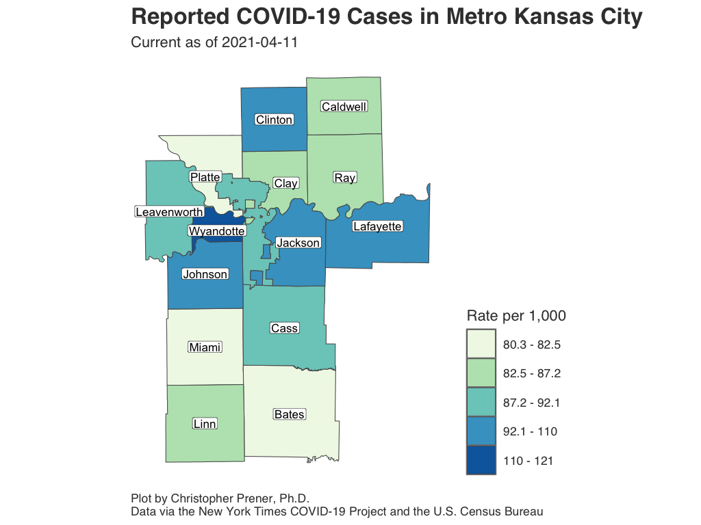
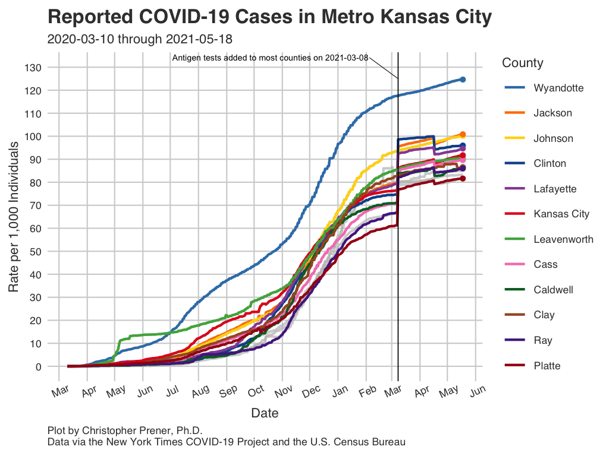
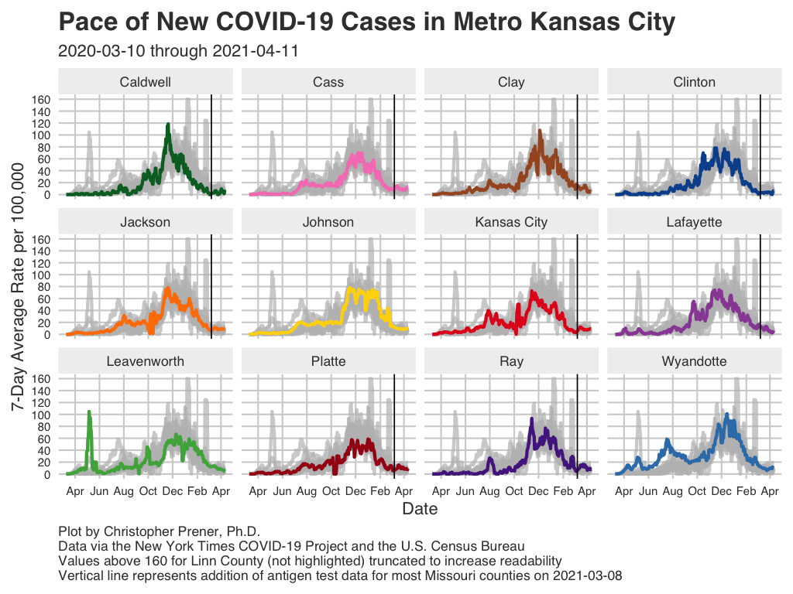
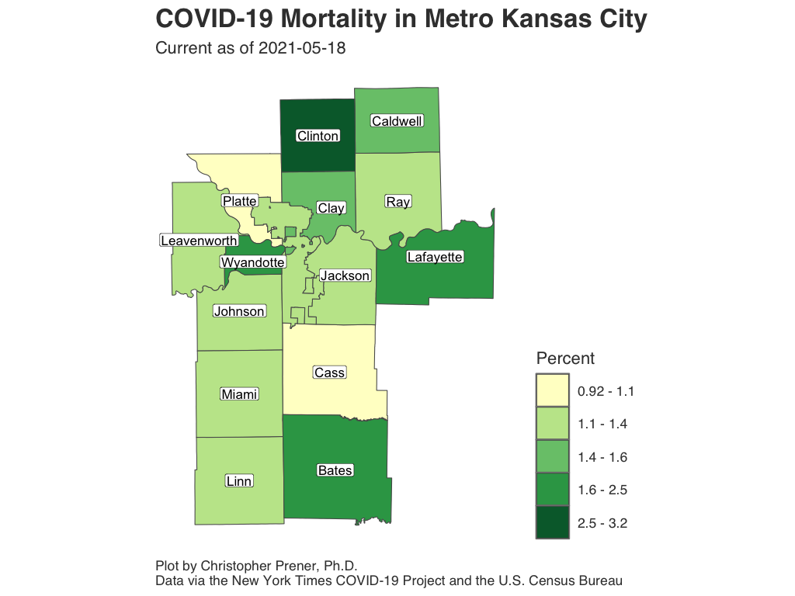
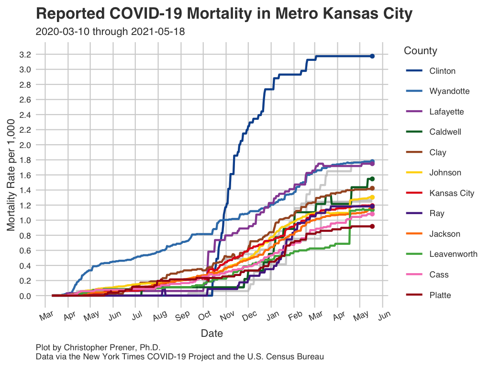
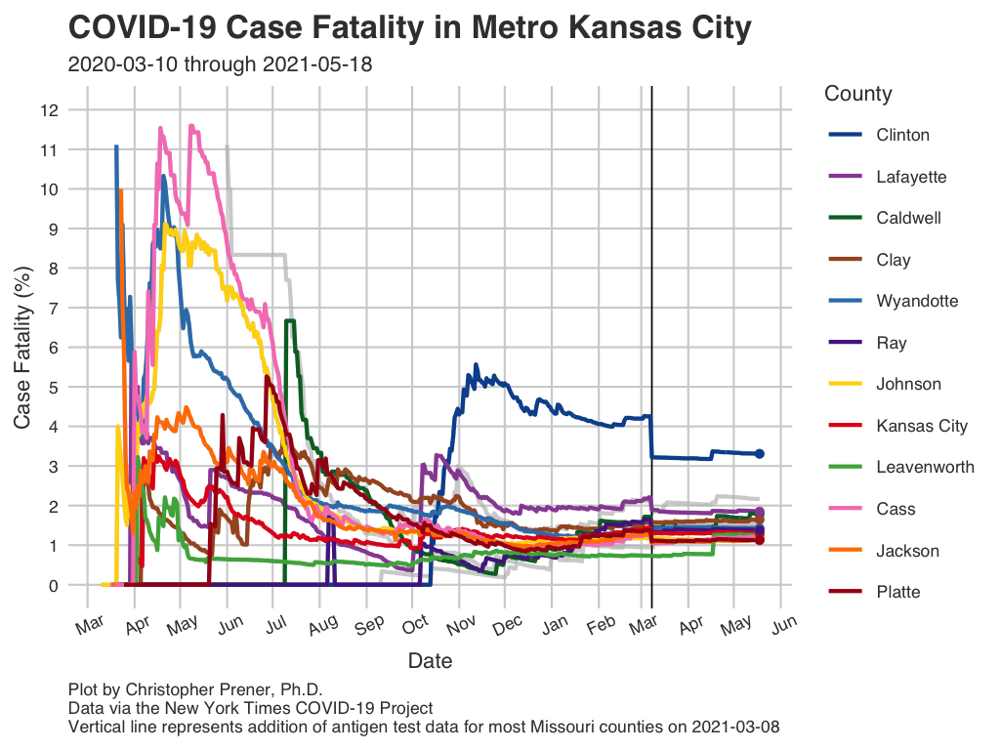

```{r setup, include=FALSE}
knitr::opts_chunk$set(echo = TRUE)

# dependencies
library(dplyr)
library(leaflet)
library(readr)
library(sf)

# functions
source(here::here("source", "functions", "map_breaks.R"))
source(here::here("source", "functions", "round_any.R"))

# load data
county_data <- read_csv(here::here("data", "MO_HEALTH_Covid_Tracking", "data", "county", "county_full.csv")) %>%
  filter(geoid %in% c("20091", "20103", "20107", "20121", "20209",
                  "29013", "29025", "29037", "29047", "29049", 
                  "29095", "29107", "29165", "29177", "29511")) %>%
  filter(report_date >= "2020-03-07") %>%
  arrange(desc(report_date), county)

regional_counties <- st_read(here::here("data", "MO_HEALTH_Covid_Tracking", "data", "county", "daily_snapshot_mo_xl.geojson")) %>%
  filter(GEOID %in% c("29047", "29095", "20091", "29511", "29165", "20209")) %>%
  select(GEOID, county)

zip_snapshot <- st_read(here::here("data", "MO_HEALTH_Covid_Tracking", "data", "zip", 
                                   "daily_snapshot_kansas_city.geojson"), 
                        stringsAsFactors = FALSE) 
```

The following plots and maps focus on the Kansas City <a href="faq.html#What_is_a_Metropolitan_Statistical_Area">metropolitan statistical area</a>, which covers fourteen counties in Missouri and Kansas plus Kansas City, which is treated here as <a href="faq.html#Why_Do_You_Treat_Joplin_and_Kansas_City_as_Counties">the equivalent of a county</a>.

## Infections {.tabset .tabset-fade .tabset-pills .padtop}
These plots show patterns in infections for the Kansas City <a href="faq.html#What_is_a_Metropolitan_Statistical_Area">metro area</a>.

### Static Map

```{r metro-infection-map, echo=FALSE, out.width = '100%'}

```

Download: [<a href="https://raw.githubusercontent.com/slu-openGIS/covid_daily_viz/master/results/high_res/kc_metro/a_case_map.png" target="_blank">High-res</a>] [<a href="https://raw.githubusercontent.com/slu-openGIS/covid_daily_viz/master/results/low_res/kc_metro/a_case_map.png" target="_blank">Low-res</a>]

### Infection Rates

```{r metro-infection-rate, echo=FALSE, out.width = '100%'}

```

Download: [<a href="https://raw.githubusercontent.com/slu-openGIS/covid_daily_viz/master/results/high_res/kc_metro/b_case_rate.png" target="_blank">High-res</a>] [<a href="https://raw.githubusercontent.com/slu-openGIS/covid_daily_viz/master/results/low_res/kc_metro/b_case_rate.png" target="_blank">Low-res</a>]

### New Infections

```{r kc-infection-avg, echo=FALSE, out.width = '100%'}

```

Download: [<a href="https://raw.githubusercontent.com/slu-openGIS/covid_daily_viz/master/results/high_res/kc_metro/e_new_case.png" target="_blank">High-res</a>] [<a href="https://raw.githubusercontent.com/slu-openGIS/covid_daily_viz/master/results/low_res/kc_metro/e_new_case.png" target="_blank">Low-res</a>]

### Data Table

```{r kc-infection-table, echo=FALSE, out.width = '100%'}
county_data %>%
  select(report_date, county, state, cases, new_cases, case_avg, case_rate) %>%
  mutate(
    case_avg = round(case_avg, digits = 2),
    case_rate = round(case_rate, digits = 2),
    state = case_when(
      state == "Kansas" ~ "KS",
      state == "Missouri" ~ "MO"
    )
  ) %>%
  rename(
    `Report Date` = report_date,
    County = county,
    State = state,
    `Cumulative Cases` = cases,
    `New Cases` = new_cases,
    `Average New Cases` = case_avg,
    `Per Capita Rate` = case_rate
  ) -> data_table

DT::datatable(data_table, rownames= FALSE)
```

### Notes

  * The underlying data for these plots are available from [GitHub](faq.html#How_Do_I_Download_Your_Data) in the `county_full.csv` table, which is assembled from data provided by the [New York Times](faq.html#Where_Do_These_Data_Come_From).
  * The FAQ contains short explanations of [per-capita rates](faq.html#What_are_Per_Capita_Rates) and [log plots](faq.html#What_are_Log_Plots).
  * All averages presented are 7-day [rolling averages](faq.html#What_are_Rolling_Averages).

## Mortality {.tabset .tabset-fade .tabset-pills .padtop}
These plots show patterns in infections for the Kansas City <a href="faq.html#What_is_a_Metropolitan_Statistical_Area">metro area</a>.

### Static Map

```{r metro-death-map, echo=FALSE, out.width = '100%'}

```

Download: [<a href="https://raw.githubusercontent.com/slu-openGIS/covid_daily_viz/master/results/high_res/kc_metro/g_mortality_map.png" target="_blank">High-res</a>] [<a href="https://raw.githubusercontent.com/slu-openGIS/covid_daily_viz/master/results/low_res/kc_metro/g_mortality_map.png" target="_blank">Low-res</a>]

### Mortality Rates

```{r metro-death-rate, echo=FALSE, out.width = '100%'}

```

Download: [<a href="https://raw.githubusercontent.com/slu-openGIS/covid_daily_viz/master/results/high_res/kc_metro/h_mortality_rate.png" target="_blank">High-res</a>] [<a href="https://raw.githubusercontent.com/slu-openGIS/covid_daily_viz/master/results/low_res/kc_metro/h_mortality_rate.png" target="_blank">Low-res</a>]

### Case Fatality Rate

```{r metro-cfr, echo=FALSE, out.width = '100%'}

```

Download: [<a href="https://raw.githubusercontent.com/slu-openGIS/covid_daily_viz/master/results/high_res/kc_metro/m_case_fatality_rate.png" target="_blank">High-res</a>] [<a href="https://raw.githubusercontent.com/slu-openGIS/covid_daily_viz/master/results/low_res/kc_metro/m_case_fatality_rate.png" target="_blank">Low-res</a>]

### Data Table

```{r metro-death-table, echo=FALSE, out.width = '100%'}
county_data %>%
  select(report_date, county, state, deaths, new_deaths, deaths_avg, mortality_rate, case_fatality_rate) %>%
  mutate(
    deaths_avg = round(deaths_avg, digits = 2),
    mortality_rate = round(mortality_rate, digits = 2),
    case_fatality_rate = round(case_fatality_rate, digits = 2),
    state = case_when(
      state == "Kansas" ~ "KC",
      state == "Missouri" ~ "MO"
    )
  ) %>%
  rename(
    `Report Date` = report_date,
    County = county,
    State = state,
    `Cumulative Deaths` = deaths,
    `New Deaths` = new_deaths,
    `Average New Deaths` = deaths_avg,
    `Per Capita Rate` = mortality_rate,
    CFR = case_fatality_rate
  ) -> data_table

DT::datatable(data_table, rownames= FALSE)
```

### Notes

  * The underlying data for these plots are available from [GitHub](faq.html#How_Do_I_Download_Your_Data) in the `county_full.csv` table, which is assembled from data provided by the [New York Times](faq.html#Where_Do_These_Data_Come_From).
  * The FAQ contains short explanations of [per-capita rates](faq.html#What_are_Per_Capita_Rates) and [log plots](faq.html#What_are_Log_Plots).
  * All averages presented are 7-day [rolling averages](faq.html#What_are_Rolling_Averages).
  * The abbreviation "CFR" states for case fatality rate (the number of deaths divided by the number of known cases, expressed as a percentage).

## Infection Rates by ZCTA (Zip Code) {.tabset .tabset-fade .tabset-pills .padtop}
This map shows infections as a rate per 1,000 residents for all ZCTAs with five or more patients. It is important not to map the raw counts themselves, but if you want to see those data, click on a ZCTA or the data table.

### Interactive Map

```{r map-infections-zip, echo = FALSE, out.width = '100%', out.height='600px', warning=FALSE}
# calculate breaks
bins <- map_bins(zip_snapshot, var = "case_rate", style = "quantile", classes = 5, dig_lab = 2,
                 round = 2)
bins[1] <- round_any(x = min(zip_snapshot$case_rate, na.rm = TRUE), accuracy = .01, f = floor)
bins[length(bins)] <- round_any(x = max(zip_snapshot$case_rate, na.rm = TRUE), accuracy = .01, f = ceiling)

# create color palette
pal <- colorBin("BuGn", domain = zip_snapshot$case_rate, bins = bins)

# map
leaflet() %>%
  addProviderTiles(providers$CartoDB.Positron) %>%
  addPolygons(
    data = zip_snapshot,
    color = "#444444", 
    weight = 1, 
    opacity = 1.0, 
    smoothFactor = 0.5,
    fillOpacity = 0.75,
    fillColor = ~pal(case_rate),
    highlightOptions = highlightOptions(color = "white", weight = 2, bringToFront = TRUE),
    popup = paste0("<b>Zip:</b> ", zip_snapshot$zip, " <br> ",
                 "<b>Current Cumulative Count:</b> ", zip_snapshot$cases, "<br>",
                 "<b>Current Cumulative Rate per 1,000:</b> ", round(zip_snapshot$case_rate, digits = 2))) %>%
  addPolylines(
    data = regional_counties,
    color = "#000000",
    weight = 3
  ) %>%
  addLegend(pal = pal, values = zip_snapshot$case_rate, opacity = .75, title = "Rate")
  
#  , " <br> ",
#                 "<b>Population Below Poverty Line:</b> ", round(zip_snapshot$pvty_pct, digits = 2), "% <br> ",
#                 "<b>African American Population:</b> ", round(zip_snapshot$blk_pct, digits = 2), "% ")
  
```

### Data Table

```{r zip-data-table, echo=FALSE, out.width = '100%'}
zip_snapshot %>%
  select(zip, cases, case_rate) %>% # , pvty_pct, blk_pct
  mutate(
    case_rate = round(case_rate, digits = 2) #,
    # pvty_pct = round(pvty_pct, digits = 2),
    # blk_pct = round(blk_pct, digits = 2)
  ) %>%
  rename(
    `Zip Code` = zip,
    `Cumulative Cases` = cases,
    `Rate per 1,000 Residents` = case_rate #,
    # `Poverty Rate (%)` = pvty_pct,
    # `% African American` = blk_pct
  ) -> data_table
st_geometry(data_table) <- NULL
DT::datatable(data_table)
```

### Notes

  * ZCTA stands for "<a href="https://www.census.gov/programs-surveys/geography/guidance/geo-areas/zctas.html" target="_blank">ZIP Code Tabulation Area</a>. These are not identical to zip codes, but they are essential for mapping zip codes as regions on a map.
  * The underlying data for these plots are available from [GitHub](faq.html#How_Do_I_Download_Your_Data) in the `zip_kansas_city.csv` table, which are assembled from data provided by Clay, Johnson, Jackson, Platte, and Wyandotte counties as well as Kansas City itself. These data are also available as a `.geojson` file for mapping.
  * The FAQ contains a short explanation of [per-capita rates](faq.html#What_are_Per_Capita_Rates).
  