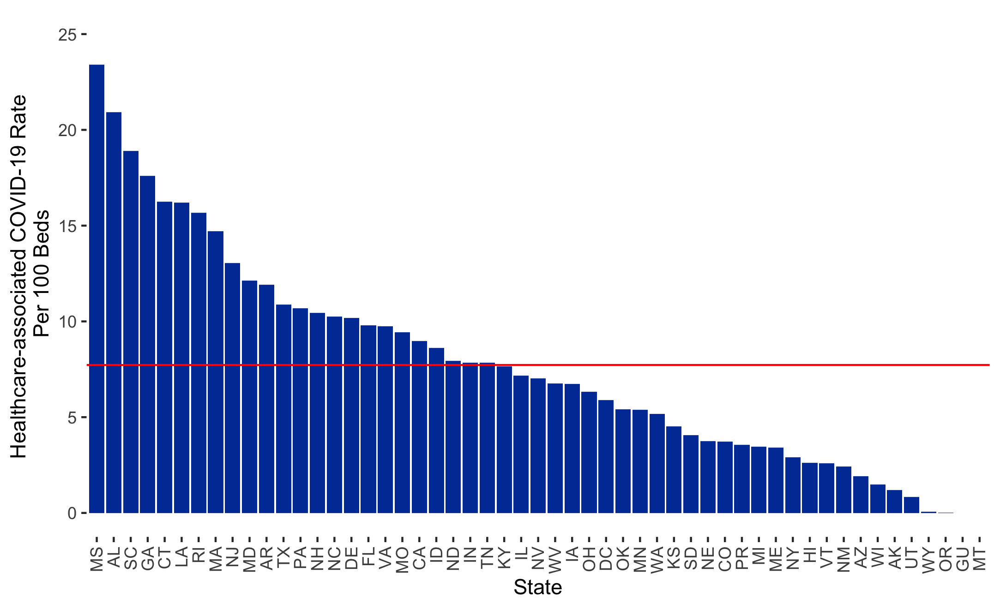

```{r setup, include=FALSE}
knitr::opts_chunk$set(echo = TRUE)

# dependencies
library(dplyr)
library(leaflet)
library(readr)
library(sf)

# functions
source(here::here("source", "functions", "map_breaks.R"))
source(here::here("source", "functions", "round_any.R"))

# load data
# state <- read_csv(here::here("data", "MO_HEALTH_Covid_Tracking", "data", 
#  "nursing_home_ltc", "state_ltc.csv"))
county <- st_read(here::here("data", "MO_HEALTH_Covid_Tracking", "data", 
  "nursing_home_ltc", "mo_xl_ltc_county.geojson")) 
facility <- st_read(here::here("data", "MO_HEALTH_Covid_Tracking", "data", 
  "nursing_home_ltc", "mo_xl_ltc_full.geojson")) 
load(here::here("data", "MO_HEALTH_Covid_Tracking", "data",
                              "source", "ltc", "last_update.rda"))

state <- read_csv(here::here("data", "state.csv"))
# county <- st_read(here::here("data", "mo_xl_ltc_county.geojson")) 
# facility <- st_read(here::here("data", "mo_xl_ltc_full.geojson")) %>%
#  arrange(p_state, p_county, p_name)

# pre-process data views
county_outline <- select(county, GEOID)
facility_cases <- select(facility, p_name:p_county, p_own_type, p_own_subtype,
                            cases_rate_all:cases_staff)
facility_new_cases <- select(facility, p_name:p_county, p_own_type, p_own_subtype,
                            new_cases_rate_all:new_cases_staff)
county_cases <- select(county, state, county, cases, cases_ltc_all, cases_ltc_pct, 
                       cases_ltc_res, cases_ltc_staff)
facility_deaths <- select(facility, p_name:p_county, p_own_type, p_own_subtype,
                            deaths_rate_all:deaths_staff)
facility_new_deaths <- select(facility, p_name:p_county, p_own_type, p_own_subtype,
                            new_deaths_rate_all:new_deaths_staff)
county_deaths <- select(county, state, county, deaths, deaths_ltc_all, deaths_ltc_pct, 
                   deaths_ltc_res, deaths_ltc_staff)

mo_data <- county
st_geometry(mo_data) <- NULL

mo_data %>%
  filter(state == "Missouri") %>%
  group_by(state) %>%
  summarise(
    cases = sum(cases, na.rm = TRUE),
    cases_ltc_all = sum(cases_ltc_all, na.rm = TRUE),
    cases_ltc_res = sum(cases_ltc_res, na.rm = TRUE),
    cases_ltc_staff = sum(cases_ltc_staff, na.rm = TRUE),
    deaths = sum(deaths, na.rm = TRUE),
    deaths_ltc_all = sum(deaths_ltc_all, na.rm = TRUE),
    deaths_ltc_res = sum(deaths_ltc_res, na.rm = TRUE),
    deaths_ltc_staff = sum(deaths_ltc_staff, na.rm = TRUE)) %>%
  mutate(cases_ltc_pct = cases_ltc_all/cases*100) %>%
  mutate(deaths_ltc_pct = deaths_ltc_all/deaths*100) -> mo_data
```

COVID-19 has been implicated in substantial morbidity and mortality in nursing home residents since the onset of the outbreak in the United States. However, it is still unknown as to how the cases are distributed geographically and if clusters are correlated with overall geographic burden of COVID-19 cases. Moreover, the State of Missouri and local county health departments have refused, generally, to name nursing homes and long term care facilities (LTCs) associated with COVID-19 outbreaks. Using the Centers for Medicare and Medicaid Services (CMS) nursing home COVID-19 data set, which is <a href="https://data.cms.gov/Special-Programs-Initiatives-COVID-19-Nursing-Home/COVID-19-Nursing-Home-Dataset/s2uc-8wxp" target="_blank">publicly available</a>, my colleague <a href="https://www.slu.edu/slucor/faculty/wiemken-timothy.php" target="_blank">Timothy Wiemken</a> and I have put together the following maps and tables that illustrate the extent of COVID-19 within facilities and relative to the counties these facilities reside in.

## Missouri Overview {.padtop}
As of `r last_update$last_date`, a total of `r format(mo_data$cases_ltc_all, digits = 5)` cases have been reported in Missouri nursing homes and LTCs. These represent `r round(mo_data$cases_ltc_pct, digits = 2)`% of all cases reported to date in Missouri. Of these cases, `r format(mo_data$cases_ltc_res, digits = 5)` have occurred among residents and `r format(mo_data$cases_ltc_staff, digits = 5)` have occurred among staff.

In terms of mortality, a total of `r mo_data$deaths_ltc_all` deaths have been reported in Missouri nursing homes and LTCs. These represent `r round(mo_data$deaths_ltc_pct, digits = 2)`% of all deaths reported to date in Missouri. Of these deaths, `r mo_data$deaths_ltc_res` have occurred among residents and `r mo_data$deaths_ltc_staff` have occurred among staff.

## State Comparisons {.tabset .tabset-fade .tabset-pills .padtop}
Health care transmission of SARS-CoV-2 has been documented but it is unknown as to how much transmission is occurring in nursing homes. The plot below depicts one approach to exploring this issue. Here, we subtracted the aggregate total admissions with COVID-19 from the total resident COVID-19 cases by state to approximate transmission. Dividing by the total number of nursing home beds in a state allows a more standardized rate-based evaluation of health care-associated COVID-19 transmission. The red line is the average, meaning Missouri is slightly above average.

### Static Plot

```{r state-plot, echo=FALSE, out.width = '100%'}

```

### Data Table

```{r state-table, echo=FALSE, out.width = '100%'}
state %>%
  select(Provider.State, rate.transmission) %>%
  rename(
    State = Provider.State,
    `Transmission Rate` = rate.transmission
  ) -> data_table

DT::datatable(data_table)
```

## Morbidity {.padtop}
The following maps track *confirmed* case rates by facility, new case rates in the last two weeks, and compare facility rates to county rates.

### Cases by Facility {.tabset .tabset-fade .tabset-pills .padtop}
This map shows the rate of *confirmed* COVID-19 cases per 100 beds at each LTC facility. The size of each circle is related to the rate - the larger the size, the higher the rate per 100 beds. It is possible for a facility to have a rate higher than 100 because our calculation also includes staff cases and because of resident turnover. The pop-up associated with each circle will reveal facility details as well as a breakdown of resident and staff cases.

#### Interactive Map

```{r facility-cases, echo=FALSE, warning=FALSE, out.width = '100%', out.height='600px'}
# calculate breaks
bins <- map_bins(facility_cases, var = "cases_rate_all", style = "fisher", classes = 10, dig_lab = 2,
                 round = 2)

facility_cases <- map_breaks(facility_cases, var = "cases_rate_all", newvar = "map_breaks",
                    style = "fisher", classes = 10, dig_lab = 2)

# create color palette
# pal <- colorBin("BuGn", domain = facilities$cases_all, bins = bins)

# map
leaflet() %>%
  addProviderTiles(providers$CartoDB.Positron) %>%
  addPolylines(
    data = county_outline,
    color = "#a9a9a9",
    weight = 1
  ) %>%
  addCircleMarkers(
    data = facility_cases,
    radius = ~ (as.numeric(map_breaks)*4),
    weight = 2,
    opacity = .7,
    color = RColorBrewer::brewer.pal(n = 5, "BuGn")[5] ,
    fillColor = RColorBrewer::brewer.pal(n = 5, "BuGn")[5],
    popup = paste0("<b>Facility:</b> ", facility_cases$p_name, "<br>",
                  "<b>Address:</b><br>",
                  facility_cases$p_address, "<br>",
                  facility_cases$p_city, ", ", facility_cases$p_state, " ", facility_cases$p_zip, "<br>",
                  "<b>Type:</b> ", facility_cases$p_own_type, " (", facility_cases$p_own_subtype,")", "<br>",
                  "<br>",
                  "<b>County:</b> ", facility_cases$p_county, "<br>",
                  "<br>",
                  "<b>Total Cases per 100 Beds:</b> ", round(facility_cases$cases_rate_all, digits = 2), "<br>",
                  "<b>Total Cases:</b> ", facility_cases$cases_all, "<br>",
                  "<b>Resident Cases:</b> ", facility_cases$cases_res, "<br>",
                  "<b>Staff Cases:</b> ", facility_cases$cases_staff))
```

#### Data Table

```{r facility-cases-table, echo=FALSE, out.width = '100%'}
facility_cases %>%
  select(p_name, p_city, p_state, p_county, cases_rate_all, cases_all, cases_res, cases_staff) %>%
  mutate(
    cases_rate_all = round(cases_rate_all, digits = 2)
  ) %>%
  rename(
    Name = p_name,
    City = p_city,
    State = p_state,
    County = p_county,
    `Case Rate` = cases_rate_all,
    `Total Cases` = cases_all,
    `Resident Cases` = cases_res,
    `Staff Cases` = cases_staff
  ) -> data_table

st_geometry(data_table) <- NULL

DT::datatable(data_table)
```

### New Cases by Facility {.tabset .tabset-fade .tabset-pills .padtop}
This map shows the rate of *new, confirmed* COVID-19 cases per 100 beds at each LTC facility. These are cases added at the facility in the last two weeks. For the purposes of this report, this is the period between `r last_update$last_date[2]-14` and `r last_update$last_date[2]`. The size of each circle is related to the rate - the larger the size, the higher the rate per 100 beds. The pop-up associated with each circle will reveal facility details as well as a breakdown of resident and staff cases.

#### Interactive Map

```{r facility-new-cases, warning=FALSE, echo=FALSE, out.width = '100%', out.height='600px'}
# calculate breaks
bins <- map_bins(facility_new_cases, var = "new_cases_rate_all", style = "fisher", 
                 classes = 6, dig_lab = 2, round = 2)

facility_new_cases <- map_breaks(facility_new_cases, var = "new_cases_rate_all", newvar = "map_breaks",
                    style = "fisher", classes = 6, dig_lab = 2)

# create color palette
# pal <- colorBin("RdPu", domain = facilities$cases_all, bins = bins)

# map
leaflet() %>%
  addProviderTiles(providers$CartoDB.Positron) %>%
  addPolylines(
    data = county_outline,
    color = "#a9a9a9",
    weight = 1
  ) %>%
  addCircleMarkers(
    data = facility_new_cases,
    radius = ~ (as.numeric(map_breaks)*4),
    weight = 2,
    opacity = .7,
    color = RColorBrewer::brewer.pal(n = 5, "RdPu")[5] ,
    fillColor = RColorBrewer::brewer.pal(n = 5, "RdPu")[5],
    popup = paste0("<b>Facility:</b> ", facility_new_cases$p_name, "<br>",
                  "<b>Address:</b><br>",
                  facility_new_cases$p_address, "<br>",
                  facility_new_cases$p_city, ", ", facility_new_cases$p_state, " ", facility_new_cases$p_zip, "<br>",
                  "<b>Type:</b> ", facility_new_cases$p_own_type, " (", facility_new_cases$p_own_subtype,")", "<br>",
                  "<br>",
                  "<b>County:</b> ", facility_new_cases$p_county, "<br>",
                  "<br>",
                  "<b>Total New Cases per 100 Beds:</b> ", round(facility_new_cases$new_cases_rate_all, digits = 2), "<br>",
                  "<b>Total New Cases:</b> ", facility_new_cases$new_cases_all, "<br>",
                  "<b>New Resident Cases:</b> ", facility_new_cases$new_cases_res, "<br>",
                  "<b>New Staff Cases:</b> ", facility_new_cases$new_cases_staff, "<br>"))
```

#### Data Table

```{r facility-new-cases-table, echo=FALSE, out.width = '100%'}
facility_new_cases %>%
  select(p_name, p_city, p_state, p_county, new_cases_rate_all, new_cases_all, new_cases_res, new_cases_staff) %>%
  mutate(
    new_cases_rate_all = round(new_cases_rate_all, digits = 2)
  ) %>%
  rename(
    Name = p_name,
    City = p_city,
    State = p_state,
    County = p_county,
    `New Case Rate` = new_cases_rate_all,
    `Total New Cases` = new_cases_all,
    `New Resident Cases` = new_cases_res,
    `New Staff Cases` = new_cases_staff
  ) -> data_table

st_geometry(data_table) <- NULL

DT::datatable(data_table)
```

### Cases by County {.tabset .tabset-fade .tabset-pills .padtop}
This map shows the number of cases in LTC facilities as a percentage of the total number of cases reported by individual counties. There is a temporal mismatch here - the LTC data are from `r last_update$last_date` while the county case data are from `r last_update$statewide_date`. This is done to compensate for difference reporting practices and time lines between the two data sets. The pop-up associated with each county will reveal counts as well as a breakdown of resident and staff cases.

#### Interactive Map

```{r county-cases, echo = FALSE, out.width = '100%', out.height='600px'}
# calculate breaks
# bins <- map_bins(counties, var = "cases_ltc_pct", style = "fisher", classes = 5, dig_lab = 2,
#                 round = 2)
bins <- c(min(county_cases$cases_ltc_pct, na.rm = TRUE), 5, 10, 15, 20, 25,
          round(max(county_cases$cases_ltc_pct, na.rm = TRUE)+1, digits = 0))

# create color palette
pal <- colorBin("BuGn", domain = county_cases$cases_ltc_pct, bins = bins)

# map
leaflet() %>%
  addProviderTiles(providers$CartoDB.Positron) %>%
  addPolygons(
    data = county_cases,
    color = "#444444", 
    weight = 1, 
    opacity = 1.0, 
    smoothFactor = 0.5,
    fillOpacity = 0.75,
    fillColor = ~pal(cases_ltc_pct),
    highlightOptions = highlightOptions(color = "white", weight = 2, bringToFront = TRUE),
    popup = paste0("<b>County:</b> ", county_cases$county, "<br>",
                           "<b>Total Cases:</b> ", county_cases$cases, "<br>",
                           "<b>Total Cases in LTC Facilities:</b> ", county_cases$cases_ltc_all, "<br>",
                           "<b>LTC Facility Cases as % of Total:</b> ", round(county_cases$cases_ltc_pct, digits = 2), "% <br>",
                           "<br>",
                           "<b>Resident Cases in LTC Facilities:</b> ", county_cases$cases_ltc_res, "<br>",
                           "<b>Staff Cases in LTC Facilities:</b> ", county_cases$cases_ltc_staff)
    )  %>%
    addLegend(pal = pal, values = county_cases$cases_ltc_pct, opacity = .75, title = "Percent")
```

#### Data Table

```{r county-cases-data-table, echo=FALSE, out.width = '100%'}
county_cases %>%
  select(state, county, cases, cases_ltc_all, cases_ltc_pct, cases_ltc_res, cases_ltc_staff) %>%
  mutate(
    cases_ltc_pct = round(cases_ltc_pct, digits = 2)
  ) %>%
  rename(
    State = state,
    County = county,
    `Total Cases` = cases,
    `Total LTC Cases` = cases_ltc_all,
    `LTC Case %` = cases_ltc_pct,
    `LTC Resident Cases` = cases_ltc_res,
    `LTC Staff Cases` = cases_ltc_staff
  ) %>%
  arrange(State, County) -> data_table

st_geometry(data_table) <- NULL

DT::datatable(data_table)
```

## Mortality {.padtop}
The following maps track *confirmed* mortality rates by facility, new mortality rates in the last two weeks, and compare facility rates to county rates.

### Deaths by Facility {.tabset .tabset-fade .tabset-pills .padtop}
This map shows the rate of *confirmed* COVID-19 deaths per 100 beds at each LTC facility. The size of each circle is related to the rate - the larger the size, the higher the rate per 100 beds. It is possible for a facility to have a rate higher than 100 because our calculation also includes staff deaths and because of resident turnover. The pop-up associated with each circle will reveal facility details as well as a breakdown of resident and staff deaths.

#### Interactive Map

```{r facility-deaths, echo=FALSE, warning=FALSE, out.width = '100%', out.height='600px'}
# calculate breaks
bins <- map_bins(facility_deaths, var = "deaths_rate_all", style = "fisher", classes = 6, dig_lab = 2,
                 round = 2)

facility_deaths <- map_breaks(facility_deaths, var = "deaths_rate_all", newvar = "map_breaks",
                    style = "fisher", classes = 6, dig_lab = 2)

# create color palette
# pal <- colorBin("BuGn", domain = facilities$deaths_all, bins = bins)

# map
leaflet() %>%
  addProviderTiles(providers$CartoDB.Positron) %>%
  addPolylines(
    data = county_outline,
    color = "#a9a9a9",
    weight = 1
  ) %>%
  addCircleMarkers(
    data = facility_deaths,
    radius = ~ (as.numeric(map_breaks)*4),
    weight = 2,
    opacity = .7,
    color = RColorBrewer::brewer.pal(n = 5, "Reds")[5] ,
    fillColor = RColorBrewer::brewer.pal(n = 5, "Reds")[5],
    popup = paste0("<b>Facility:</b> ", facility_deaths$p_name, "<br>",
                  "<b>Address:</b><br>",
                  facility_deaths$p_address, "<br>",
                  facility_deaths$p_city, ", ", facility_deaths$p_state, " ", facility_deaths$p_zip, "<br>",
                  "<b>Type:</b> ", facility_deaths$p_own_type, " (", facility_deaths$p_own_subtype,")", "<br>",
                  "<br>",
                  "<b>County:</b> ", facility_deaths$p_county, "<br>",
                  "<br>",
                  "<b>Total Deaths per 100 Beds:</b> ", round(facility_deaths$deaths_rate_all, digits = 2), "<br>",
                  "<b>Total Deaths:</b> ", facility_deaths$deaths_all, "<br>",
                  "<b>Resident Deaths:</b> ", facility_deaths$deaths_res, "<br>",
                  "<b>Staff Deaths:</b> ", facility_deaths$deaths_staff))
```

#### Data Table

```{r facility-deaths-table, echo=FALSE, out.width = '100%'}
facility_deaths %>%
  select(p_name, p_city, p_state, p_county, deaths_rate_all, deaths_all, deaths_res, deaths_staff) %>%
  mutate(
    deaths_rate_all = round(deaths_rate_all, digits = 2)
  ) %>%
  rename(
    Name = p_name,
    City = p_city,
    State = p_state,
    County = p_county,
    `Mortality Rate` = deaths_rate_all,
    `Total Deaths` = deaths_all,
    `Resident Deaths` = deaths_res,
    `Staff Deaths` = deaths_staff
  ) -> data_table

st_geometry(data_table) <- NULL

DT::datatable(data_table)
```

### New Deaths by Facility {.tabset .tabset-fade .tabset-pills .padtop}
This map shows the rate of *new, confirmed* COVID-19 deaths per 100 beds at each LTC facility. These are deaths added at the facility in the last two weeks. For the purposes of this report, this is the period between `r last_update$last_date[2]-14` and `r last_update$last_date[2]`. The size of each circle is related to the rate - the larger the size, the higher the rate per 100 beds. The pop-up associated with each circle will reveal facility details as well as a breakdown of resident and staff deaths.

#### Interactive Map

```{r facility-new-deaths, warning=FALSE, echo=FALSE, out.width = '100%', out.height='600px'}
# calculate breaks
bins <- map_bins(facility_new_deaths, var = "new_deaths_rate_all", style = "fisher", 
                 classes = 4, dig_lab = 2, round = 2)

facility_new_deaths <- map_breaks(facility_new_deaths, var = "new_deaths_rate_all", newvar = "map_breaks",
                    style = "fisher", classes = 4, dig_lab = 2)

# create color palette
# pal <- colorBin("RdPu", domain = facilities$deaths_all, bins = bins)

# map
leaflet() %>%
  addProviderTiles(providers$CartoDB.Positron) %>%
  addPolylines(
    data = county_outline,
    color = "#a9a9a9",
    weight = 1
  ) %>%
  addCircleMarkers(
    data = facility_new_deaths,
    radius = ~ (as.numeric(map_breaks)*4),
    weight = 2,
    opacity = .7,
    color = RColorBrewer::brewer.pal(n = 5, "Oranges")[5] ,
    fillColor = RColorBrewer::brewer.pal(n = 5, "Oranges")[5],
    popup = paste0("<b>Facility:</b> ", facility_new_deaths$p_name, "<br>",
                  "<b>Address:</b><br>",
                  facility_new_deaths$p_address, "<br>",
                  facility_new_deaths$p_city, ", ", facility_new_deaths$p_state, " ", facility_new_deaths$p_zip, "<br>",
                  "<b>Type:</b> ", facility_new_deaths$p_own_type, " (", facility_new_deaths$p_own_subtype,")", "<br>",
                  "<br>",
                  "<b>County:</b> ", facility_new_deaths$p_county, "<br>",
                  "<br>",
                  "<b>Total New Deaths per 100 Beds:</b> ", round(facility_new_deaths$new_deaths_rate_all, digits = 2), "<br>",
                  "<b>Total New Deaths:</b> ", facility_new_deaths$new_deaths_all, "<br>",
                  "<b>New Resident Deaths:</b> ", facility_new_deaths$new_deaths_res, "<br>",
                  "<b>New Staff Deaths:</b> ", facility_new_deaths$new_deaths_staff, "<br>"))
```

#### Data Table

```{r facility-new-deaths-table, echo=FALSE, out.width = '100%'}
facility_new_deaths %>%
  select(p_name, p_city, p_state, p_county, new_deaths_rate_all, new_deaths_all, new_deaths_res, new_deaths_staff) %>%
  mutate(
    new_deaths_rate_all = round(new_deaths_rate_all, digits = 2)
  ) %>%
  rename(
    Name = p_name,
    City = p_city,
    State = p_state,
    County = p_county,
    `New Mortality Rate` = new_deaths_rate_all,
    `Total New Deaths` = new_deaths_all,
    `New Resident Deaths` = new_deaths_res,
    `New Staff Deaths` = new_deaths_staff
  ) -> data_table

st_geometry(data_table) <- NULL

DT::datatable(data_table)
```

### Deaths by County {.tabset .tabset-fade .tabset-pills .padtop}
This map shows the number of deaths in LTC facilities as a percentage of the total number of deaths reported by individual counties. There is a temporal mismatch here - the LTC data are from `r last_update$last_date` while the county case data are from `r last_update$statewide_date`. This is done to compensate for difference reporting practices and time lines between the two data sets. The pop-up associated with each county will reveal counts as well as a breakdown of resident and staff deaths.

#### Interactive Map

```{r county-deaths, echo = FALSE, out.width = '100%', out.height='600px'}
# calculate breaks
# bins <- map_bins(counties, var = "deaths_ltc_pct", style = "fisher", classes = 5, dig_lab = 2,
#                 round = 2)
bins <- c(min(county_deaths$deaths_ltc_pct, na.rm = TRUE), 25, 50, 75, 100,
          round(max(county_deaths$deaths_ltc_pct, na.rm = TRUE)+1, digits = 0))

# create color palette
pal <- colorBin("OrRd", domain = county_deaths$deaths_ltc_pct, bins = bins)

# map
leaflet() %>%
  addProviderTiles(providers$CartoDB.Positron) %>%
  addPolygons(
    data = county_deaths,
    color = "#444444", 
    weight = 1, 
    opacity = 1.0, 
    smoothFactor = 0.5,
    fillOpacity = 0.75,
    fillColor = ~pal(deaths_ltc_pct),
    highlightOptions = highlightOptions(color = "white", weight = 2, bringToFront = TRUE),
    popup = paste0("<b>County:</b> ", county_deaths$county, "<br>",
                           "<b>Total Deaths:</b> ", county_deaths$deaths, "<br>",
                           "<b>Total Deaths in LTC Facilities:</b> ", county_deaths$deaths_ltc_all, "<br>",
                           "<b>LTC Facility Deaths as % of Total:</b> ", round(county_deaths$deaths_ltc_pct, digits = 2), "% <br>",
                           "<br>",
                           "<b>Resident Deaths in LTC Facilities:</b> ", county_deaths$deaths_ltc_res, "<br>",
                           "<b>Staff Deaths in LTC Facilities:</b> ", county_deaths$deaths_ltc_staff)
    )  %>%
    addLegend(pal = pal, values = county_deaths$deaths_ltc_pct, opacity = .75, title = "Percent")
```

#### Data Table

```{r county-deaths-data-table, echo=FALSE, out.width = '100%'}
county_deaths %>%
  select(state, county, deaths, deaths_ltc_all, deaths_ltc_pct, deaths_ltc_res, deaths_ltc_staff) %>%
  mutate(
    deaths_ltc_pct = round(deaths_ltc_pct, digits = 2)
  ) %>%
  rename(
    State = state,
    County = county,
    `Total Deaths` = deaths,
    `Total LTC Deaths` = deaths_ltc_all,
    `LTC Mortality %` = deaths_ltc_pct,
    `LTC Resident Deaths` = deaths_ltc_res,
    `LTC Staff Deaths` = deaths_ltc_staff
  ) %>%
  arrange(State, County) -> data_table

st_geometry(data_table) <- NULL

DT::datatable(data_table)
```