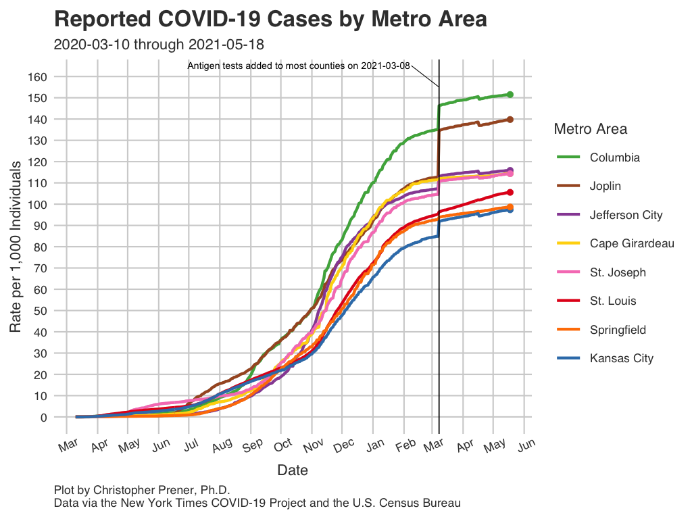
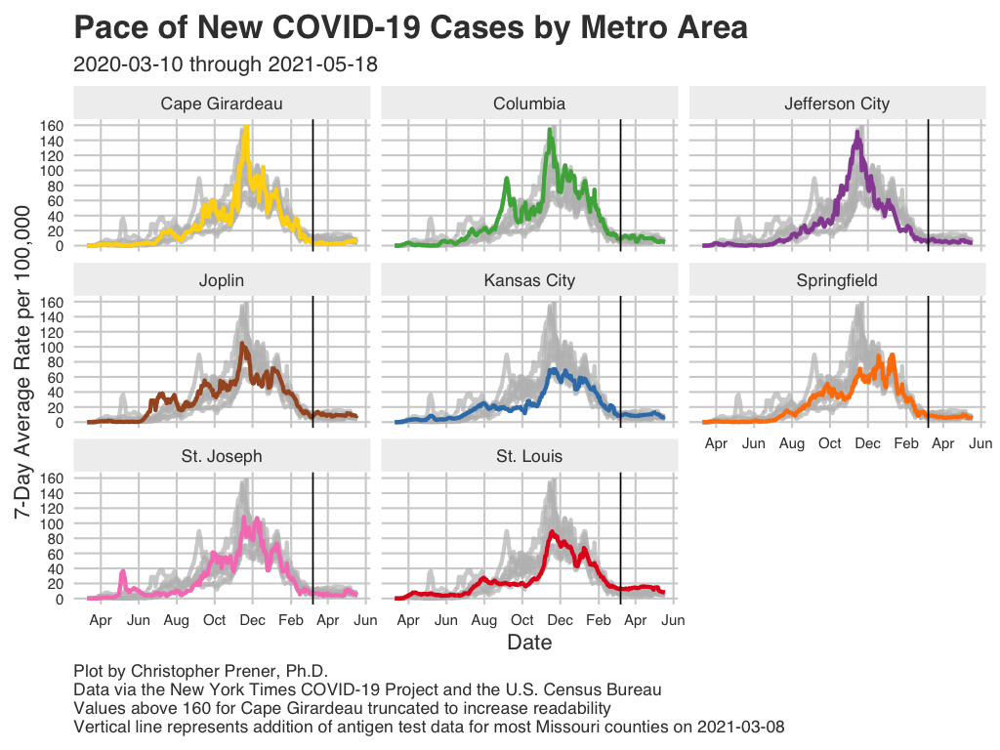
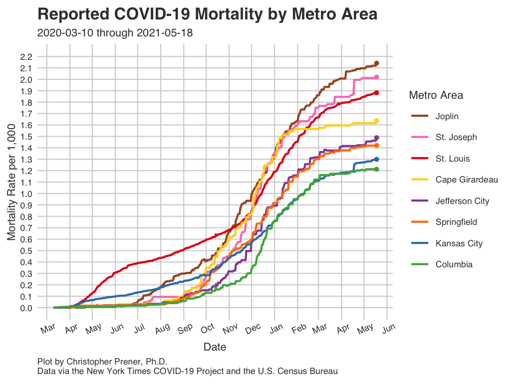
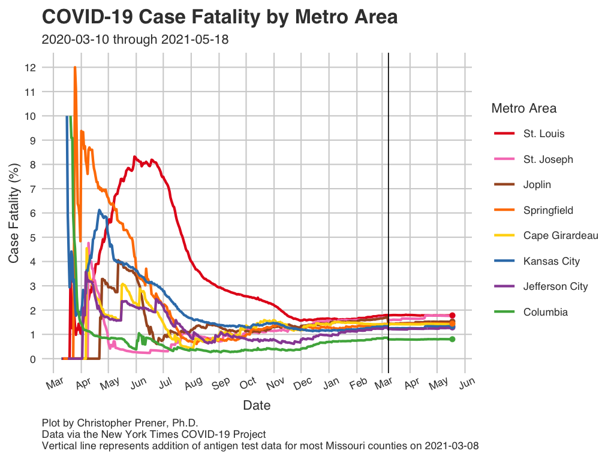
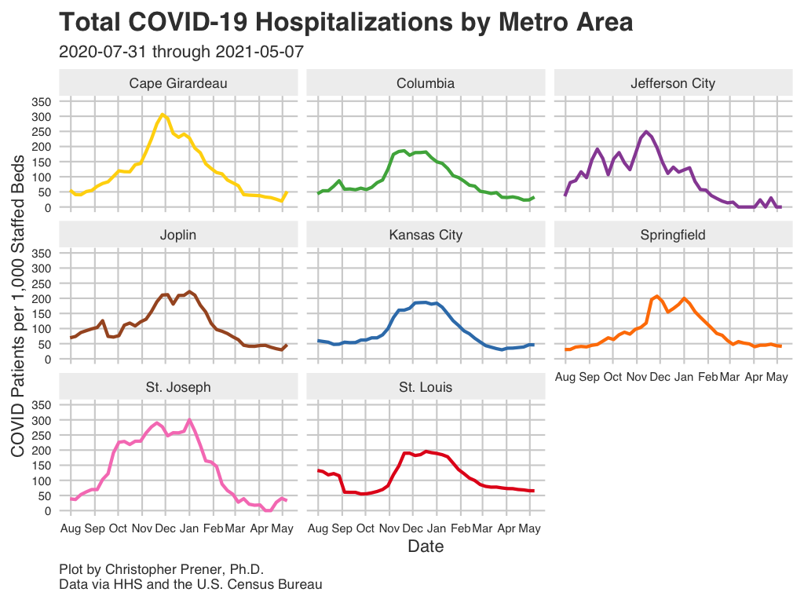

```{r setup, include=FALSE}
knitr::opts_chunk$set(echo = TRUE)

# dependencies
library(dplyr)
library(readr)

# load data
metro_data <- read_csv(here::here("data", "MO_HEALTH_Covid_Tracking", "data", 
                                  "metro_all", "metro_full.csv")) %>%
  filter(report_date >= "2020-03-07") %>%
  arrange(desc(report_date), short_name)

metro_hosp <- read_csv(here::here("data", "MO_HEALTH_Covid_Tracking", "data", 
                                  "metro_all", "metro_hospital.csv")) %>%
  arrange(desc(report_date), short_name)
```

The following plots and maps focus on all of Missouri's <a href="faq.html#What_is_a_Metropolitan_Statistical_Area">metropolitan statistical areas</a> (MSA). These areas include portions of Illinois (in the case of the Cape Girardeau and St. Louis metros), Kansas (in the case of the Kansas City and St. Joseph metros), and Oklahoma (the Joplin metro). The <a href="faq.html#What_is_a_Metropolitan_Statistical_Area">FAQ</a> contains more details about what constitutes a MSA.

## Infections {.tabset .tabset-fade .tabset-pills .padtop}
These plots show patterns in infections for all of Missouri's <a href="faq.html#What_is_a_Metropolitan_Statistical_Area">metro areas</a>.

### Infection Rates

```{r metro-infection-rate, echo=FALSE, out.width = '100%'}

```

Download: [<a href="https://raw.githubusercontent.com/slu-openGIS/covid_daily_viz/master/results/high_res/metro/b_case_rate.png" target="_blank">High-res</a>] [<a href="https://raw.githubusercontent.com/slu-openGIS/covid_daily_viz/master/results/low_res/metro/b_case_rate.png" target="_blank">Low-res</a>]

### New Infections

```{r metro-infection-avg, echo=FALSE, out.width = '100%'}

```

Download: [<a href="https://raw.githubusercontent.com/slu-openGIS/covid_daily_viz/master/results/high_res/metro/e_new_case.png" target="_blank">High-res</a>] [<a href="https://raw.githubusercontent.com/slu-openGIS/covid_daily_viz/master/results/low_res/metro/e_new_case.png" target="_blank">Low-res</a>]

### Data Table

```{r metro-infection-table, echo=FALSE, out.width = '100%'}
metro_data %>%
  select(report_date, short_name, cases, case_rate, new_cases, case_avg, case_avg_rate) %>%
  mutate(
    case_avg = round(case_avg, digits = 2),
    case_rate = round(case_rate, digits = 2),
    case_avg_rate = round(case_avg_rate, digits = 2)
  ) %>%
  rename(
    `Report Date` = report_date,
    MSA = short_name,
    `Cumulative Cases` = cases,
    `Per Capita Rate` = case_rate,
    `New Cases` = new_cases,
    `Average New Cases` = case_avg,
    `New Cases Per Capita` = case_avg_rate
  ) -> data_table

DT::datatable(data_table, rownames= FALSE)
```

### Notes

  * The underlying data for these plots are available from [GitHub](faq.html#How_Do_I_Download_Your_Data) in the `county_full.csv` table, which is assembled from data provided by the [New York Times](faq.html#Where_Do_These_Data_Come_From).
  * The FAQ contains short explanations of [per-capita rates](faq.html#What_are_Per_Capita_Rates) and [log plots](faq.html#What_are_Log_Plots).
  * All averages presented are 7-day [rolling averages](faq.html#What_are_Rolling_Averages).

## Mortality {.tabset .tabset-fade .tabset-pills .padtop}
These plots show patterns in mortality for all of Missouri's <a href="faq.html#What_is_a_Metropolitan_Statistical_Area">metro areas</a>.

### Mortality Rates

```{r metro-death-rate, echo=FALSE, out.width = '100%'}

```

Download: [<a href="https://raw.githubusercontent.com/slu-openGIS/covid_daily_viz/master/results/high_res/metro/h_mortality_rate.png" target="_blank">High-res</a>] [<a href="https://raw.githubusercontent.com/slu-openGIS/covid_daily_viz/master/results/low_res/metro/h_mortality_rate.png" target="_blank">Low-res</a>]

### Case Fatality Rate

```{r metro-cfr, echo=FALSE, out.width = '100%'}

```

Download: [<a href="https://raw.githubusercontent.com/slu-openGIS/covid_daily_viz/master/results/high_res/metro/m_case_fatality_rate.png" target="_blank">High-res</a>] [<a href="https://raw.githubusercontent.com/slu-openGIS/covid_daily_viz/master/results/low_res/metro/m_case_fatality_rate.png" target="_blank">Low-res</a>]

### Data Table

```{r metro-death-table, echo=FALSE, out.width = '100%'}
metro_data %>%
  select(report_date, short_name, deaths, new_deaths, deaths_avg, mortality_rate, case_fatality_rate) %>%
  mutate(
    deaths_avg = round(deaths_avg, digits = 2),
    mortality_rate = round(mortality_rate, digits = 2),
    case_fatality_rate = round(case_fatality_rate, digits = 2)
  ) %>%
  rename(
    `Report Date` = report_date,
    MSA = short_name,
    `Cumulative Deaths` = deaths,
    `New Deaths` = new_deaths,
    `Average New Deaths` = deaths_avg,
    `Per Capita Rate` = mortality_rate,
    CFR = case_fatality_rate
  ) -> data_table

DT::datatable(data_table, rownames= FALSE)
```

### Notes

  * The underlying data for these plots are available from [GitHub](faq.html#How_Do_I_Download_Your_Data) in the `county_full.csv` table, which is assembled from data provided by the [New York Times](faq.html#Where_Do_These_Data_Come_From).
  * The FAQ contains short explanations of [per-capita rates](faq.html#What_are_Per_Capita_Rates) and [log plots](faq.html#What_are_Log_Plots).
  * All averages presented are 7-day [rolling averages](faq.html#What_are_Rolling_Averages).
  * The abbreviation "CFR" states for case fatality rate (the number of deaths divided by the number of known cases, expressed as a percentage).

## Hospitalizations {.tabset .tabset-fade .tabset-pills .padtop}
These plots show patterns in hospitalizations for all of Missouri's <a href="faq.html#What_is_a_Metropolitan_Statistical_Area">metro areas</a>. The federal government only began collecting these data systematically in mid-summer, and so these data do not reflect hospitalization patterns at the beginning of the pandemic.

### Current Total In-Patients

```{r metro-hosp, echo=FALSE, out.width = '100%'}

```

Download: [<a href="https://raw.githubusercontent.com/slu-openGIS/covid_daily_viz/master/results/high_res/metro/o_in_pt.png" target="_blank">High-res</a>] [<a href="https://raw.githubusercontent.com/slu-openGIS/covid_daily_viz/master/results/low_res/metro/o_in_pt.png" target="_blank">Low-res</a>]

### Data Table

```{r metro-hosp-table, echo=FALSE, out.width = '100%'}
metro_hosp %>%
  select(report_date, short_name, adult_covid, covid_per_cap) %>%
  mutate(
    adult_covid = round(adult_covid, digits = 2),
    covid_per_cap = round(covid_per_cap, digits = 2)
  ) %>%
  rename(
    `Report Date` = report_date,
    MSA = short_name,
    `7-day Average Adult COVID Patients` = adult_covid,
    `7-day Average Adult COVID Patients Per Capita` = covid_per_cap,
  ) -> data_table

DT::datatable(data_table, rownames= FALSE)
```
