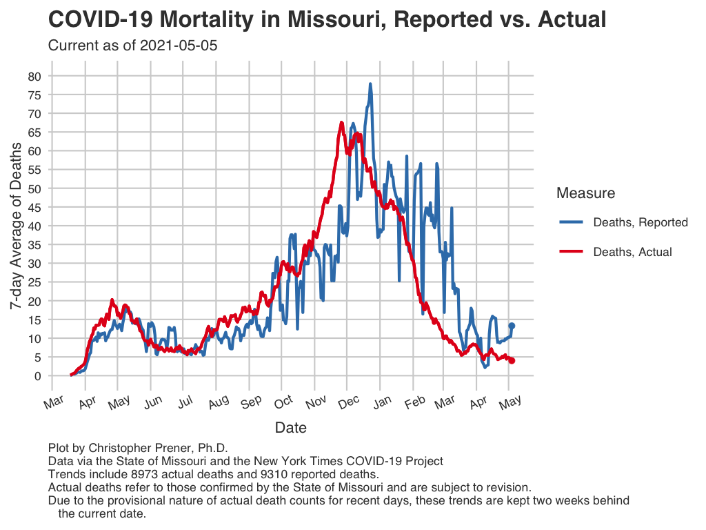
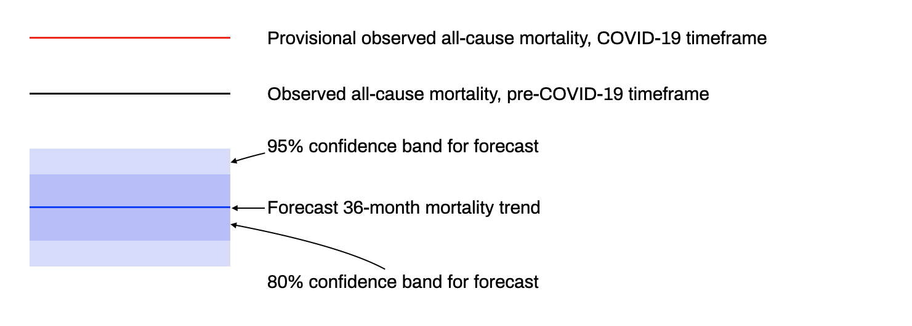

```{r setup, include=FALSE}
knitr::opts_chunk$set(echo = TRUE)

library(tidyverse)
library(rvest)
library(forecast)
library(dygraphs)
library(dplyr)
```

The following plots offer two alternative perspectives to the <a href="states.html#Mortality">reported mortality data</a> shared on the state comparison page. Those data are based on *mortality reports*, which could be off by days, weeks, or even months from the actual date of death. These data are based on provisional data that reflect the actual date of death. We can use these data to explore differences between report date and actual date of death as well as excess mortality. 

## Reported Deaths vs. Actual {.tabset .tabset-fade .tabset-pills .padtop}
A routine criticism of mortality data during the COVID-19 pandemic has been that they do not accurately reflect current temporal trends because deaths are often reported weeks or months after they occur. While the reported data do not perfectly match the actual death trend, they are also not radically different for much of the course of the pandemic to this point.

### Static Plot

```{r mortality-compare, echo=FALSE, out.width = '100%'}

```

Download: [<a href="https://raw.githubusercontent.com/slu-openGIS/covid_daily_viz/master/results/high_res/state/n_mortality_compare.png" target="_blank">High-res</a>] [<a href="https://raw.githubusercontent.com/slu-openGIS/covid_daily_viz/master/results/low_res/state/n_mortality_compare.png" target="_blank">Low-res</a>]

## Excess Mortality {.padtop}
"Excess deaths" refer to deaths that occur beyond what we would expect in a given time period. This plot shows a forecast of mortality based on all-cause mortality dating back to 1999. The difference between the red line (provisional mortality during COVID-19) and the forecast suggests the burden of excess death experienced during the COVID-19 pandemic. These plots are created and maintained by <a href="https://www.slu.edu/slucor/faculty/wiemken-timothy.php" target="_blank">Timothy Wiemken, Ph.D</a>.

Both excess mortality plots below use the same fundamental data - all-cause mortality data from the CDC as well as the State of Missouri. We forecast mortality during the pandemic using all-cause mortality data dating back to 1999, and then overlay the provisional observed mortality during the COVID-19 pandemic in red. The confidence bands highlight the estimated amount of uncertainty in the forecast. 80 out of 100 estimates fall within the 80% confidence band, while 95 out of 100 estimates fall in the 95% band. By comparing the red line to the forecast trend as well as the confidence bands, we can get a sense of where the observed (but provisional) mortality trend fits within the forecast's expected variation.

```{r legend, echo=FALSE, out.height='150%'}

```

### Excess Mortality, Missouri {.tabset .tabset-fade .tabset-pills .padtop}

#### Interactive Plot

```{r excess-mortality, echo=FALSE, out.width = '100%'}
df<-read.csv(here::here("data","totaldeaths_timeseries_missouri.csv"))
df$date<-format(as.Date(paste("1", substr(df$Month.Code, start=6, stop=8), substr(df$Month.Code, start=1, stop=4), sep = "-"), format = "%d-%m-%Y"), "%Y-%m")
df<-df[,c("date", "Deaths")]
names(df)<-c("date", "deaths")


### live provisional data
movital<-c(5681, 5369,  5631, 5823, 5649)
covid<-c(rep(NA, times=nrow(df)), movital, rep(NA, times=(36-length(movital))))


#### create time series object - monthly
pre<-ts(df$deaths, start=c(1999,1), end = c(2020,2), frequency = 12)

#### make actuals overlay
movital<-c(5681, 5369,  5631, 5823, 5649)
df.post<-c(rep(NA, times=nrow(df)), movital, rep(NA, times=(36-length(movital))))

#### start plot
interval_value_formatter <- "function(num, opts, seriesName, g, row, col) {
  value = g.getValue(row, col);
  if(value[0] != value[2]) {
    lower = Dygraph.numberValueFormatter(value[0], opts);
    upper = Dygraph.numberValueFormatter(value[2], opts);
    return '[' + lower + ', ' + upper + ']';
  } else {
    return Dygraph.numberValueFormatter(num, opts);
  }
}"


pre %>%
  stlf(lambda = 0, h = 36, method="arima") %>%
  {cbind(actuals=.$x, forecast_mean=.$mean,
         lower_95=.$lower[,"95%"], upper_95=.$upper[,"95%"],
         lower_80=.$lower[,"80%"], upper_80=.$upper[,"80%"],
         covid_actuals=df.post)} %>%
  dygraph(main="All-Cause Mortality, Missouri", ylab = "Total Deaths") %>%
  dyAxis("y", valueFormatter = interval_value_formatter) %>%
  dySeries("actuals", color = "black", label="Pre-COVID-19 Mortality") %>%
  dySeries("forecast_mean", color = "blue", label = "Forecasted Mortality") %>%
  dySeries(c("lower_80", "forecast_mean", "upper_80"),
           label = "80% Confidence Band", color = "blue") %>%
  dySeries(c("lower_95", "forecast_mean", "upper_95"),
           label = "95% Confidence Band", color = "blue") %>%
  dySeries("covid_actuals", color = "red", label="COVID-19 era Mortality") %>%
  dyLegend(labelsSeparateLines=TRUE, show="never") %>%
  dyRangeSelector(dateWindow = c(as.Date("2019-01-01"), Sys.Date())) %>%
  dyOptions(digitsAfterDecimal = 1, axisLabelWidth=75) %>%
  dyCSS(textConnection(".dygraph-legend {background-color: rgba(255, 255, 255, 0.5) !important; }")) %>%
  dyAxis(
    "y",
    label = "Total Number of Deaths (All-Cause)",
    valueFormatter =  'function(d){return  d.toString().replace(/\\B(?=(\\d{3})+(?!\\d))/g, ",");}',
    axisLabelFormatter = 'function(d){return d.toString().replace(/\\B(?=(\\d{3})+(?!\\d))/g, ",");}'
  )
```

#### Notes
* All-cause mortality data in Missouri from January 1, 1999 through December 2018 were gathered from [CDC WONDER](https://wonder.cdc.gov/controller/datarequest/D76) grouped by month. 
* Provisional all-cause mortality from January 2019-Present were gathered from [The Missouri Department of Health & Senior Services Vital Statistics](https://health.mo.gov/data/vitalstatistics/). 

* Analysis is conducted using the Seasonal and Trend decomposition using Loess Forecasting model, as implemented in the [Forecast](https://cran.r-project.org/web/packages/forecast/forecast.pdf) package in [R](https://cran.r-project.org). 
* Forecasting is done on data from January 1999 through February 2020, since COVID-19 began circulating more in March 2020 in the USA. There is a 36 month forecast. 
* The black lines on the plot are the actual observed mortality in the USA during the pre-COVID-19 time frame (mortality counts from 2019 and 2020 are still considered provisional). 
* Observed all-cause mortality is plotted through July, 2020.

### Excess Mortality, United States {.tabset .tabset-fade .tabset-pills .padtop}

#### Interactive Plot

```{r excess-mortality-us, echo=FALSE, out.width = '100%', eval = FALSE}
#### Historical Data from: CDC wonder and NVSS = 1999 through 2019
df<-read.csv(here::here("data", "totaldeaths_timeseries.csv"))
df$date<-format(as.Date(paste("1", substr(df$Month.Code, start=6, stop=8), substr(df$Month.Code, start=1, stop=4), sep = "-"), format = "%d-%m-%Y"), "%Y-%m")
df<-df[,c("date", "Deaths")]
names(df)<-c("date", "deaths")


### live provisional data
## scrape
url<-"https://www.cdc.gov/coronavirus/2019-ncov/covid-data/covidview/10302020/nchs-mortality-report.html"
url%>%
  read_html(url) %>%
  html_nodes("table") %>%
  html_table %>%
  .[[1]]-> out

### clean/drop crap
out <- out[-1,1:3]
out[,3]<-gsub(",", "", out[,3])
out[,3]<-as.numeric(out[,3])
### make month year
out$date<-format(as.Date(paste("1", out$Week, out$Year, sep = "-"), format = "%w-%W-%Y"), "%Y-%m")
### drop 2019
out<-subset(out, out$Year!=2019)
### clean more
out<-out[,c(4,3)]
names(out)<-c("date", "deaths")
### sum by month

out %>%
  group_by(date) %>%
  summarise(deaths = sum(deaths, na.rm=T), .groups = "drop_last") -> out2

### final data
df <- rbind(df, out2)
### clean
rm(list = ls(pattern="[^df]"))


### convert date back to full date with '1' for day - needed for some functions
df$date<-as.Date(paste("1", substr(df$date, start=6, stop=8), substr(df$date, start=1, stop=4), sep = "-"), format = "%d-%m-%Y")

#### select just data through feb 2020
df.pre<-df[1:254,]
#### post for overlaying will be: (excluding current month as itll always be less than it should be due to provisional counts)
df.post<-df[255:(nrow(df)-1),]
#### create time series object - monthly
pre<-ts(df.pre$deaths, start=c(1999,1), end = c(2020,2), frequency = 12)

#### make actuals overlay
df.post2<-c(rep(NA, times=254), df.post$deaths[-nrow(df.post)], rep(NA, times=(36-nrow(df.post)+1)))


#### start plot
interval_value_formatter <- "function(num, opts, seriesName, g, row, col) {
  value = g.getValue(row, col);
  if(value[0] != value[2]) {
    lower = Dygraph.numberValueFormatter(value[0], opts);
    upper = Dygraph.numberValueFormatter(value[2], opts);
    return '[' + lower + ', ' + upper + ']';
  } else {
    return Dygraph.numberValueFormatter(num, opts);
  }
}"


pre %>%
  stlf(lambda = 0, h = 36, method="arima") %>%
  {cbind(actuals=.$x, forecast_mean=.$mean,
         lower_95=.$lower[,"95%"], upper_95=.$upper[,"95%"],
         lower_80=.$lower[,"80%"], upper_80=.$upper[,"80%"],
         covid_actuals=df.post2)} %>%
  dygraph(main="All-Cause Mortality, USA", ylab = "Total Deaths") %>%
  dyAxis("y", valueFormatter = interval_value_formatter) %>%
  dySeries("actuals", color = "black", label="Pre-COVID-19 Mortality") %>%
  dySeries("forecast_mean", color = "blue", label = "Forecasted Mortality") %>%
  dySeries(c("lower_80", "forecast_mean", "upper_80"),
           label = "80% Confidence Band", color = "blue") %>%
  dySeries(c("lower_95", "forecast_mean", "upper_95"),
           label = "95% Confidence Band", color = "blue") %>%
  dySeries("covid_actuals", color = "red", label="COVID-19 era Mortality") %>%
  dyLegend(labelsSeparateLines=TRUE, show="never") %>%
  dyRangeSelector(dateWindow = c(as.Date("2019-01-01"), Sys.Date())) %>%
  dyOptions(digitsAfterDecimal = 1, axisLabelWidth=75) %>%
  dyCSS(textConnection(".dygraph-legend {background-color: rgba(255, 255, 255, 0.5) !important; }")) %>%
  dyAxis(
    "y",
    label = "Total Number of Deaths (All-Cause)",
    valueFormatter =  'function(d){return  d.toString().replace(/\\B(?=(\\d{3})+(?!\\d))/g, ",");}',
    axisLabelFormatter = 'function(d){return d.toString().replace(/\\B(?=(\\d{3})+(?!\\d))/g, ",");}'
  )

```

#### Notes
* All-cause mortality data in the USA from January 1, 1999 through December 2018 were gathered from [CDC WONDER](https://wonder.cdc.gov/controller/datarequest/D76) grouped by month. 
* Provisional all-cause mortality from January 2019-December 2019 were gathered from [The National Center for Health Statistics](https://www.cdc.gov/nchs/nvss/vsrr/provisional-tables.htm). 
* Finally, provisional all-cause mortality data for January, 2020 to present are scraped on-demand from the [CDC COVID View](https://www.cdc.gov/coronavirus/2019-ncov/covid-data/covidview/index.html) website.

* Analysis is conducted using the Seasonal and Trend decomposition using Loess Forecasting model, as implemented in the [Forecast](https://cran.r-project.org/web/packages/forecast/forecast.pdf) package in [R](https://cran.r-project.org). 
* Forecasting is done on data from January 1999 through February 2020, since COVID-19 began circulating more in March 2020 in the USA. There is a 36 month forecast. 
* The black lines on the plot are the actual observed mortality in the USA during the pre-COVID-19 time frame (mortality counts from 2019 and 2020 are still considered provisional). 
* Observed all-cause mortality is plotted through September, 2020.
