```{r setup, include=FALSE}
knitr::opts_chunk$set(echo = TRUE)

# dependencies
library(dplyr)
library(readr)

# load data
county_data <- read_csv(here::here("data", "MO_HEALTH_Covid_Tracking", "data", 
                                   "county", "county_full.csv")) %>%
  mutate(geoid = as.character(geoid)) %>%
  filter(state == "Missouri") %>%
  arrange(desc(report_date), county)

load(here::here("data/regional_geoids.rda"))

# subset data
cape <- filter(county_data, geoid %in% regional_geoids$cape)
mid_mo <- filter(county_data, geoid %in% regional_geoids$mid_mo)
ozark <- filter(county_data, geoid %in% regional_geoids$ozark)
ozark_mtns <- filter(county_data, geoid %in% regional_geoids$ozark_mtns)
nemo <- filter(county_data, geoid %in% regional_geoids$nemo)
nomo <- filter(county_data, geoid %in% regional_geoids$nomo)
semo <- filter(county_data, geoid %in% regional_geoids$semo)
spring <- filter(county_data, geoid %in% regional_geoids$spring)
st_jo <- filter(county_data, geoid %in% regional_geoids$st_jo)
swmo <- filter(county_data, geoid %in% regional_geoids$swmo)
west <- filter(county_data, geoid %in% regional_geoids$west)

# remove county data
rm(county_data, regional_geoids)
```

<div class="alert">
<b>As of 2020-11-14, counties formerly on the "Northern Missouri" plots have been split into "Northern" and "Northeastern" plots. Additional counties have been added to the "Lake of the Ozarks and South-Central Missouri," "Southwest Missouri," "St. Joseph and Northwestern Missouri," and "West-Central Missouri" plots.</b>
</div>

The following plots focus on a number of regions around Missouri. Unlike the pages for [St. Louis](stl.html) and [Kansas City](kc.html), these regions do not encompass officially designated regions. Rather, they attempt to group counties together based on geographic proximity.

## Cape Girardeau {.tabset .tabset-fade .tabset-pills .padtop}
These plots show patterns in infections for a number of counties in the Cape Girardeau region of Missouri, which lies along the Mississippi River to the south of St. Louis. These include some, but not all, of the counties in the Cape Girardeau <a href="faq.html#What_is_a_Metropolitan_Statistical_Area">metro area</a>.

### Infection Rates

```{r cape-infection-rate, echo=FALSE, out.width = '100%'}
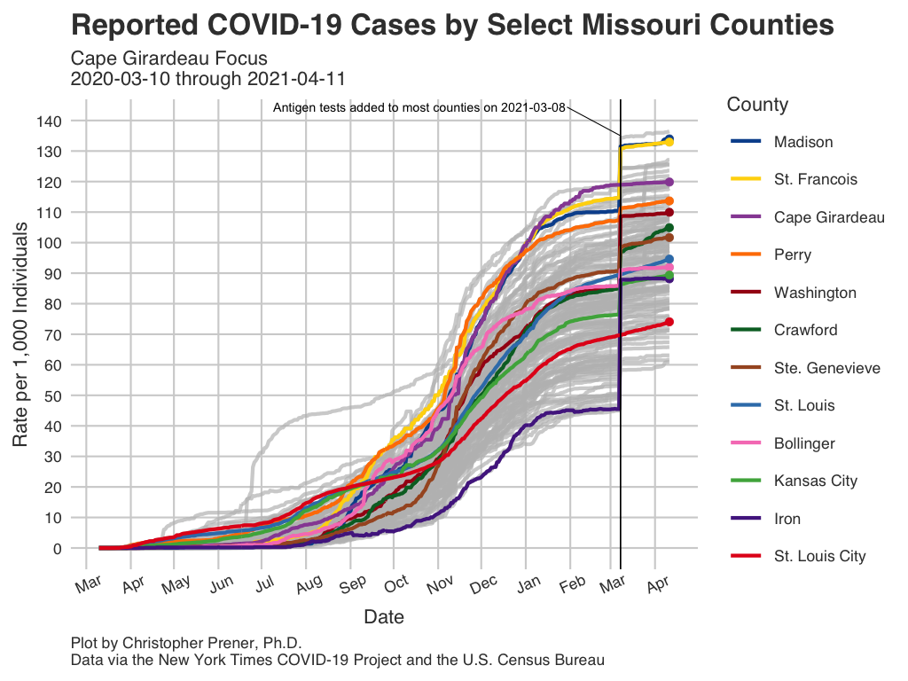
```

Download: [<a href="https://raw.githubusercontent.com/slu-openGIS/covid_daily_viz/master/results/high_res/county_cape/b_case_rate.png" target="_blank">High-res</a>] [<a href="https://raw.githubusercontent.com/slu-openGIS/covid_daily_viz/master/results/low_res/county_cape/b_case_rate.png" target="_blank">Low-res</a>]

### New Infections

```{r cape-infection-avg, echo=FALSE, out.width = '100%'}
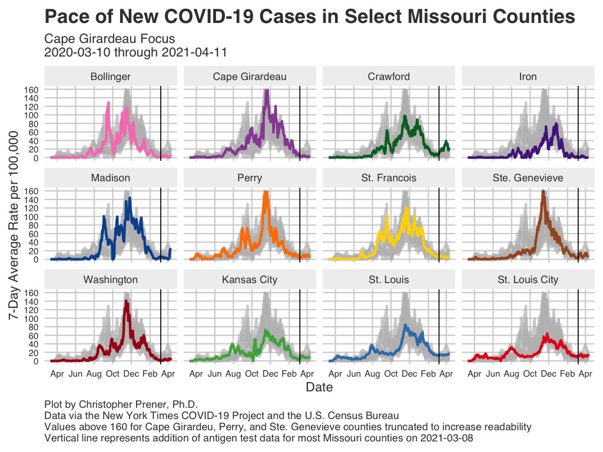
```

Download: [<a href="https://raw.githubusercontent.com/slu-openGIS/covid_daily_viz/master/results/high_res/county_cape/e_new_case.png" target="_blank">High-res</a>] [<a href="https://raw.githubusercontent.com/slu-openGIS/covid_daily_viz/master/results/low_res/county_cape/e_new_case.png" target="_blank">Low-res</a>]

### Data Table

```{r cape-infection-table, echo=FALSE, out.width = '100%'}
cape %>%
  select(report_date, county, state, cases, new_cases, case_avg, case_rate) %>%
  mutate(
    case_avg = round(case_avg, digits = 2),
    case_rate = round(case_rate, digits = 2),
    state = case_when(
      state == "Kansas" ~ "KS",
      state == "Missouri" ~ "MO"
    )
  ) %>%
  rename(
    `Report Date` = report_date,
    County = county,
    State = state,
    `Cumulative Cases` = cases,
    `New Cases` = new_cases,
    `Average New Cases` = case_avg,
    `Per Capita Rate` = case_rate
  ) -> data_table

DT::datatable(data_table, rownames= FALSE)
```

### Notes

  * The underlying data for these plots are available from [GitHub](faq.html#How_Do_I_Download_Your_Data) in the `county_full.csv` table, which is assembled from data provided by the [New York Times](faq.html#Where_Do_These_Data_Come_From).
  * The FAQ contains short explanations of [per-capita rates](faq.html#What_are_Per_Capita_Rates) and [log plots](faq.html#What_are_Log_Plots).
  * All averages presented are 7-day [rolling averages](faq.html#What_are_Rolling_Averages).
  
## Mid-Missouri {.tabset .tabset-fade .tabset-pills .padtop}
These plots show patterns in infections for a number of counties in the Mid-Missouri region of Missouri, which lies along the Missouri River to the west of St. Louis and the east of Kansas City. These include some, but not all, of the counties in the Jefferson City and Columbia <a href="faq.html#What_is_a_Metropolitan_Statistical_Area">metro areas</a>.

### Infection Rates

```{r midmo-infection-rate, echo=FALSE, out.width = '100%'}
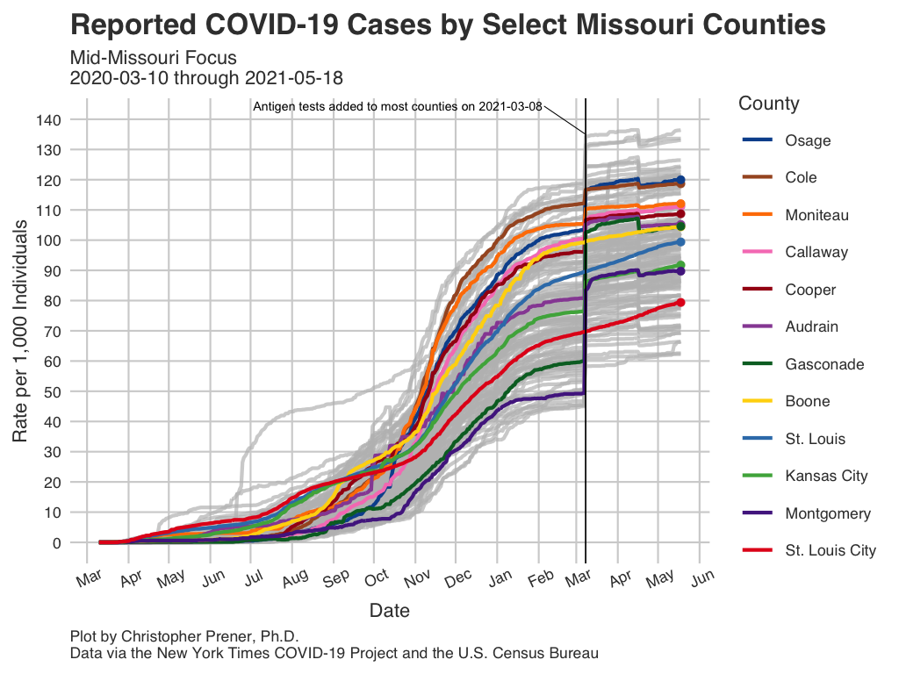
```

Download: [<a href="https://raw.githubusercontent.com/slu-openGIS/covid_daily_viz/master/results/high_res/county_midmo/b_case_rate.png" target="_blank">High-res</a>] [<a href="https://raw.githubusercontent.com/slu-openGIS/covid_daily_viz/master/results/low_res/county_midmo/b_case_rate.png" target="_blank">Low-res</a>]

### New Infections

```{r midmo-infection-avg, echo=FALSE, out.width = '100%'}
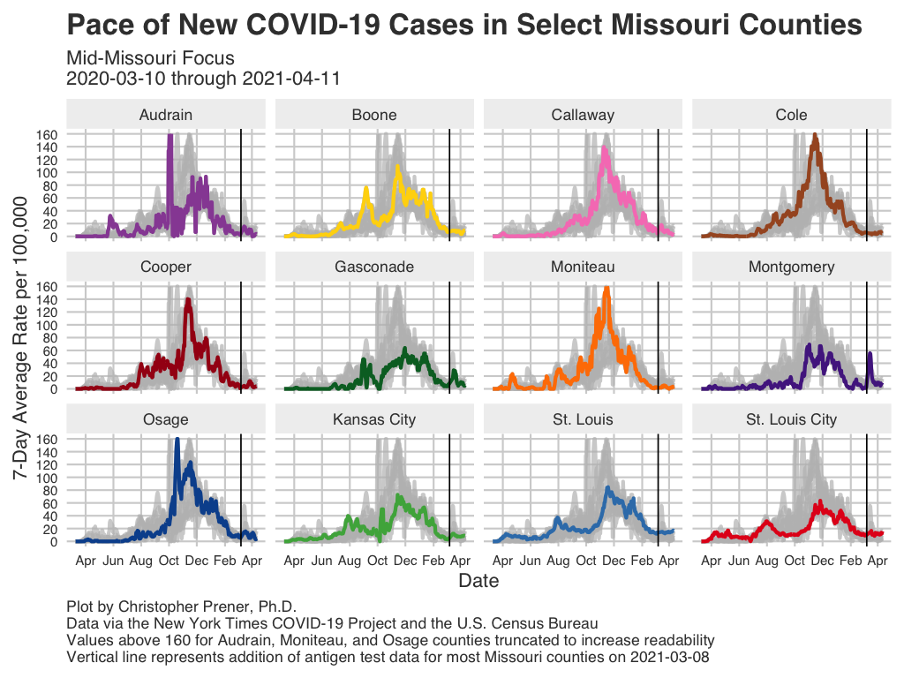
```

Download: [<a href="https://raw.githubusercontent.com/slu-openGIS/covid_daily_viz/master/results/high_res/county_midmo/e_new_case.png" target="_blank">High-res</a>] [<a href="https://raw.githubusercontent.com/slu-openGIS/covid_daily_viz/master/results/low_res/county_midmo/e_new_case.png" target="_blank">Low-res</a>]

### Data Table

```{r midmo-infection-table, echo=FALSE, out.width = '100%'}
mid_mo %>%
  select(report_date, county, state, cases, new_cases, case_avg, case_rate) %>%
  mutate(
    case_avg = round(case_avg, digits = 2),
    case_rate = round(case_rate, digits = 2),
    state = case_when(
      state == "Kansas" ~ "KS",
      state == "Missouri" ~ "MO"
    )
  ) %>%
  rename(
    `Report Date` = report_date,
    County = county,
    State = state,
    `Cumulative Cases` = cases,
    `New Cases` = new_cases,
    `Average New Cases` = case_avg,
    `Per Capita Rate` = case_rate
  ) -> data_table

DT::datatable(data_table, rownames= FALSE)
```

### Notes

  * The underlying data for these plots are available from [GitHub](faq.html#How_Do_I_Download_Your_Data) in the `county_full.csv` table, which is assembled from data provided by the [New York Times](faq.html#Where_Do_These_Data_Come_From).
  * The FAQ contains short explanations of [per-capita rates](faq.html#What_are_Per_Capita_Rates) and [log plots](faq.html#What_are_Log_Plots).
  * All averages presented are 7-day [rolling averages](faq.html#What_are_Rolling_Averages).

## Lake of the Ozarks and South-Central Missouri {.tabset .tabset-fade .tabset-pills .padtop}
These plots show patterns in infections for a number of counties in central Missouri's Lake of the Ozarks region. Camden County is the primary county at the heart of the region, containing much of Osage Beach, MO. These counties are south of the Mid-Missouri region.

### Infection Rates

```{r ozark-infection-rate, echo=FALSE, out.width = '100%'}
knitr::include_graphics("img/county_ozark/b_case_rate.png")
```

Download: [<a href="https://raw.githubusercontent.com/slu-openGIS/covid_daily_viz/master/results/high_res/county_ozark/b_case_rate.png" target="_blank">High-res</a>] [<a href="https://raw.githubusercontent.com/slu-openGIS/covid_daily_viz/master/results/low_res/county_ozark/b_case_rate.png" target="_blank">Low-res</a>]

### New Infections

```{r ozark-infection-avg, echo=FALSE, out.width = '100%'}
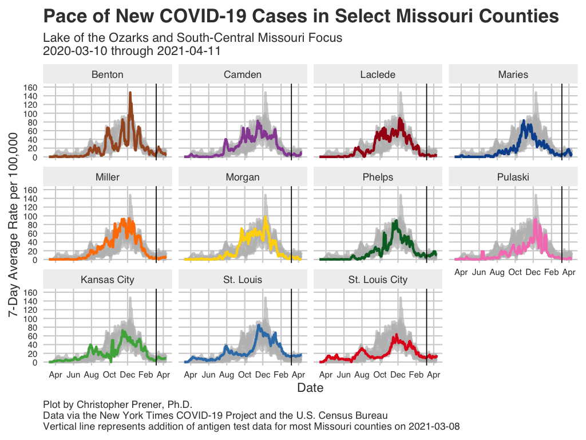
```

Download: [<a href="https://raw.githubusercontent.com/slu-openGIS/covid_daily_viz/master/results/high_res/county_ozark/e_new_case.png" target="_blank">High-res</a>] [<a href="https://raw.githubusercontent.com/slu-openGIS/covid_daily_viz/master/results/low_res/county_ozark/e_new_case.png" target="_blank">Low-res</a>]

### Data Table

```{r ozark-infection-table, echo=FALSE, out.width = '100%'}
ozark %>%
  select(report_date, county, state, cases, new_cases, case_avg, case_rate) %>%
  mutate(
    case_avg = round(case_avg, digits = 2),
    case_rate = round(case_rate, digits = 2),
    state = case_when(
      state == "Kansas" ~ "KS",
      state == "Missouri" ~ "MO"
    )
  ) %>%
  rename(
    `Report Date` = report_date,
    County = county,
    State = state,
    `Cumulative Cases` = cases,
    `New Cases` = new_cases,
    `Average New Cases` = case_avg,
    `Per Capita Rate` = case_rate
  ) -> data_table

DT::datatable(data_table, rownames= FALSE)
```

### Notes

  * The underlying data for these plots are available from [GitHub](faq.html#How_Do_I_Download_Your_Data) in the `county_full.csv` table, which is assembled from data provided by the [New York Times](faq.html#Where_Do_These_Data_Come_From).
  * The FAQ contains short explanations of [per-capita rates](faq.html#What_are_Per_Capita_Rates) and [log plots](faq.html#What_are_Log_Plots).
  * All averages presented are 7-day [rolling averages](faq.html#What_are_Rolling_Averages).

## Northeastern Missouri {.tabset .tabset-fade .tabset-pills .padtop}
These plots show patterns in infections for a number of counties in the northeastern part Missouri. These counties lie along the Mississippi River from the St. Louis Metro area north to the Iowa border.

### Infection Rates

```{r nemo-infection-rate, echo=FALSE, out.width = '100%'}
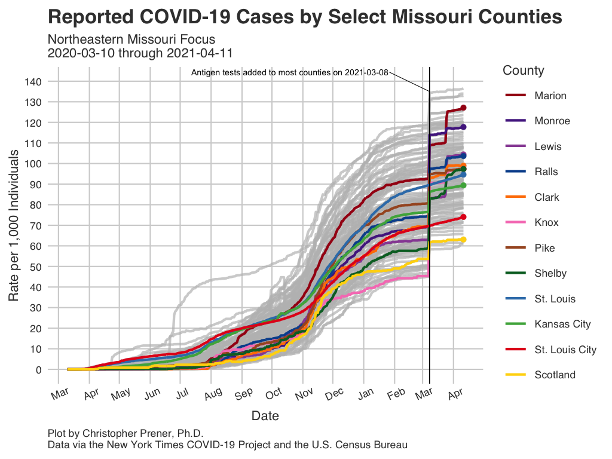
```

Download: [<a href="https://raw.githubusercontent.com/slu-openGIS/covid_daily_viz/master/results/high_res/county_nemo/b_case_rate.png" target="_blank">High-res</a>] [<a href="https://raw.githubusercontent.com/slu-openGIS/covid_daily_viz/master/results/low_res/county_nemo/b_case_rate.png" target="_blank">Low-res</a>]

### New Infections

```{r nemo-infection-avg, echo=FALSE, out.width = '100%'}
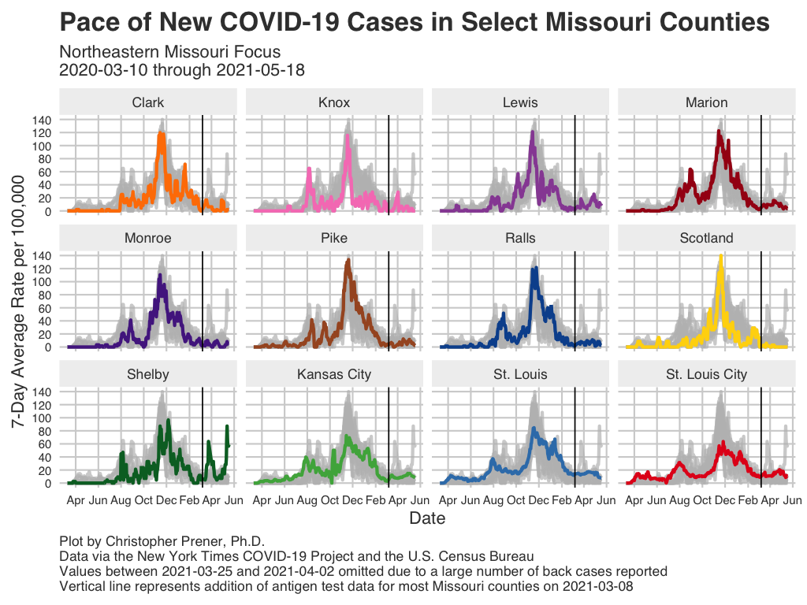
```

Download: [<a href="https://raw.githubusercontent.com/slu-openGIS/covid_daily_viz/master/results/high_res/county_nemo/e_new_case.png" target="_blank">High-res</a>] [<a href="https://raw.githubusercontent.com/slu-openGIS/covid_daily_viz/master/results/low_res/county_nemo/e_new_case.png" target="_blank">Low-res</a>]

### Data Table

```{r nemo-infection-table, echo=FALSE, out.width = '100%'}
nemo %>%
  select(report_date, county, state, cases, new_cases, case_avg, case_rate) %>%
  mutate(
    case_avg = round(case_avg, digits = 2),
    case_rate = round(case_rate, digits = 2),
    state = case_when(
      state == "Kansas" ~ "KS",
      state == "Missouri" ~ "MO"
    )
  ) %>%
  rename(
    `Report Date` = report_date,
    County = county,
    State = state,
    `Cumulative Cases` = cases,
    `New Cases` = new_cases,
    `Average New Cases` = case_avg,
    `Per Capita Rate` = case_rate
  ) -> data_table

DT::datatable(data_table, rownames= FALSE)
```

### Notes

  * The underlying data for these plots are available from [GitHub](faq.html#How_Do_I_Download_Your_Data) in the `county_full.csv` table, which is assembled from data provided by the [New York Times](faq.html#Where_Do_These_Data_Come_From).
  * The FAQ contains short explanations of [per-capita rates](faq.html#What_are_Per_Capita_Rates) and [log plots](faq.html#What_are_Log_Plots).
  * All averages presented are 7-day [rolling averages](faq.html#What_are_Rolling_Averages).

## Northern Missouri {.tabset .tabset-fade .tabset-pills .padtop}
These plots show patterns in infections for a number of counties in the northern part Missouri. These counties lie north of the Mid-Missouri region and south of the Iowa border.

### Infection Rates

```{r nomo-infection-rate, echo=FALSE, out.width = '100%'}
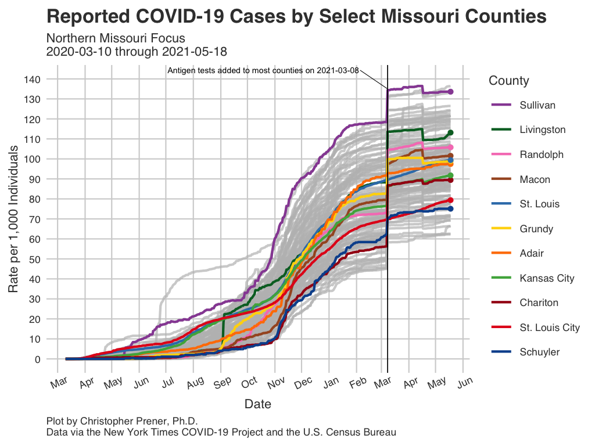
```

Download: [<a href="https://raw.githubusercontent.com/slu-openGIS/covid_daily_viz/master/results/high_res/county_nomo/b_case_rate.png" target="_blank">High-res</a>] [<a href="https://raw.githubusercontent.com/slu-openGIS/covid_daily_viz/master/results/low_res/county_nomo/b_case_rate.png" target="_blank">Low-res</a>]

### New Infections

```{r nomo-infection-avg, echo=FALSE, out.width = '100%'}
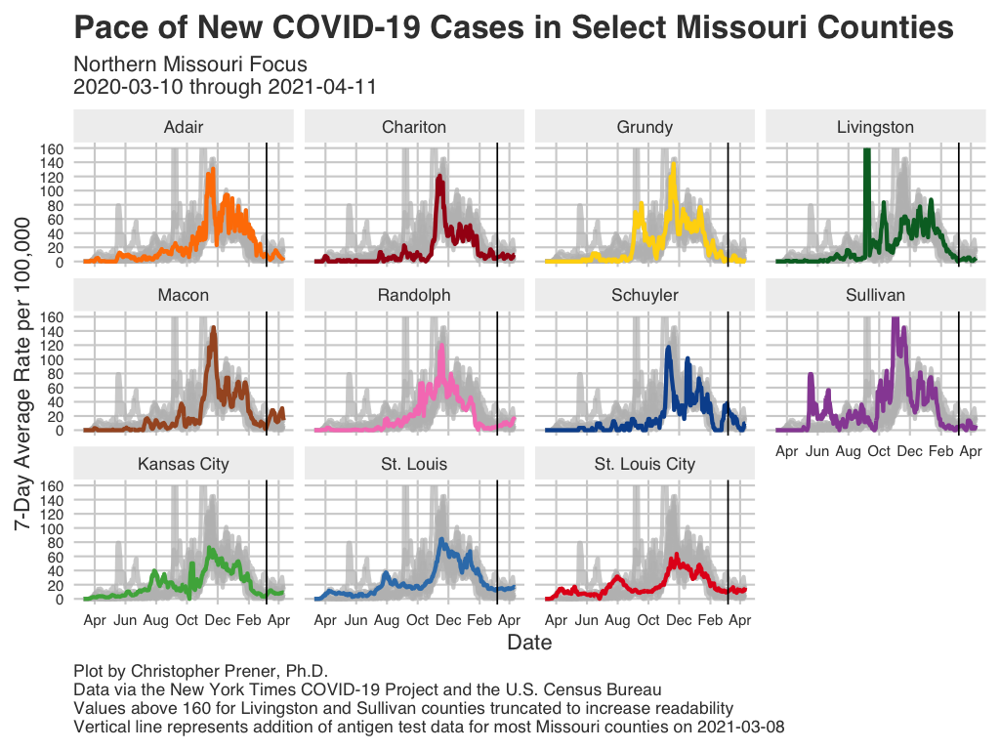
```

Download: [<a href="https://raw.githubusercontent.com/slu-openGIS/covid_daily_viz/master/results/high_res/county_nomo/e_new_case.png" target="_blank">High-res</a>] [<a href="https://raw.githubusercontent.com/slu-openGIS/covid_daily_viz/master/results/low_res/county_nomo/e_new_case.png" target="_blank">Low-res</a>]

### Data Table

```{r nomo-infection-table, echo=FALSE, out.width = '100%'}
nomo %>%
  select(report_date, county, state, cases, new_cases, case_avg, case_rate) %>%
  mutate(
    case_avg = round(case_avg, digits = 2),
    case_rate = round(case_rate, digits = 2),
    state = case_when(
      state == "Kansas" ~ "KS",
      state == "Missouri" ~ "MO"
    )
  ) %>%
  rename(
    `Report Date` = report_date,
    County = county,
    State = state,
    `Cumulative Cases` = cases,
    `New Cases` = new_cases,
    `Average New Cases` = case_avg,
    `Per Capita Rate` = case_rate
  ) -> data_table

DT::datatable(data_table, rownames= FALSE)
```

### Notes

  * The underlying data for these plots are available from [GitHub](faq.html#How_Do_I_Download_Your_Data) in the `county_full.csv` table, which is assembled from data provided by the [New York Times](faq.html#Where_Do_These_Data_Come_From).
  * The FAQ contains short explanations of [per-capita rates](faq.html#What_are_Per_Capita_Rates) and [log plots](faq.html#What_are_Log_Plots).
  * All averages presented are 7-day [rolling averages](faq.html#What_are_Rolling_Averages).

## Ozark Mountains {.tabset .tabset-fade .tabset-pills .padtop}
These plots show patterns in infections for a number of counties in the southern part Missouri. These counties lie south and east of the cities of Springfield and Branson.

### Infection Rates

```{r ozkmtn-infection-rate, echo=FALSE, out.width = '100%'}
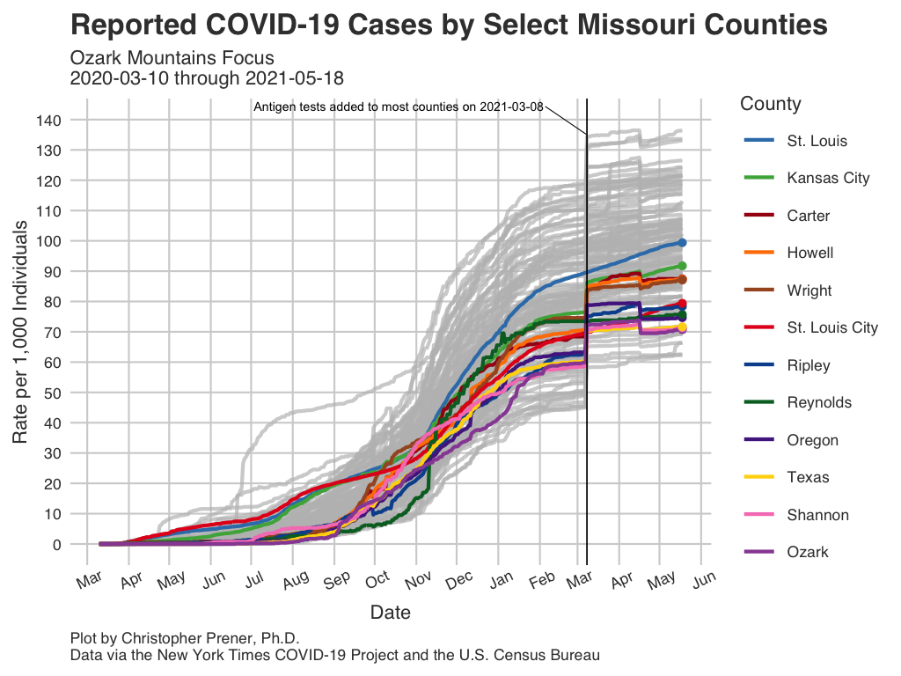
```

Download: [<a href="https://raw.githubusercontent.com/slu-openGIS/covid_daily_viz/master/results/high_res/county_ozkmtns/b_case_rate.png" target="_blank">High-res</a>] [<a href="https://raw.githubusercontent.com/slu-openGIS/covid_daily_viz/master/results/low_res/county_ozkmtns/b_case_rate.png" target="_blank">Low-res</a>]

### New Infections

```{r ozkmtn-infection-avg, echo=FALSE, out.width = '100%'}
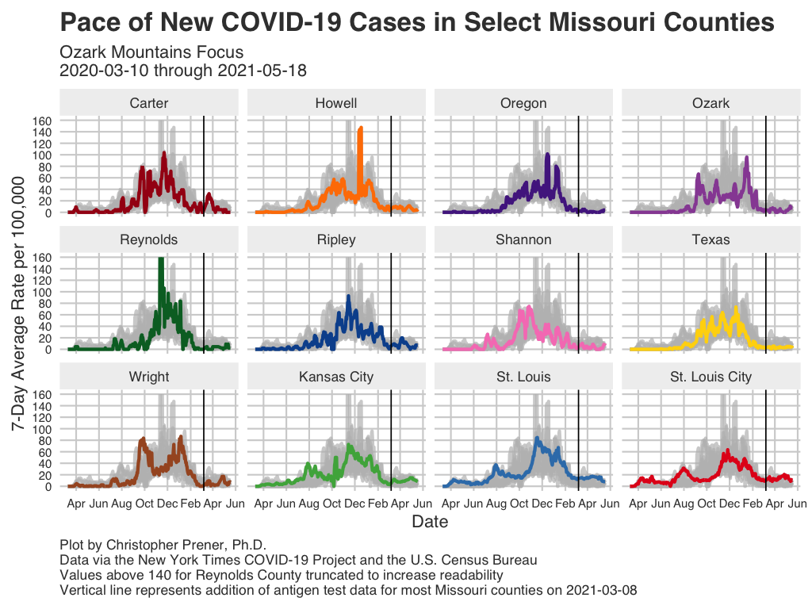
```

Download: [<a href="https://raw.githubusercontent.com/slu-openGIS/covid_daily_viz/master/results/high_res/county_ozkmtns/e_new_case.png" target="_blank">High-res</a>] [<a href="https://raw.githubusercontent.com/slu-openGIS/covid_daily_viz/master/results/low_res/county_ozkmtns/e_new_case.png" target="_blank">Low-res</a>]

### Data Table

```{r ozkmtn-infection-table, echo=FALSE, out.width = '100%'}
ozark_mtns %>%
  select(report_date, county, state, cases, new_cases, case_avg, case_rate) %>%
  mutate(
    case_avg = round(case_avg, digits = 2),
    case_rate = round(case_rate, digits = 2),
    state = case_when(
      state == "Kansas" ~ "KS",
      state == "Missouri" ~ "MO"
    )
  ) %>%
  rename(
    `Report Date` = report_date,
    County = county,
    State = state,
    `Cumulative Cases` = cases,
    `New Cases` = new_cases,
    `Average New Cases` = case_avg,
    `Per Capita Rate` = case_rate
  ) -> data_table

DT::datatable(data_table, rownames= FALSE)
```

### Notes

  * The underlying data for these plots are available from [GitHub](faq.html#How_Do_I_Download_Your_Data) in the `county_full.csv` table, which is assembled from data provided by the [New York Times](faq.html#Where_Do_These_Data_Come_From).
  * The FAQ contains short explanations of [per-capita rates](faq.html#What_are_Per_Capita_Rates) and [log plots](faq.html#What_are_Log_Plots).
  * All averages presented are 7-day [rolling averages](faq.html#What_are_Rolling_Averages).

## Southeast Missouri {.tabset .tabset-fade .tabset-pills .padtop}
These plots show patterns in infections for a number of counties in the southeastern part Missouri known as the "bootheel." These counties lie south of the Cape Girardeau <a href="faq.html#What_is_a_Metropolitan_Statistical_Area">metro area</a> along the Mississippi River.

### Infection Rates

```{r semo-infection-rate, echo=FALSE, out.width = '100%'}
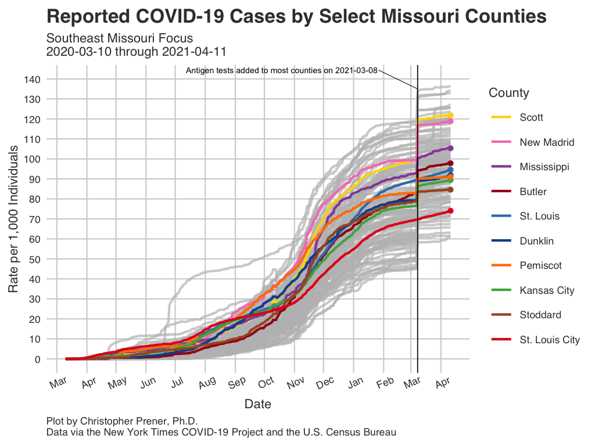
```

Download: [<a href="https://raw.githubusercontent.com/slu-openGIS/covid_daily_viz/master/results/high_res/county_semo/b_case_rate.png" target="_blank">High-res</a>] [<a href="https://raw.githubusercontent.com/slu-openGIS/covid_daily_viz/master/results/low_res/county_semo/b_case_rate.png" target="_blank">Low-res</a>]

### New Infections

```{r semo-infection-avg, echo=FALSE, out.width = '100%'}
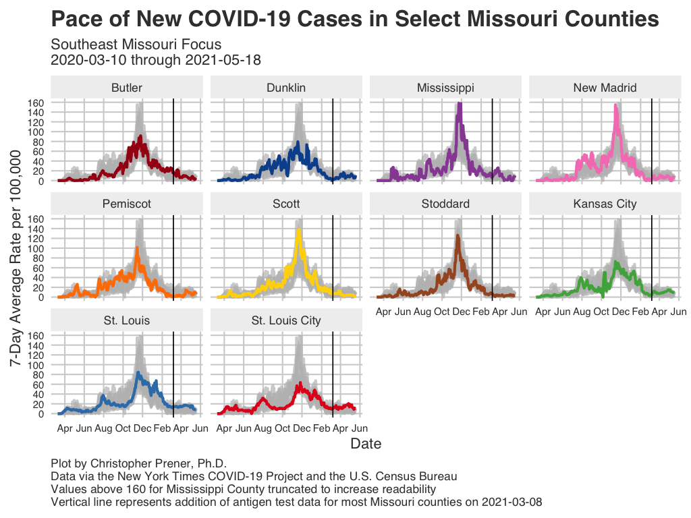
```

Download: [<a href="https://raw.githubusercontent.com/slu-openGIS/covid_daily_viz/master/results/high_res/county_semo/e_new_case.png" target="_blank">High-res</a>] [<a href="https://raw.githubusercontent.com/slu-openGIS/covid_daily_viz/master/results/low_res/county_semo/e_new_case.png" target="_blank">Low-res</a>]

### Data Table

```{r semo-infection-table, echo=FALSE, out.width = '100%'}
semo %>%
  select(report_date, county, state, cases, new_cases, case_avg, case_rate) %>%
  mutate(
    case_avg = round(case_avg, digits = 2),
    case_rate = round(case_rate, digits = 2),
    state = case_when(
      state == "Kansas" ~ "KS",
      state == "Missouri" ~ "MO"
    )
  ) %>%
  rename(
    `Report Date` = report_date,
    County = county,
    State = state,
    `Cumulative Cases` = cases,
    `New Cases` = new_cases,
    `Average New Cases` = case_avg,
    `Per Capita Rate` = case_rate
  ) -> data_table

DT::datatable(data_table, rownames= FALSE)
```

### Notes

  * The underlying data for these plots are available from [GitHub](faq.html#How_Do_I_Download_Your_Data) in the `county_full.csv` table, which is assembled from data provided by the [New York Times](faq.html#Where_Do_These_Data_Come_From).
  * The FAQ contains short explanations of [per-capita rates](faq.html#What_are_Per_Capita_Rates) and [log plots](faq.html#What_are_Log_Plots).
  * All averages presented are 7-day [rolling averages](faq.html#What_are_Rolling_Averages).

## Southwest Missouri {.tabset .tabset-fade .tabset-pills .padtop}
These plots show patterns in infections for a number of counties in the southwestern part Missouri, including parts (but not all of) of the Joplin <a href="faq.html#What_is_a_Metropolitan_Statistical_Area">metro area</a>.

### Infection Rates

```{r swmo-infection-rate, echo=FALSE, out.width = '100%'}
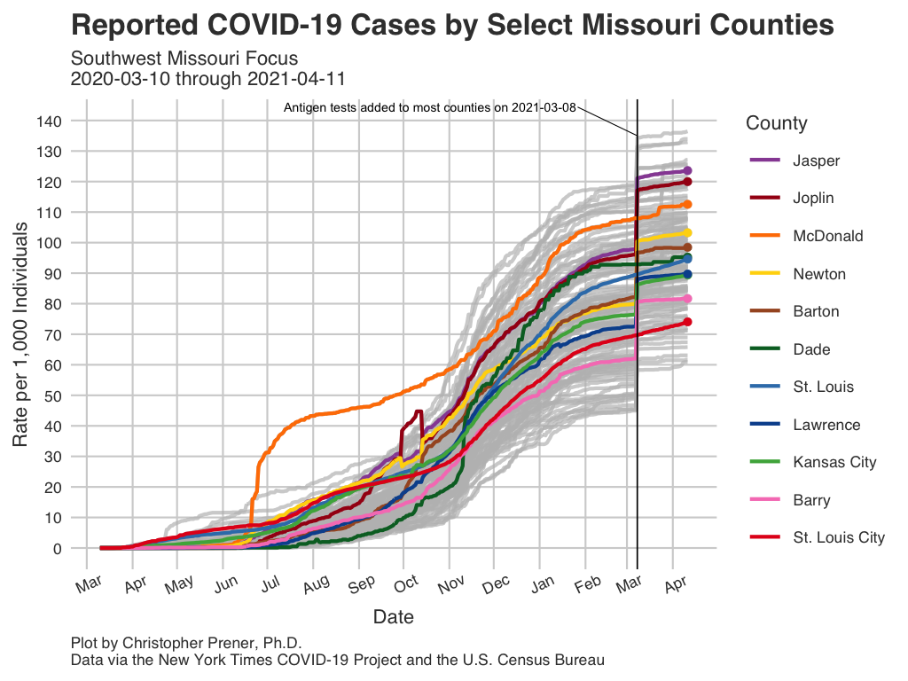
```

Download: [<a href="https://raw.githubusercontent.com/slu-openGIS/covid_daily_viz/master/results/high_res/county_swmo/b_case_rate.png" target="_blank">High-res</a>] [<a href="https://raw.githubusercontent.com/slu-openGIS/covid_daily_viz/master/results/low_res/county_swmo/b_case_rate.png" target="_blank">Low-res</a>]

### New Infections

```{r swmo-infection-avg, echo=FALSE, out.width = '100%'}
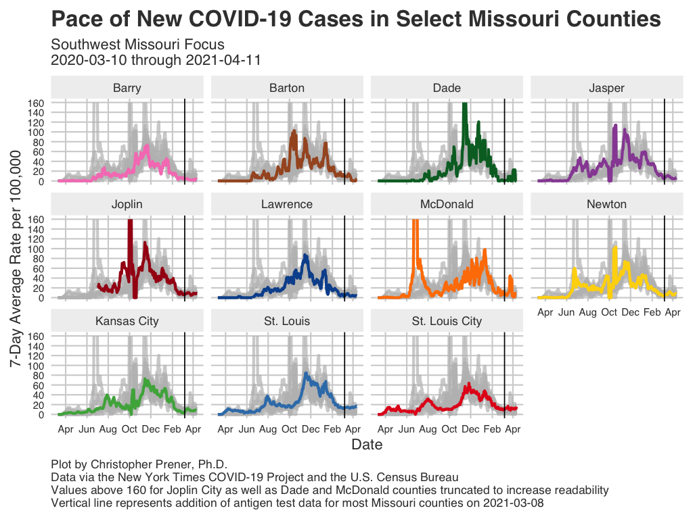
```

Download: [<a href="https://raw.githubusercontent.com/slu-openGIS/covid_daily_viz/master/results/high_res/county_swmo/e_new_case.png" target="_blank">High-res</a>] [<a href="https://raw.githubusercontent.com/slu-openGIS/covid_daily_viz/master/results/low_res/county_swmo/e_new_case.png" target="_blank">Low-res</a>]

### Data Table

```{r swmo-infection-table, echo=FALSE, out.width = '100%'}
swmo %>%
  select(report_date, county, state, cases, new_cases, case_avg, case_rate) %>%
  mutate(
    case_avg = round(case_avg, digits = 2),
    case_rate = round(case_rate, digits = 2),
    state = case_when(
      state == "Kansas" ~ "KS",
      state == "Missouri" ~ "MO"
    )
  ) %>%
  rename(
    `Report Date` = report_date,
    County = county,
    State = state,
    `Cumulative Cases` = cases,
    `New Cases` = new_cases,
    `Average New Cases` = case_avg,
    `Per Capita Rate` = case_rate
  ) -> data_table

DT::datatable(data_table, rownames= FALSE)
```

### Notes

  * The underlying data for these plots are available from [GitHub](faq.html#How_Do_I_Download_Your_Data) in the `county_full.csv` table, which is assembled from data provided by the [New York Times](faq.html#Where_Do_These_Data_Come_From).
  * The FAQ contains short explanations of [per-capita rates](faq.html#What_are_Per_Capita_Rates) and [log plots](faq.html#What_are_Log_Plots).
  * All averages presented are 7-day [rolling averages](faq.html#What_are_Rolling_Averages).

## Springfield {.tabset .tabset-fade .tabset-pills .padtop}
These plots show patterns in infections for a number of counties near Springfield and Branson, Missouri. This region lies between Lake of the Ozarks and the Joplin metro, and includes parts (but not all of) of the Springfield <a href="faq.html#What_is_a_Metropolitan_Statistical_Area">metro area</a>.

### Infection Rates

```{r spring-infection-rate, echo=FALSE, out.width = '100%'}
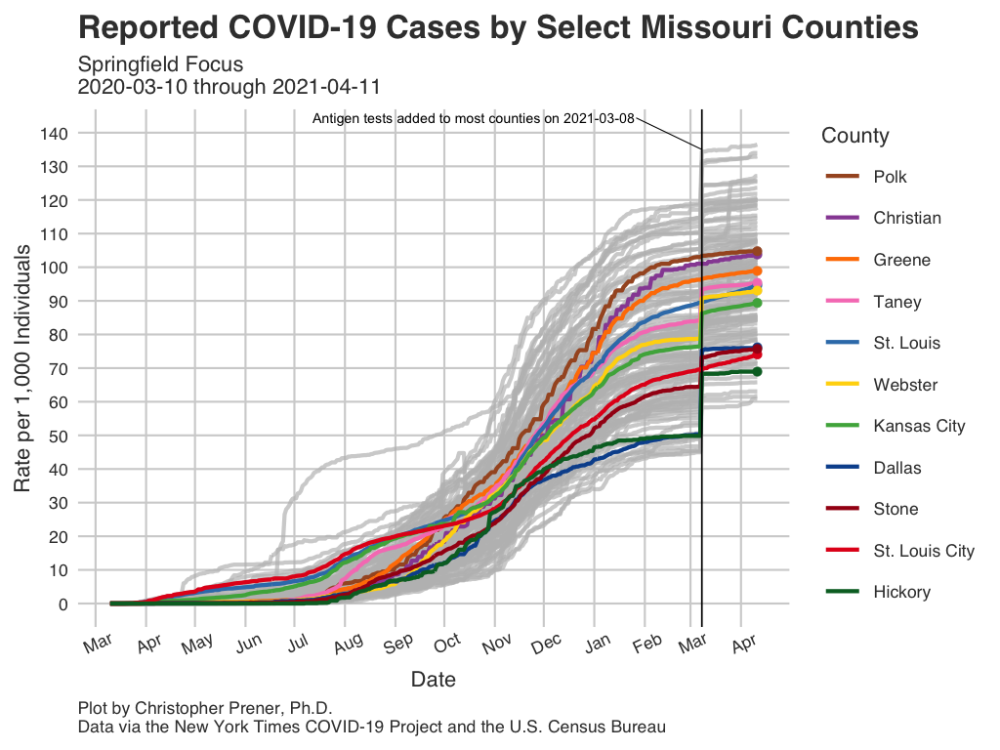
```

Download: [<a href="https://raw.githubusercontent.com/slu-openGIS/covid_daily_viz/master/results/high_res/county_spring/b_case_rate.png" target="_blank">High-res</a>] [<a href="https://raw.githubusercontent.com/slu-openGIS/covid_daily_viz/master/results/low_res/county_spring/b_case_rate.png" target="_blank">Low-res</a>]

### New Infections

```{r spring-infection-avg, echo=FALSE, out.width = '100%'}
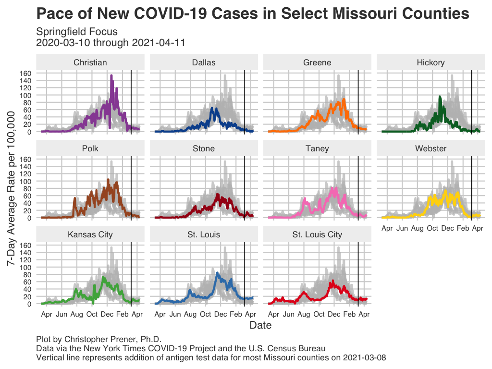
```

Download: [<a href="https://raw.githubusercontent.com/slu-openGIS/covid_daily_viz/master/results/high_res/county_spring/e_new_case.png" target="_blank">High-res</a>] [<a href="https://raw.githubusercontent.com/slu-openGIS/covid_daily_viz/master/results/low_res/county_spring/e_new_case.png" target="_blank">Low-res</a>]

### Data Table

```{r spring-infection-table, echo=FALSE, out.width = '100%'}
spring %>%
  select(report_date, county, state, cases, new_cases, case_avg, case_rate) %>%
  mutate(
    case_avg = round(case_avg, digits = 2),
    case_rate = round(case_rate, digits = 2),
    state = case_when(
      state == "Kansas" ~ "KS",
      state == "Missouri" ~ "MO"
    )
  ) %>%
  rename(
    `Report Date` = report_date,
    County = county,
    State = state,
    `Cumulative Cases` = cases,
    `New Cases` = new_cases,
    `Average New Cases` = case_avg,
    `Per Capita Rate` = case_rate
  ) -> data_table

DT::datatable(data_table, rownames= FALSE)
```

### Notes

  * The underlying data for these plots are available from [GitHub](faq.html#How_Do_I_Download_Your_Data) in the `county_full.csv` table, which is assembled from data provided by the [New York Times](faq.html#Where_Do_These_Data_Come_From).
  * The FAQ contains short explanations of [per-capita rates](faq.html#What_are_Per_Capita_Rates) and [log plots](faq.html#What_are_Log_Plots).
  * All averages presented are 7-day [rolling averages](faq.html#What_are_Rolling_Averages).

## St. Joseph and Northwestern Missouri {.tabset .tabset-fade .tabset-pills .padtop}
These plots show patterns in infections for a number of counties in the northwestern part Missouri, including parts (but not all of) of the St. Joseph <a href="faq.html#What_is_a_Metropolitan_Statistical_Area">metro area</a>. These counties lie just to the north of the Kansas City <a href="faq.html#What_is_a_Metropolitan_Statistical_Area">metro area</a> along the Missouri River.

### Infection Rates

```{r st_jo-infection-rate, echo=FALSE, out.width = '100%'}
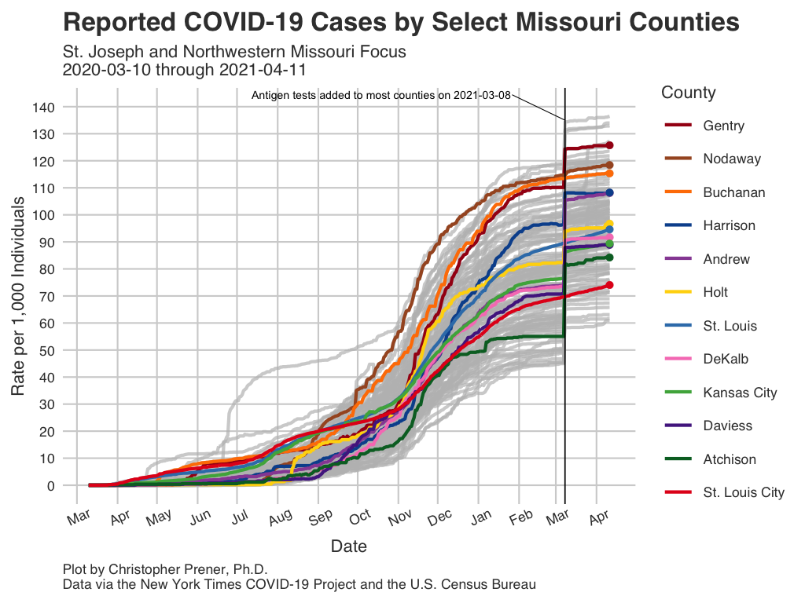
```

Download: [<a href="https://raw.githubusercontent.com/slu-openGIS/covid_daily_viz/master/results/high_res/county_stjo/b_case_rate.png" target="_blank">High-res</a>] [<a href="https://raw.githubusercontent.com/slu-openGIS/covid_daily_viz/master/results/low_res/county_stjo/b_case_rate.png" target="_blank">Low-res</a>]

### New Infections

```{r st_jo-infection-avg, echo=FALSE, out.width = '100%'}
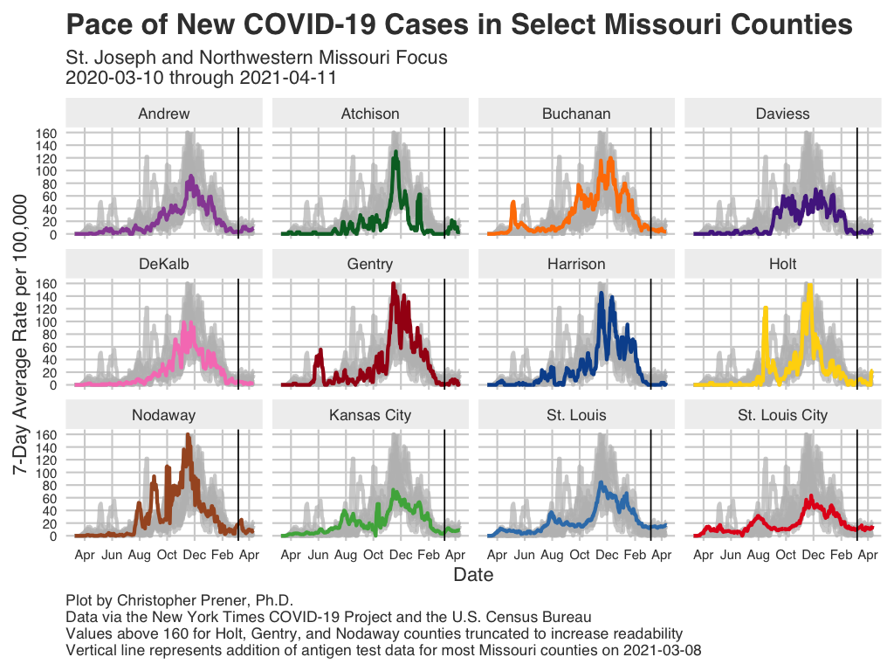
```

Download: [<a href="https://raw.githubusercontent.com/slu-openGIS/covid_daily_viz/master/results/high_res/county_stjo/e_new_case.png" target="_blank">High-res</a>] [<a href="https://raw.githubusercontent.com/slu-openGIS/covid_daily_viz/master/results/low_res/county_stjo/e_new_case.png" target="_blank">Low-res</a>]

### Data Table

```{r st_jo-infection-table, echo=FALSE, out.width = '100%'}
st_jo %>%
  select(report_date, county, state, cases, new_cases, case_avg, case_rate) %>%
  mutate(
    case_avg = round(case_avg, digits = 2),
    case_rate = round(case_rate, digits = 2),
    state = case_when(
      state == "Kansas" ~ "KS",
      state == "Missouri" ~ "MO"
    )
  ) %>%
  rename(
    `Report Date` = report_date,
    County = county,
    State = state,
    `Cumulative Cases` = cases,
    `New Cases` = new_cases,
    `Average New Cases` = case_avg,
    `Per Capita Rate` = case_rate
  ) -> data_table

DT::datatable(data_table, rownames= FALSE)
```

### Notes

  * The underlying data for these plots are available from [GitHub](faq.html#How_Do_I_Download_Your_Data) in the `county_full.csv` table, which is assembled from data provided by the [New York Times](faq.html#Where_Do_These_Data_Come_From).
  * The FAQ contains short explanations of [per-capita rates](faq.html#What_are_Per_Capita_Rates) and [log plots](faq.html#What_are_Log_Plots).
  * All averages presented are 7-day [rolling averages](faq.html#What_are_Rolling_Averages).

## West-Central Missouri {.tabset .tabset-fade .tabset-pills .padtop}
These plots show patterns in infections for a number of counties that lie along the Missouri River between Mid-MO and Kansas City. 

### Infection Rates

```{r west-infection-rate, echo=FALSE, out.width = '100%'}
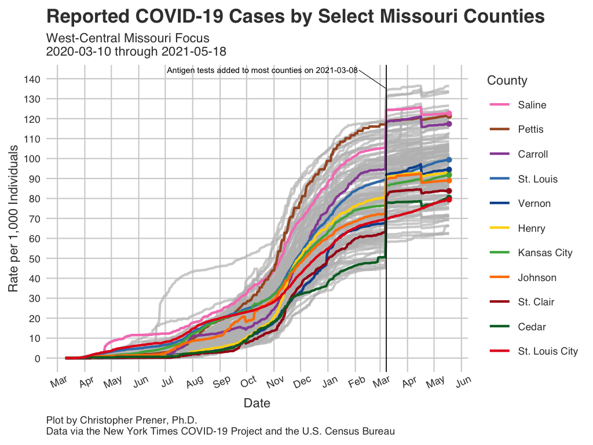
```

Download: [<a href="https://raw.githubusercontent.com/slu-openGIS/covid_daily_viz/master/results/high_res/county_west/b_case_rate.png" target="_blank">High-res</a>] [<a href="https://raw.githubusercontent.com/slu-openGIS/covid_daily_viz/master/results/low_res/county_west/b_case_rate.png" target="_blank">Low-res</a>]

### New Infections

```{r west-infection-avg, echo=FALSE, out.width = '100%'}
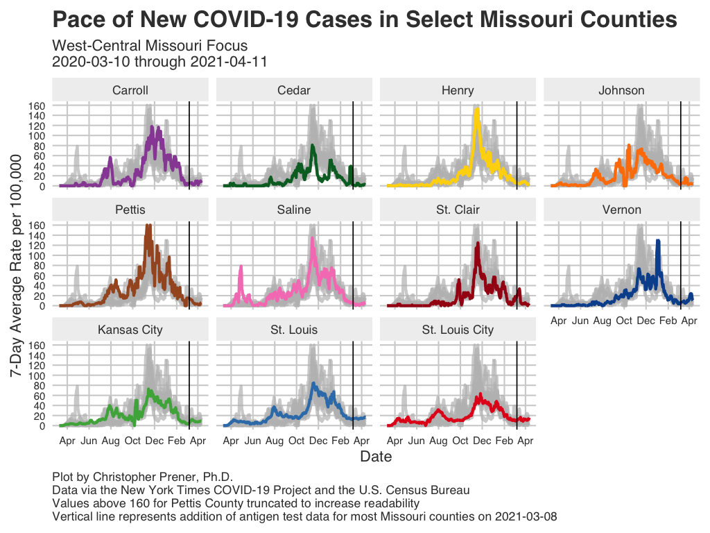
```

Download: [<a href="https://raw.githubusercontent.com/slu-openGIS/covid_daily_viz/master/results/high_res/county_west/e_new_case.png" target="_blank">High-res</a>] [<a href="https://raw.githubusercontent.com/slu-openGIS/covid_daily_viz/master/results/low_res/county_west/e_new_case.png" target="_blank">Low-res</a>]

### Data Table

```{r west-infection-table, echo=FALSE, out.width = '100%'}
west %>%
  select(report_date, county, state, cases, new_cases, case_avg, case_rate) %>%
  mutate(
    case_avg = round(case_avg, digits = 2),
    case_rate = round(case_rate, digits = 2),
    state = case_when(
      state == "Kansas" ~ "KS",
      state == "Missouri" ~ "MO"
    )
  ) %>%
  rename(
    `Report Date` = report_date,
    County = county,
    State = state,
    `Cumulative Cases` = cases,
    `New Cases` = new_cases,
    `Average New Cases` = case_avg,
    `Per Capita Rate` = case_rate
  ) -> data_table

DT::datatable(data_table, rownames= FALSE)
```

### Notes

  * The underlying data for these plots are available from [GitHub](faq.html#How_Do_I_Download_Your_Data) in the `county_full.csv` table, which is assembled from data provided by the [New York Times](faq.html#Where_Do_These_Data_Come_From).
  * The FAQ contains short explanations of [per-capita rates](faq.html#What_are_Per_Capita_Rates) and [log plots](faq.html#What_are_Log_Plots).
  * All averages presented are 7-day [rolling averages](faq.html#What_are_Rolling_Averages).
  