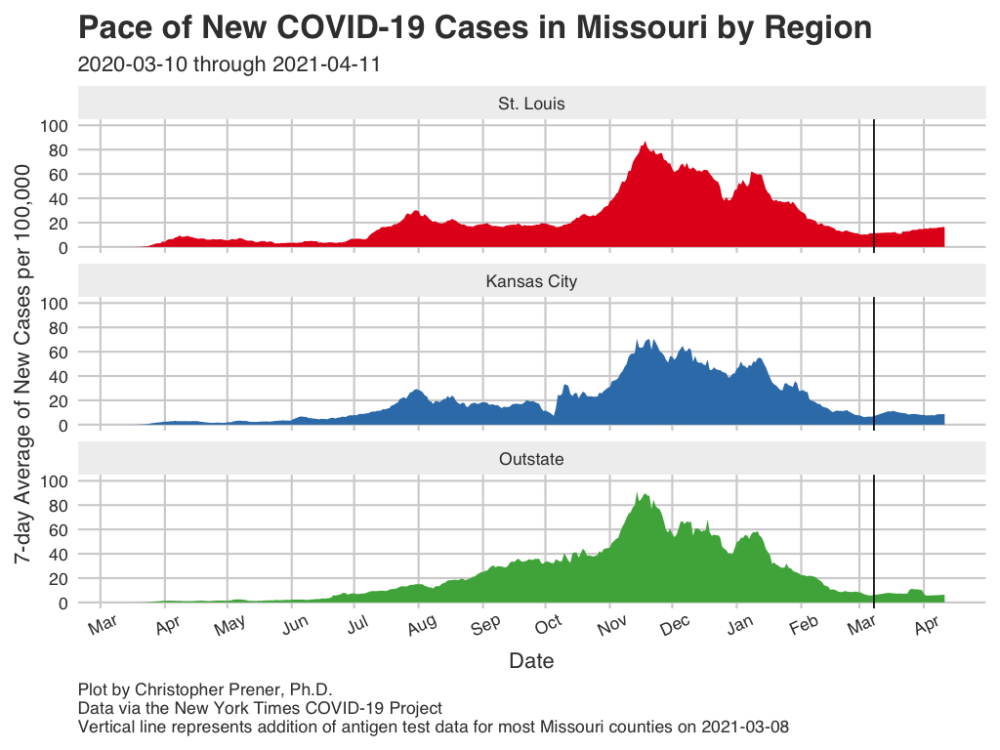
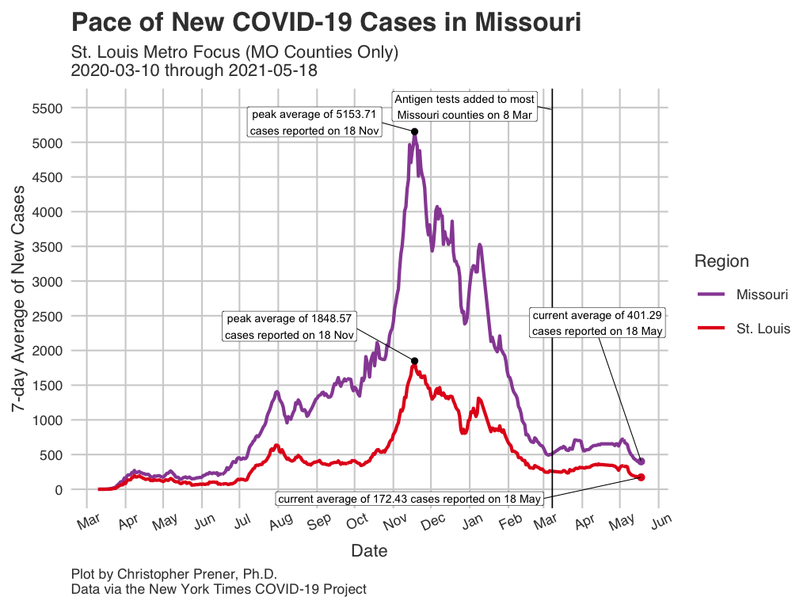
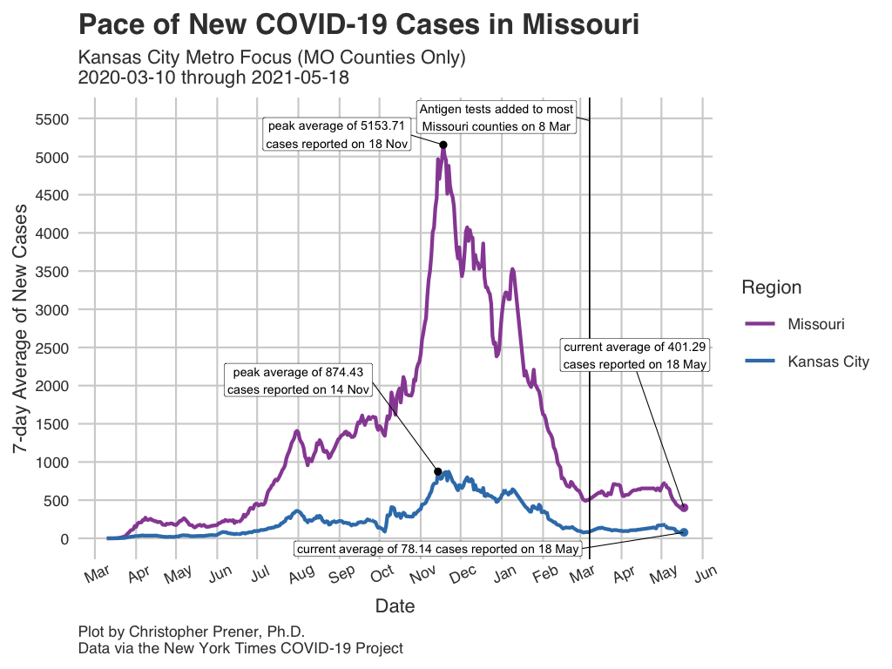
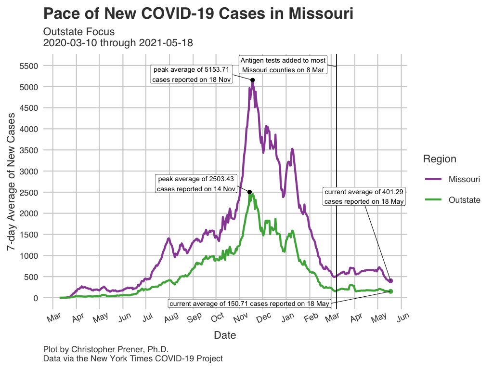
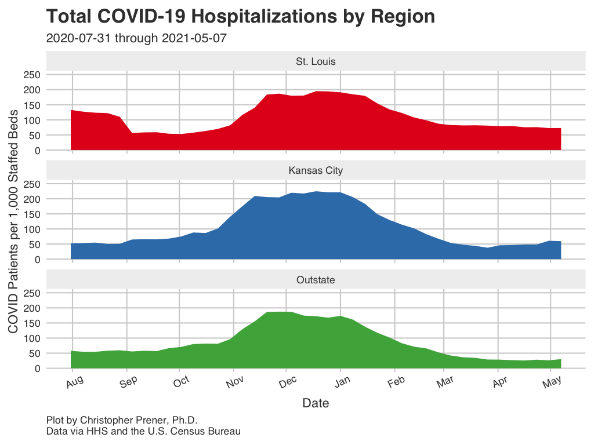

```{r setup, include=FALSE}
knitr::opts_chunk$set(echo = TRUE)

# dependencies
library(dplyr)
library(readr)

# load data
regional_data <- read_csv(here::here("data", "MO_HEALTH_Covid_Tracking", "data", "region", 
                                     "region_meso.csv")) %>%
  filter(report_date >= "2020-03-07") %>%
  arrange(desc(report_date), region)

regional_hosp <- read_csv(here::here("data", "MO_HEALTH_Covid_Tracking", "data", "region", 
                                     "region_meso_hospital.csv")) %>%
  arrange(desc(report_date), region)
```

The following plots and maps focus on three "meso regions" in Missouri. The St. Louis and Kansas City regions only contain the Missouri countiesin those regionals, so the 7-day averages will be different than the values reported for the [full regionalpolitan statistical areas](regionals.html). The "outstate" region borrows a term used occasionally to describe areas outside of St. Louis and Kansas City. It includes all Missouri counties not included in either the St. Louis pr Kansas City MSAs.

## Infections {.tabset .tabset-fade .tabset-pills .padtop}
These plots show patterns in infections for these three meso regions.

### All Meso Regions

```{r region-all, echo=FALSE, out.width = '100%'}

```

Download: [<a href="https://raw.githubusercontent.com/slu-openGIS/covid_daily_viz/master/results/high_res/regional/a_avg_all.png" target="_blank">High-res</a>] [<a href="https://raw.githubusercontent.com/slu-openGIS/covid_daily_viz/master/results/low_res/regional/a_avg_all.png" target="_blank">Low-res</a>]

### St. Louis

```{r region-stl, echo=FALSE, out.width = '100%'}

```

Download: [<a href="https://raw.githubusercontent.com/slu-openGIS/covid_daily_viz/master/results/high_res/regional/b_avg_stl.png" target="_blank">High-res</a>] [<a href="https://raw.githubusercontent.com/slu-openGIS/covid_daily_viz/master/results/low_res/regional/b_avg_stl.png" target="_blank">Low-res</a>]

### Kansas City

```{r region-kc, echo=FALSE, out.width = '100%'}

```

Download: [<a href="https://raw.githubusercontent.com/slu-openGIS/covid_daily_viz/master/results/high_res/regional/c_avg_kc.png" target="_blank">High-res</a>] [<a href="https://raw.githubusercontent.com/slu-openGIS/covid_daily_viz/master/results/low_res/regional/c_avg_kc.png" target="_blank">Low-res</a>]

### Outstate

```{r region-outstate, echo=FALSE, out.width = '100%'}

```

Download: [<a href="https://raw.githubusercontent.com/slu-openGIS/covid_daily_viz/master/results/high_res/regional/d_avg_outstate.png" target="_blank">High-res</a>] [<a href="https://raw.githubusercontent.com/slu-openGIS/covid_daily_viz/master/results/low_res/regional/d_avg_outstate.png" target="_blank">Low-res</a>]

### Data Table

```{r regional-infection-table, echo=FALSE, out.width = '100%', eval=FALSE}
regional_data %>%
  select(report_date, region, new_cases, case_avg, case_avg_rate) %>%
  mutate(
    case_avg = round(case_avg, digits = 2),
    case_avg_rate = round(case_avg_rate, digits = 2)
  ) %>%
  rename(
    `Report Date` = report_date,
    Region = region,
    `New Cases` = new_cases,
    `Average New Cases` = case_avg,
    `Per Capita Rate` = case_avg_rate
  ) -> data_table

DT::datatable(data_table, rownames= FALSE)
```

### Notes

  * The underlying data for these plots are available from [GitHub](faq.html#How_Do_I_Download_Your_Data) the `county_full.csv` and `state_full.csv` tables, which are assembled from data provided by the [New York Times](faq.html#Where_Do_These_Data_Come_From).
  * The FAQ contains a short explanation of [per-capita rates](faq.html#What_are_Per_Capita_Rates).
  * All averages presented are 7-day [rolling averages](faq.html#What_are_Rolling_Averages).

## Hospitalizations {.tabset .tabset-fade .tabset-pills .padtop}
These plots show patterns in hospitalizations for these three meso regions. The federal government only began collecting these data systematically in mid-summer, and so these data do not reflect hospitalization patterns at the beginning of the pandemic.

### Current Total In-Patients

```{r region-hosp, echo=FALSE, out.width = '100%'}

```

Download: [<a href="https://raw.githubusercontent.com/slu-openGIS/covid_daily_viz/master/results/high_res/regional/o_in_pt.png" target="_blank">High-res</a>] [<a href="https://raw.githubusercontent.com/slu-openGIS/covid_daily_viz/master/results/low_res/regional/o_in_pt.png" target="_blank">Low-res</a>]

### Data Table

```{r region-hosp-table, echo=FALSE, out.width = '100%'}
regional_hosp %>%
  select(report_date, region, adult_covid, covid_per_cap) %>%
  mutate(
    adult_covid = round(adult_covid, digits = 2),
    covid_per_cap = round(covid_per_cap, digits = 2)
  ) %>%
  rename(
    `Report Date` = report_date,
    Region = region,
    `7-day Average Adult COVID Patients` = adult_covid,
    `7-day Average Adult COVID Patients Per Capita` = covid_per_cap,
  ) -> data_table

DT::datatable(data_table, rownames= FALSE)
```

  