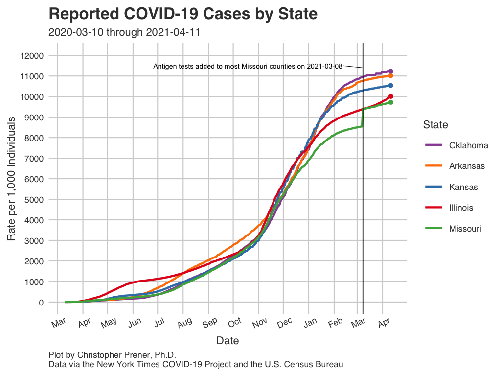
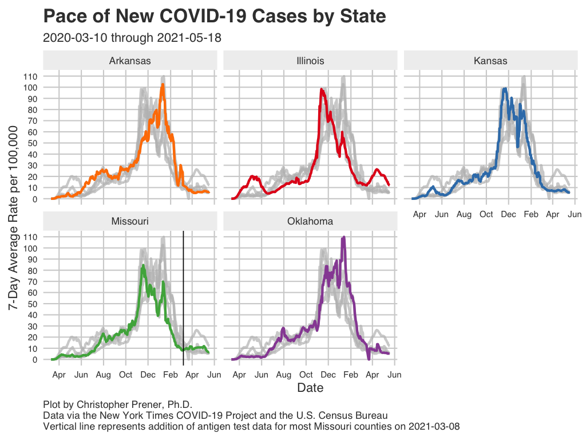
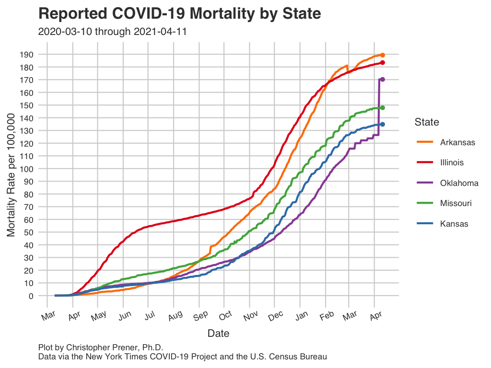
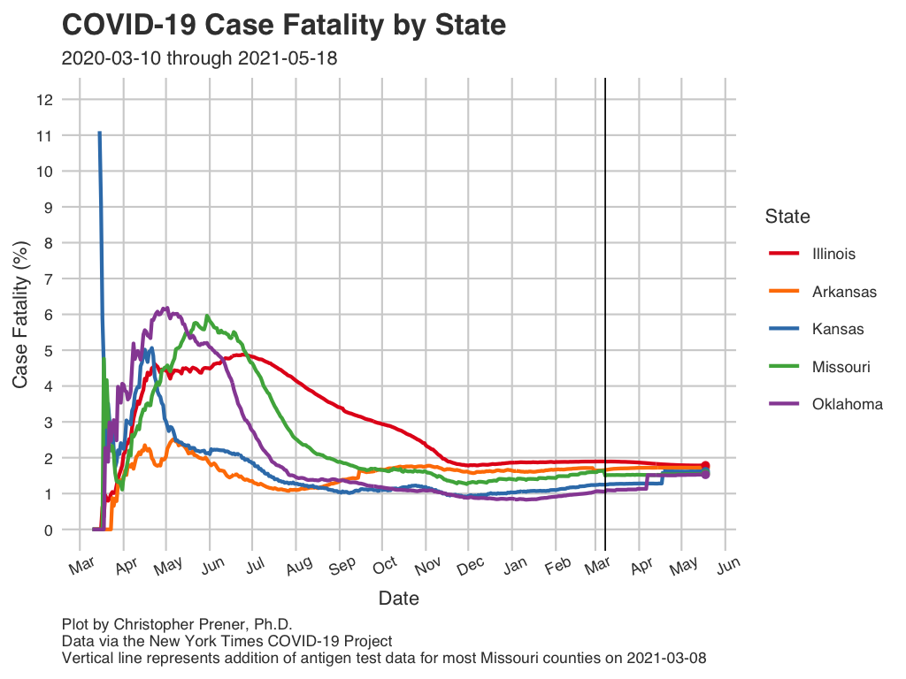

```{r setup, include=FALSE}
knitr::opts_chunk$set(echo = TRUE)

# dependencies
library(dplyr)
library(readr)

# load data
state_data <- read_csv(here::here("data", "MO_HEALTH_Covid_Tracking", "data", "state", "state_full.csv")) %>%
  filter(report_date >= "2020-03-07") %>%
  arrange(desc(report_date), state)

state_test_data <- read_csv(here::here("data", "MO_HEALTH_Covid_Tracking", "data", "state", "state_testing.csv")) %>%
  arrange(desc(report_date), state)

state_live_data <- read_csv(here::here("data", "MO_HEALTH_Covid_Tracking", "data", "state", "state_live_tests.csv")) %>%
  arrange(desc(report_date))
```

The following plots and maps focus on a number of states surrounding Missouri in order to provide a comparison for our own state-level trends. The focal states in this section are currently Arkansas, Illinois, Kansas, and Oklahoma in addition to Missouri itself.

## Infections {.tabset .tabset-fade .tabset-pills .padtop}
These plots show patterns in infections for the focal states.

### Infection Rates

```{r state-infection-rate, echo=FALSE, out.width = '100%'}

```

Download: [<a href="https://raw.githubusercontent.com/slu-openGIS/covid_daily_viz/master/results/high_res/state/b_case_rate.png" target="_blank">High-res</a>] [<a href="https://raw.githubusercontent.com/slu-openGIS/covid_daily_viz/master/results/low_res/state/b_case_rate.png" target="_blank">Low-res</a>]

### New Infections

```{r state-infection-avg, echo=FALSE, out.width = '100%'}

```

Download: [<a href="https://raw.githubusercontent.com/slu-openGIS/covid_daily_viz/master/results/high_res/state/e_new_case.png" target="_blank">High-res</a>] [<a href="https://raw.githubusercontent.com/slu-openGIS/covid_daily_viz/master/results/low_res/state/e_new_case.png" target="_blank">Low-res</a>]

### Data Table

```{r state-infection-table, echo=FALSE, out.width = '100%'}
state_data %>%
  select(report_date, state, cases, new_cases, case_avg, case_rate) %>%
  mutate(
    case_avg = round(case_avg, digits = 2),
    case_rate = round(case_rate, digits = 2)
  ) %>%
  rename(
    `Report Date` = report_date,
    State = state,
    `Cumulative Cases` = cases,
    `New Cases` = new_cases,
    `Average New Cases` = case_avg,
    `Per Capita Rate` = case_rate
  ) -> data_table

DT::datatable(data_table, rownames= FALSE)
```

### Notes

  * The underlying data for these plots are available from [GitHub](faq.html#How_Do_I_Download_Your_Data) in the `state_full.csv` table, which is assembled from data provided by the [New York Times](faq.html#Where_Do_These_Data_Come_From).
  * The FAQ contains short explanations of [per-capita rates](faq.html#What_are_Per_Capita_Rates) and [log plots](faq.html#What_are_Log_Plots). Note that the rates presented for testing data are per 100,000 individuals.
  * All averages presented are 7-day [rolling averages](faq.html#What_are_Rolling_Averages).

## Mortality {.tabset .tabset-fade .tabset-pills .padtop}
These plots show patterns in deaths for the focal states.

### Mortality Rates

```{r state-death-rate, echo=FALSE, out.width = '100%'}

```

Download: [<a href="https://raw.githubusercontent.com/slu-openGIS/covid_daily_viz/master/results/high_res/state/h_mortality_rate.png" target="_blank">High-res</a>] [<a href="https://raw.githubusercontent.com/slu-openGIS/covid_daily_viz/master/results/low_res/state/h_mortality_rate.png" target="_blank">Low-res</a>]

### Case Fatality Rate

```{r state-cfr, echo=FALSE, out.width = '100%'}

```

Download: [<a href="https://raw.githubusercontent.com/slu-openGIS/covid_daily_viz/master/results/high_res/state/m_case_fatality_rate.png" target="_blank">High-res</a>] [<a href="https://raw.githubusercontent.com/slu-openGIS/covid_daily_viz/master/results/low_res/state/m_case_fatality_rate.png" target="_blank">Low-res</a>]

### Data Table

```{r state-death-table, echo=FALSE, out.width = '100%'}
state_data %>%
  select(report_date, state, deaths, new_deaths, deaths_avg, mortality_rate, case_fatality_rate) %>%
  mutate(
    deaths_avg = round(deaths_avg, digits = 2),
    mortality_rate = round(mortality_rate, digits = 2),
    case_fatality_rate = round(case_fatality_rate, digits = 2)
  ) %>%
  rename(
    `Report Date` = report_date,
    State = state,
    `Cumulative Deaths` = deaths,
    `New Deaths` = new_deaths,
    `Average New Deaths` = deaths_avg,
    `Per Capita Rate` = mortality_rate,
    CFR = case_fatality_rate
  ) -> data_table

DT::datatable(data_table, rownames= FALSE)
```

### Notes

  * The underlying data for these plots are available from [GitHub](faq.html#How_Do_I_Download_Your_Data) in the `state_full.csv` table, which is assembled from data provided by the [New York Times](faq.html#Where_Do_These_Data_Come_From).
  * The FAQ contains short explanations of [per-capita rates](faq.html#What_are_Per_Capita_Rates) and [log plots](faq.html#What_are_Log_Plots). Note that the rates presented for testing data are per 100,000 individuals.
  * All averages presented are 7-day [rolling averages](faq.html#What_are_Rolling_Averages).
  * The abbreviation "CFR" states for case fatality rate (the number of deaths divided by the number of known cases, expressed as a percentage).
  