```{r setup, include=FALSE}
knitr::opts_chunk$set(echo = TRUE)

# dependencies
library(dplyr)
library(leaflet)
library(readr)
library(sf)

library(ggplot2)

# functions
source(here::here("source", "functions", "map_breaks.R"))
source(here::here("source", "functions", "round_any.R"))

# load data
county_data <- read_csv(here::here("data", "MO_HEALTH_Covid_Tracking", "data", "county", "county_full.csv")) %>%
  filter(geoid %in% c("17005", "17013", "17027", "17083", "17117", 
               "17119", "17133", "17163", "29071", "29099", 
               "29113", "29183", "29189", "29219", "29510")) %>%
  filter(report_date >= "2020-03-07") %>%
  arrange(desc(report_date), county)

regional_counties <- st_read(here::here("data", "MO_HEALTH_Covid_Tracking", "data", "county", "daily_snapshot_mo_xl.geojson")) %>%
  filter(GEOID %in% c("17005", "17013", "17027", "17083", "17117", 
                      "17119", "17133", "17163", "29071", "29099", 
                      "29113", "29183", "29189", "29219", "29510")) %>%
  select(GEOID, county)

zip_snapshot <- st_read(here::here("data", "MO_HEALTH_Covid_Tracking", "data", "zip", "daily_snapshot_metro.geojson"), 
                        stringsAsFactors = FALSE) %>%
  mutate(case_avg_rate = ifelse(case_avg_rate < 0, NA, case_avg_rate)) %>%
  mutate(case_rate = ifelse(GEOID_ZCTA == "63628", NA, case_rate)) %>%
  mutate(case_avg_rate = ifelse(GEOID_ZCTA == "63628", NA, case_avg_rate))

stl_hosp <-  read_csv(here::here("data", "MO_HEALTH_Covid_Tracking", "data", "metro", "stl_hospital.csv"))
```

The following plots and maps focus on the St. Louis <a href="faq.html#What_is_a_Metropolitan_Statistical_Area">metropolitan statistical area</a>, which covers fifteen counties in Missouri and Illinois.

## Infections {.tabset .tabset-fade .tabset-pills .padtop}
These plots show patterns in infections for counties within the St. Louis <a href="faq.html#What_is_a_Metropolitan_Statistical_Area">metro area</a>.

### Static Map

```{r metro-infection-map, echo=FALSE, out.width = '100%'}
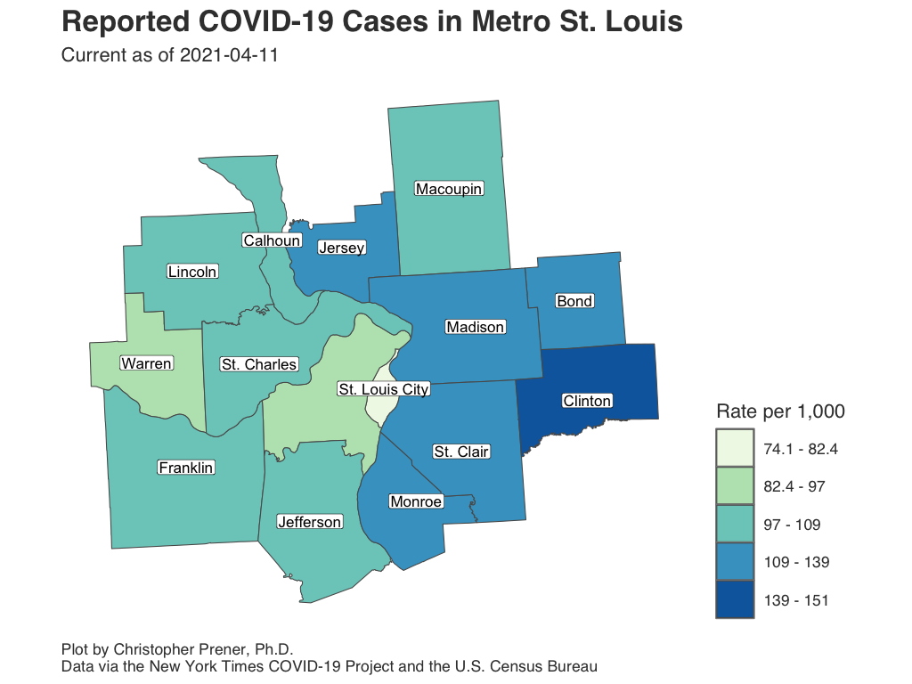
```

Download: [<a href="https://raw.githubusercontent.com/slu-openGIS/covid_daily_viz/master/results/high_res/stl_metro/a_case_map.png" target="_blank">High-res</a>] [<a href="https://raw.githubusercontent.com/slu-openGIS/covid_daily_viz/master/results/low_res/stl_metro/a_case_map.png" target="_blank">Low-res</a>]

### Infection Rates

```{r metro-infection-rate, echo=FALSE, out.width = '100%'}
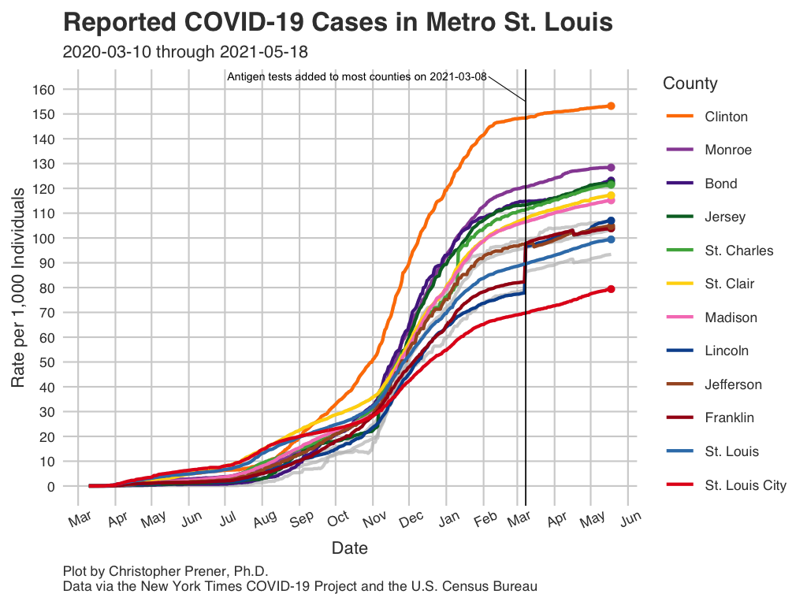
```

Download: [<a href="https://raw.githubusercontent.com/slu-openGIS/covid_daily_viz/master/results/high_res/stl_metro/b_case_rate.png" target="_blank">High-res</a>] [<a href="https://raw.githubusercontent.com/slu-openGIS/covid_daily_viz/master/results/low_res/stl_metro/b_case_rate.png" target="_blank">Low-res</a>]

### New Infections

```{r metro-infection-avg, echo=FALSE, out.width = '100%'}
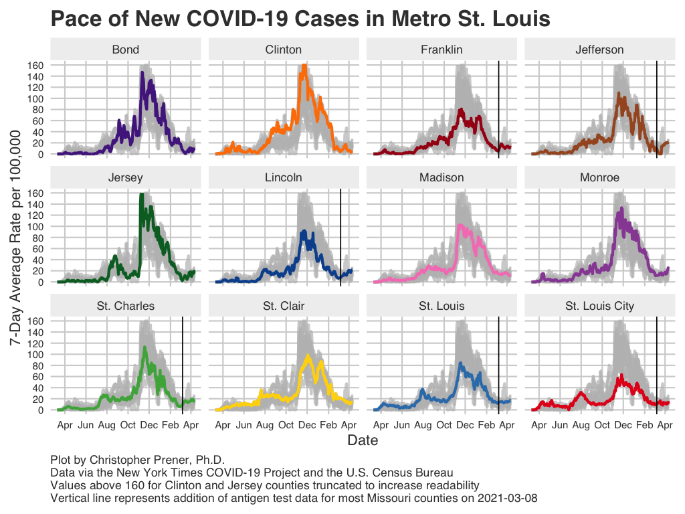
```

Download: [<a href="https://raw.githubusercontent.com/slu-openGIS/covid_daily_viz/master/results/high_res/stl_metro/e_new_case.png" target="_blank">High-res</a>] [<a href="https://raw.githubusercontent.com/slu-openGIS/covid_daily_viz/master/results/low_res/stl_metro/e_new_case.png" target="_blank">Low-res</a>]

### Data Table

```{r metro-infection-table, echo=FALSE, out.width = '100%'}
county_data %>%
  select(report_date, county, state, cases, new_cases, case_avg, case_rate) %>%
  mutate(
    case_avg = round(case_avg, digits = 2),
    case_rate = round(case_rate, digits = 2),
    state = case_when(
      state == "Illinois" ~ "IL",
      state == "Missouri" ~ "MO"
    )
  ) %>%
  rename(
    `Report Date` = report_date,
    County = county,
    State = state,
    `Cumulative Cases` = cases,
    `New Cases` = new_cases,
    `Average New Cases` = case_avg,
    `Per Capita Rate` = case_rate
  ) -> data_table

DT::datatable(data_table, rownames= FALSE)
```

### Notes

  * The underlying data for these plots are available from [GitHub](faq.html#How_Do_I_Download_Your_Data) in the `county_full.csv` table, which is assembled from data provided by the [New York Times](faq.html#Where_Do_These_Data_Come_From).
  * The FAQ contains short explanations of [per-capita rates](faq.html#What_are_Per_Capita_Rates) and [log plots](faq.html#What_are_Log_Plots).
  * All averages presented are 7-day [rolling averages](faq.html#What_are_Rolling_Averages).

## Mortality {.tabset .tabset-fade .tabset-pills .padtop}
These plots show patterns in deaths for counties within the St. Louis <a href="faq.html#What_is_a_Metropolitan_Statistical_Area">metro area</a>.

### Static Map

```{r metro-death-map, echo=FALSE, out.width = '100%'}
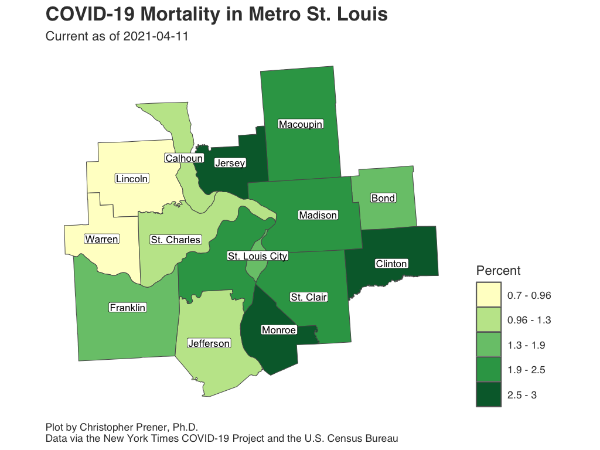
```

Download: [<a href="https://raw.githubusercontent.com/slu-openGIS/covid_daily_viz/master/results/high_res/stl_metro/g_mortality_map.png" target="_blank">High-res</a>] [<a href="https://raw.githubusercontent.com/slu-openGIS/covid_daily_viz/master/results/low_res/stl_metro/g_mortality_map.png" target="_blank">Low-res</a>]

### Mortality Rates

```{r metro-death-rate, echo=FALSE, out.width = '100%'}
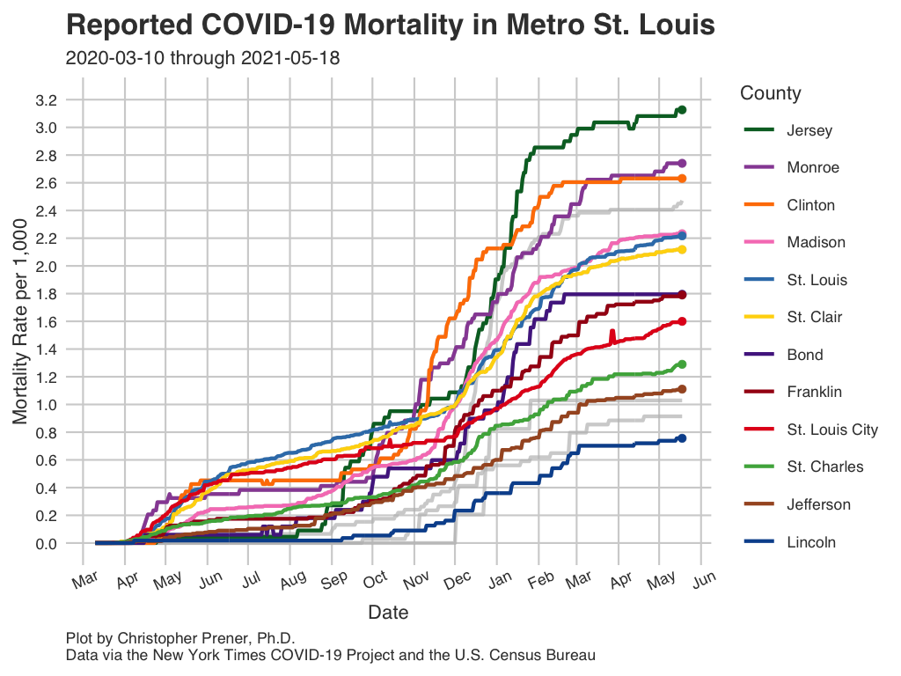
```

Download: [<a href="https://raw.githubusercontent.com/slu-openGIS/covid_daily_viz/master/results/high_res/stl_metro/h_mortality_rate.png" target="_blank">High-res</a>] [<a href="https://raw.githubusercontent.com/slu-openGIS/covid_daily_viz/master/results/low_res/stl_metro/h_mortality_rate.png" target="_blank">Low-res</a>]

### Case Fatality Rate

```{r metro-cfr, echo=FALSE, out.width = '100%'}
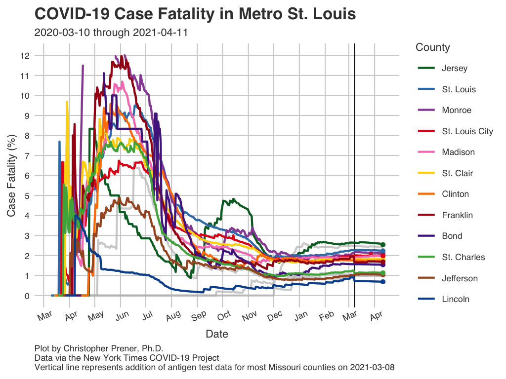
```

Download: [<a href="https://raw.githubusercontent.com/slu-openGIS/covid_daily_viz/master/results/high_res/stl_metro/m_case_fatality_rate.png" target="_blank">High-res</a>] [<a href="https://raw.githubusercontent.com/slu-openGIS/covid_daily_viz/master/results/low_res/stl_metro/m_case_fatality_rate.png" target="_blank">Low-res</a>]

### Data Table

```{r metro-death-table, echo=FALSE, out.width = '100%'}
county_data %>%
  select(report_date, county, state, deaths, new_deaths, deaths_avg, mortality_rate, case_fatality_rate) %>%
  mutate(
    deaths_avg = round(deaths_avg, digits = 2),
    mortality_rate = round(mortality_rate, digits = 2),
    case_fatality_rate = round(case_fatality_rate, digits = 2),
    state = case_when(
      state == "Illinois" ~ "IL",
      state == "Missouri" ~ "MO"
    )
  ) %>%
  rename(
    `Report Date` = report_date,
    County = county,
    State = state,
    `Cumulative Deaths` = deaths,
    `New Deaths` = new_deaths,
    `Average New Deaths` = deaths_avg,
    `Per Capita Rate` = mortality_rate,
    CFR = case_fatality_rate
  ) -> data_table

DT::datatable(data_table, rownames= FALSE)
```

### Notes

  * The underlying data for these plots are available from [GitHub](faq.html#How_Do_I_Download_Your_Data) in the `county_full.csv` table, which is assembled from data provided by the [New York Times](faq.html#Where_Do_These_Data_Come_From).
  * The FAQ contains short explanations of [per-capita rates](faq.html#What_are_Per_Capita_Rates) and [log plots](faq.html#What_are_Log_Plots).
  * All averages presented are 7-day [rolling averages](faq.html#What_are_Rolling_Averages).
  * The abbreviation "CFR" states for case fatality rate (the number of deaths divided by the number of known cases, expressed as a percentage).

## Infection Rates by ZCTA (Zip Code) {.tabset .tabset-fade .tabset-pills .padtop}
This map shows infections as a rate per 1,000 residents for all ZCTAs with five or more patients. It is important not to map the raw counts themselves, but if you want to see those data, click on a ZCTA or the data table.

### Interactive Map

```{r map-infections-zip, echo = FALSE, out.width = '100%', out.height='600px', warning=FALSE}
# calculate breaks
bins <- map_bins(zip_snapshot, var = "case_rate", style = "quantile", classes = 5, dig_lab = 3,
                 round = 2)
bins[1] <- round_any(x = min(zip_snapshot$case_rate, na.rm = TRUE), accuracy = .01, f = floor)
bins[length(bins)] <- round_any(x = max(zip_snapshot$case_rate, na.rm = TRUE), accuracy = .01, f = ceiling)

# create color palette
pal <- colorBin("BuGn", domain = zip_snapshot$case_rate, bins = bins)

# map
leaflet() %>%
  addProviderTiles(providers$CartoDB.Positron) %>%
  addPolygons(
    data = zip_snapshot,
    color = "#444444", 
    weight = 1, 
    opacity = 1.0, 
    smoothFactor = 0.5,
    fillOpacity = 0.75,
    fillColor = ~pal(case_rate),
    highlightOptions = highlightOptions(color = "white", weight = 2, bringToFront = TRUE),
    popup = paste0("<b>Zip:</b> ", zip_snapshot$GEOID_ZCTA, " <br> ",
                 "<b>Current Cumulative Count:</b> ", zip_snapshot$cases, "<br>",
                 "<b>Current Cumulative Rate per 1,000:</b> ", round(zip_snapshot$case_rate, digits = 2))) %>%
  addPolylines(
    data = regional_counties,
    color = "#000000",
    weight = 3
  ) %>%
  addLegend(pal = pal, values = zip_snapshot$case_rate, opacity = .75, title = "Rate")
  
#  , " <br> ",
#                 "<b>Population Below Poverty Line:</b> ", round(zip_snapshot$pvty_pct, digits = 2), "% <br> ",
#                 "<b>African American Population:</b> ", round(zip_snapshot$blk_pct, digits = 2), "% ")
  
```

### Static Map

```{r confirmed-static, echo=FALSE, out.width = '100%'}
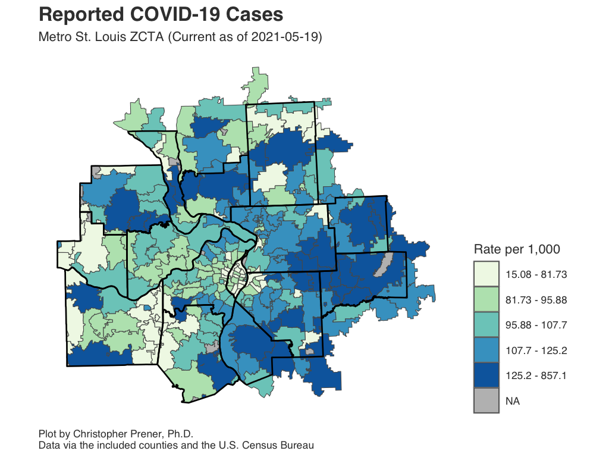
```

Download: [<a href="https://raw.githubusercontent.com/slu-openGIS/covid_daily_viz/master/results/high_res/stl_zip/a_case_map_metro.png" target="_blank">High-res</a>] [<a href="https://raw.githubusercontent.com/slu-openGIS/covid_daily_viz/master/results/low_res/stl_zip/a_case_map_metro.png" target="_blank">Low-res</a>]

### Data Table

```{r zip-data-table, echo=FALSE, out.width = '100%'}
zip_snapshot %>%
  select(GEOID_ZCTA, cases, case_rate) %>% # , pvty_pct, blk_pct
  mutate(
    case_rate = round(case_rate, digits = 2) #,
    # pvty_pct = round(pvty_pct, digits = 2),
    # blk_pct = round(blk_pct, digits = 2)
  ) %>%
  rename(
    `Zip Code` = GEOID_ZCTA,
    `Cumulative Cases` = cases,
    `Rate per 1,000 Residents` = case_rate #,
    # `Poverty Rate (%)` = pvty_pct,
    # `% African American` = blk_pct
  ) -> data_table
st_geometry(data_table) <- NULL
DT::datatable(data_table)
```

### Notes

  * If a ZCTA straddles two counties, and only has reported infection numbers in one entity, its estimated partial population will be displayed. Similarly, estimated partial populations for zip codes that straddle outlying counties are used.
  * ZCTA stands for "<a href="https://www.census.gov/programs-surveys/geography/guidance/geo-areas/zctas.html" target="_blank">ZIP Code Tabulation Area</a>. These are not identical to zip codes, but they are essential for mapping zip codes as regions on a map.
  * The underlying data for these plots are available from [GitHub](faq.html#How_Do_I_Download_Your_Data) in the following tables: 
      * Franklin County - `zip_franklin_county.csv`
      * Jefferson County - `zip_jefferson_county.csv`
      * Lincoln County - `zip_lincoln_county.csv`
      * Metro East - `zip_metro_east.csv`
      * St. Charles County - `zip_st_charles_county.csv`
      * St. Louis City - `zip_stl_city.csv`
      * St. Louis County - `zip_stl_county.csv`
      * Warren County - `zip_warren_county.csv`
  * These data are also available as `.geojson` files for mapping.
  * These tables are assembled from data provided by [local health departments in Missouri and the Illinois Department of Public Health](faq.html#Where_Do_These_Data_Come_From).
  * The FAQ contains a short explanation of [per-capita rates](faq.html#What_are_Per_Capita_Rates).

## Average New Infections by ZCTA (Zip Code) {.tabset .tabset-fade .tabset-pills .padtop}
This map shows the 14-day average of new infections as a rate per 10,000 residents for all ZCTAs with five or more patients. It is important not to map the raw counts themselves, but if you want to see those data, click on a ZCTA or the data table.

### Interactive Map

```{r map-avg-infections-zip, echo = FALSE, out.width = '100%', out.height='600px', warning=FALSE}
# calculate breaks
bins <- map_bins(zip_snapshot, var = "case_avg_rate", style = "fisher", classes = 5, dig_lab = 2,
                 round = 2)
bins[1] <- round_any(x = min(zip_snapshot$case_avg_rate, na.rm = TRUE), accuracy = .01, f = floor)
bins[length(bins)] <- round_any(x = max(zip_snapshot$case_avg_rate, na.rm = TRUE), accuracy = .01, f = ceiling)

# create color palette
pal <- colorBin("RdPu", domain = zip_snapshot$case_avg_rate, bins = bins)

# map
leaflet() %>%
  addProviderTiles(providers$CartoDB.Positron) %>%
  addPolygons(
    data = zip_snapshot,
    color = "#444444", 
    weight = 1, 
    opacity = 1.0, 
    smoothFactor = 0.5,
    fillOpacity = 0.75,
    fillColor = ~pal(case_avg_rate),
    highlightOptions = highlightOptions(color = "white", weight = 2, bringToFront = TRUE),
    popup = paste0("<b>Zip:</b> ", zip_snapshot$GEOID_ZCTA, " <br> ",
                 "<b>Current Cumulative Count:</b> ", zip_snapshot$cases, "<br>",
                 "<b>Current 14-day Average Rate per 10,000:</b> ", round(zip_snapshot$case_avg_rate, digits = 2))
  )  %>%
  addPolylines(
    data = regional_counties,
    color = "#000000",
    weight = 3
  ) %>%
  addLegend(pal = pal, values = zip_snapshot$case_avg_rate, opacity = .75, title = "Rate")

# , " <br> ",
#                 "<b>Population Below Poverty Line:</b> ", round(zip_snapshot$pvty_pct, digits = 2), "% <br> ",
#                 "<b>African American Population:</b> ", round(zip_snapshot$blk_pct, digits = 2), "% "
```

### Static Map

```{r avg-confirmed-static, echo=FALSE, out.width = '100%'}
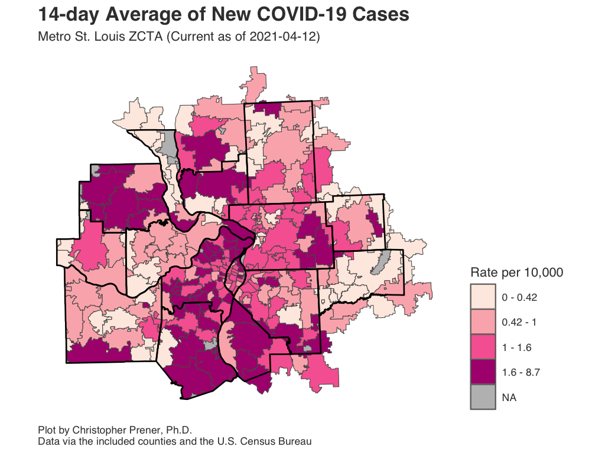
```

Download: [<a href="https://raw.githubusercontent.com/slu-openGIS/covid_daily_viz/master/results/high_res/stl_zip/d_avg_map_metro.png" target="_blank">High-res</a>] [<a href="https://raw.githubusercontent.com/slu-openGIS/covid_daily_viz/master/results/low_res/stl_zip/d_avg_map_metro.png" target="_blank">Low-res</a>]

### Data Table

```{r zip-avg-data-table, echo=FALSE, out.width = '100%'}
zip_snapshot %>%
  select(GEOID_ZCTA, cases, case_avg_rate) %>% # , pvty_pct, blk_pct
  mutate(
    case_avg_rate = round(case_avg_rate, digits = 2) #,
    # pvty_pct = round(pvty_pct, digits = 2),
    # blk_pct = round(blk_pct, digits = 2)
  ) %>%
  rename(
    `Zip Code` = GEOID_ZCTA,
    `Cumulative Cases` = cases,
    `14-day Average Rate per 10,000` = case_avg_rate #,
    # `Poverty Rate (%)` = pvty_pct,
    # `% African American` = blk_pct
  ) -> data_table
st_geometry(data_table) <- NULL
DT::datatable(data_table)
```

### Notes

  * If a ZCTA straddles two counties, and only has reported infection numbers in one entity, its estimated partial population will be displayed. Similarly, estimated partial populations for zip codes that straddle outlying counties are used.
  * ZCTA stands for "<a href="https://www.census.gov/programs-surveys/geography/guidance/geo-areas/zctas.html" target="_blank">ZIP Code Tabulation Area</a>. These are not identical to zip codes, but they are essential for mapping zip codes as regions on a map.
  * The underlying data for these plots are available from [GitHub](faq.html#How_Do_I_Download_Your_Data) in the `zip_stl_city.csv` and `zip_stl_county.csv` tables, which are assembled from data provided by [St. Louis City and County](faq.html#Where_Do_These_Data_Come_From). These data are also available as `.geojson` files for mapping.
  * The FAQ contains a short explanation of [per-capita rates](faq.html#What_are_Per_Capita_Rates).

## Hospitalizations {.padtop}
St. Louis has had a regional pandemic task force that covers four major health care systems: SSM (SLU), BJC Healthcare, Mercy, and St. Luke's Hospital. The task force has been providing daily media briefings since April 5th. Their data covers the largest hospital systems in the region, so while it does not include every possible hospital, it does include a large share of COVID-19 patients. All averages presented are 7-day rolling averages.

### In-Patient Metrics {.tabset .tabset-fade .tabset-pills .padtop}

#### New Patients 

```{r new-in-pt, echo=FALSE, out.width = '100%'}
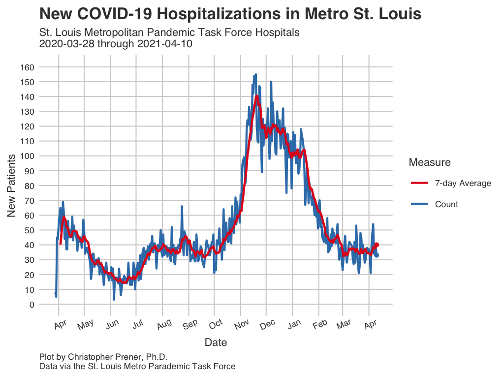
```

Download: [<a href="https://raw.githubusercontent.com/slu-openGIS/covid_daily_viz/master/results/high_res/stl_metro/n_new_in_pt.png" target="_blank">High-res</a>] [<a href="https://raw.githubusercontent.com/slu-openGIS/covid_daily_viz/master/results/low_res/stl_metro/n_new_in_pt.png" target="_blank">Low-res</a>]

#### Total Patients 

```{r total-in-pt, echo=FALSE, out.width = '100%'}
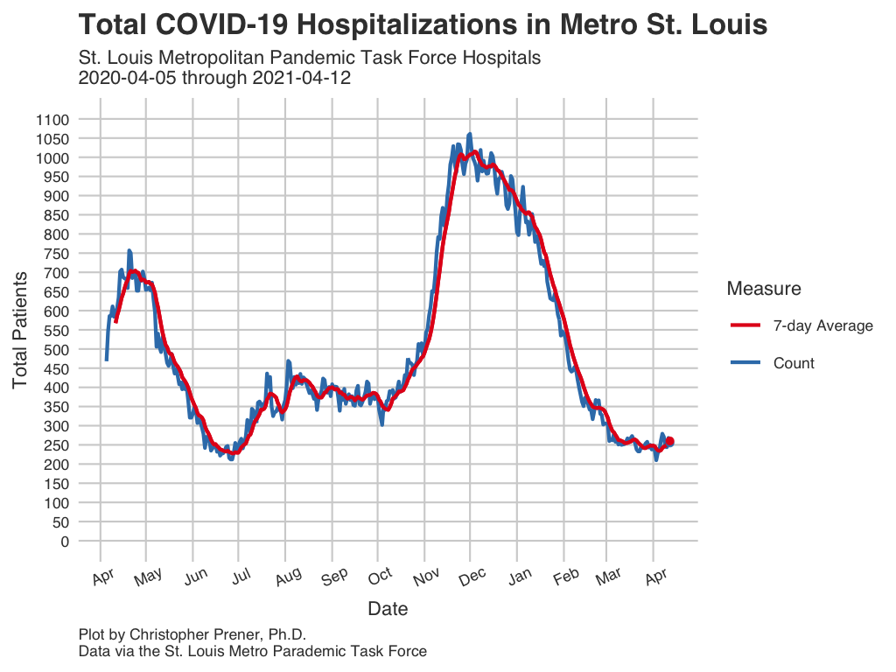
```

Download: [<a href="https://raw.githubusercontent.com/slu-openGIS/covid_daily_viz/master/results/high_res/stl_metro/o_in_pt.png" target="_blank">High-res</a>] [<a href="https://raw.githubusercontent.com/slu-openGIS/covid_daily_viz/master/results/low_res/stl_metro/o_in_pt.png" target="_blank">Low-res</a>]

#### Data Table

```{r in-patient-data, echo=FALSE, out.width = '100%'}
stl_hosp %>%
  arrange(desc(report_date)) %>%
  select(report_date, new_in_pt, new_in_pt_avg, in_pt, in_pt_avg) %>%
  mutate(
    new_in_pt_avg = round(new_in_pt_avg, digits = 2),
    in_pt_avg = round(in_pt_avg, digits = 2)
  ) %>%
  rename(
    `Report Date` = report_date,
    `New Patients` = new_in_pt,
    `New Patients Average` = new_in_pt_avg,
    `Total Patients` = in_pt,
    `Total Patients Average` = in_pt_avg
  ) -> data_table

DT::datatable(data_table)
```

#### Notes

  * The underlying data for these plots are available from [GitHub](faq.html#How_Do_I_Download_Your_Data) in the `stl_hospital.csv` table, which is assembled from data provided by the [St. Louis Pandemic Task Force](faq.html#Where_Do_These_Data_Come_From).
  * All averages presented are 7-day [rolling averages](faq.html#What_are_Rolling_Averages).
  * The new in-patient measure is lagged two days behind its report day.

### ICU Metrics {.tabset .tabset-fade .tabset-pills .padtop}

#### ICU Patients

```{r total-icu, echo=FALSE, out.width = '100%'}
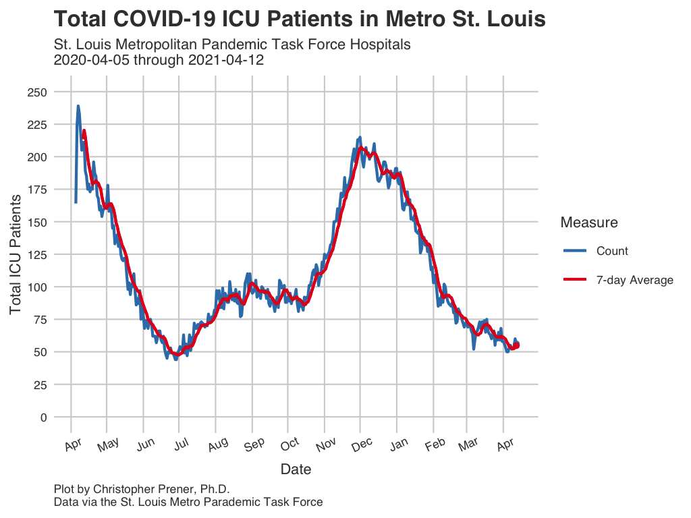
```

Download: [<a href="https://raw.githubusercontent.com/slu-openGIS/covid_daily_viz/master/results/high_res/stl_metro/p_icu.png" target="_blank">High-res</a>] [<a href="https://raw.githubusercontent.com/slu-openGIS/covid_daily_viz/master/results/low_res/stl_metro/p_icu.png" target="_blank">Low-res</a>]

#### Ventilated Patients 

```{r total-vent, echo=FALSE, out.width = '100%'}
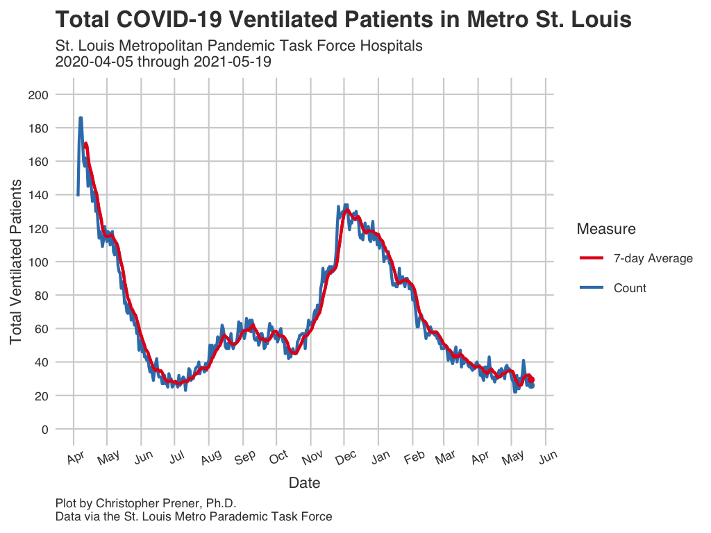
```

Download: [<a href="https://raw.githubusercontent.com/slu-openGIS/covid_daily_viz/master/results/high_res/stl_metro/q_vent.png" target="_blank">High-res</a>] [<a href="https://raw.githubusercontent.com/slu-openGIS/covid_daily_viz/master/results/low_res/stl_metro/q_vent.png" target="_blank">Low-res</a>]

#### Data Table

```{r icu-data, echo=FALSE}
stl_hosp %>%
  arrange(desc(report_date)) %>%
  select(report_date, icu, icu_avg, vent, vent_avg) %>%
  mutate(
    icu_avg = round(icu_avg, digits = 2),
    vent_avg = round(vent_avg, digits = 2)
  ) %>%
  rename(
    `Report Date` = report_date,
    `ICU Patients` = icu,
    `ICU Patients Average` = icu_avg,
    `Ventilated Patients` = vent,
    `Ventiled Patients Average` = vent_avg
  ) -> data_table

DT::datatable(data_table)
```

#### Notes

  * The underlying data for these plots are available from [GitHub](faq.html#How_Do_I_Download_Your_Data) in the `stl_hospital.csv` table, which is assembled from data provided by the [St. Louis Pandemic Task Force](faq.html#Where_Do_These_Data_Come_From).
  * All averages presented are 7-day [rolling averages](faq.html#What_are_Rolling_Averages).
