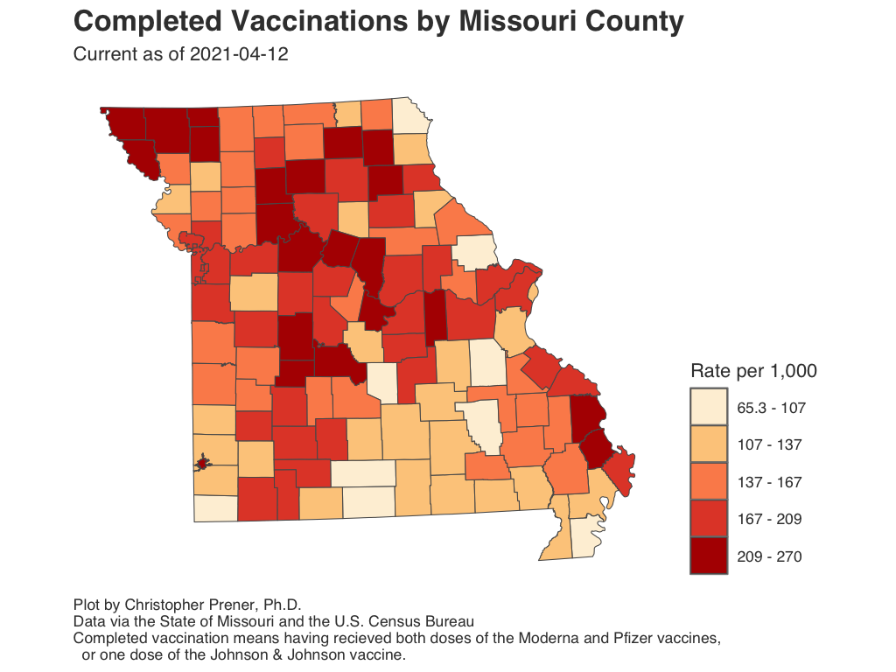
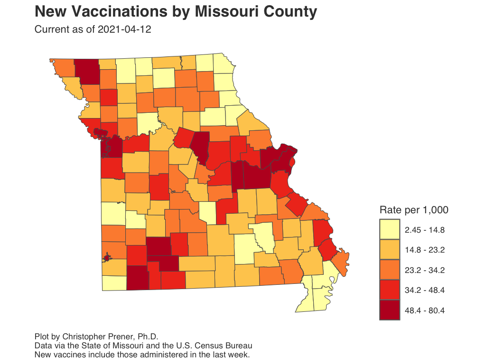
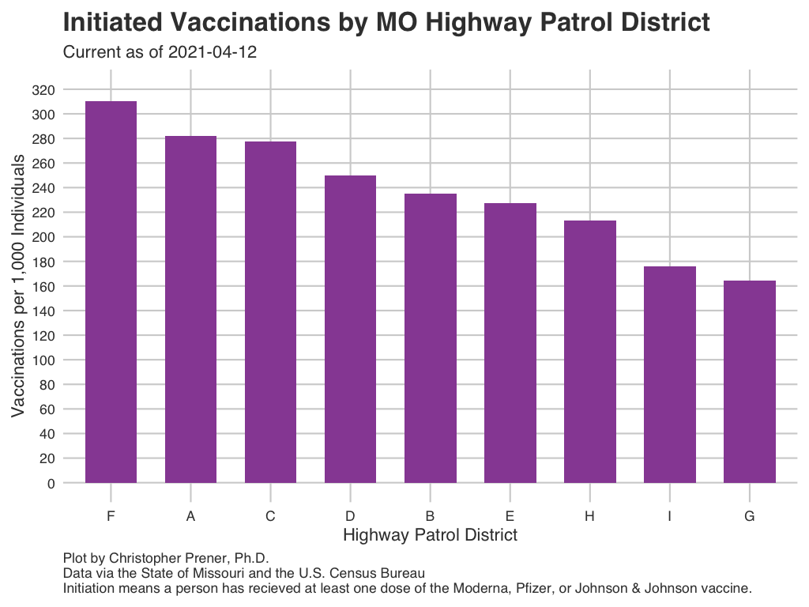
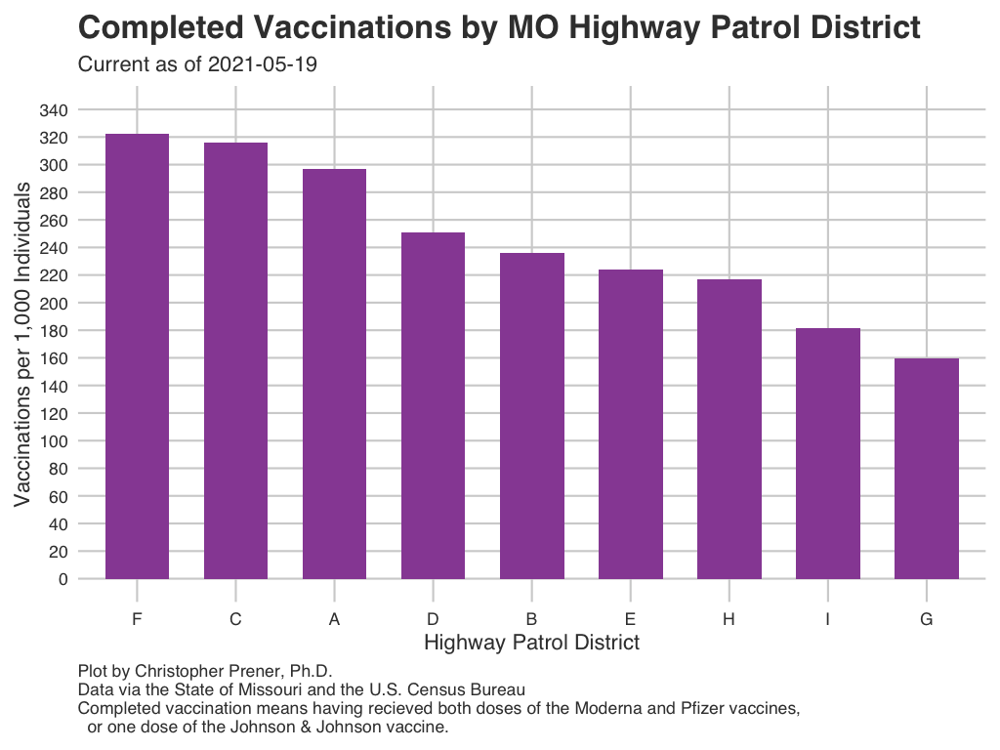
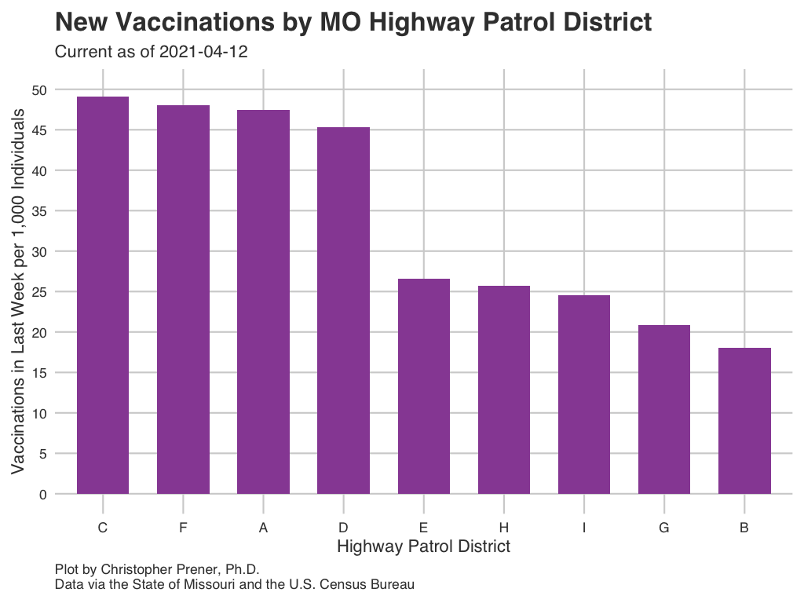

```{r setup, include=FALSE}
knitr::opts_chunk$set(echo = TRUE)

# dependencies
library(dplyr)
library(leaflet)
library(readr)
library(sf)
library(RColorBrewer)

# functions
source(here::here("source", "functions", "map_breaks.R"))
source(here::here("source", "functions", "round_any.R"))

# load data
county_vax <- st_read(here::here("data", "MO_HEALTH_Covid_Tracking", "data",
                                 "county", "daily_snapshot_mo_vaccines.geojson"),
                      quiet = TRUE)
dist_vax <- read_csv(here::here("data", "MO_HEALTH_Covid_Tracking", "data",
                                 "district", "daily_snapshot_mo_vaccines.csv"),
                     col_types = cols(report_date = col_date(format = "")))
mshp <- st_read(here::here("data", "MO_HEALTH_Covid_Tracking", "data",
                           "source", "mo_highway_districts.geojson")) %>%
  st_transform(crs = 4326)
```

This page contains vaccination data for Missouri, which are being reported by [the State on their dashboard](https://covidvaccine.mo.gov/data/).

## Initiated Vaccinations by County {.tabset .tabset-fade .tabset-pills .padtop}
This map shows the per capita rate of people who have initiated vaccination. This means they received an initial dose of the Moderna or Pfizer vaccines, or the single dose of the Johnson & Johnson vaccine. It is important not to map the raw counts themselves, but if you want to see those data, click on a county or select the data table tab.

### Interactive Map

```{r map-vax-initiate, echo = FALSE, out.width = '100%', out.height='600px', warning=FALSE}
# calculate breaks
bins <- map_bins(county_vax, var = "initiated_rate", style = "fisher", classes = 5, dig_lab = 2,
                 round = 2)
bins[1] <- round_any(x = min(county_vax$initiated_rate, na.rm = TRUE), accuracy = .01, f = floor)
bins[length(bins)] <- round_any(x = max(county_vax$initiated_rate), accuracy = .01, f = ceiling)

# create color palette
pal <- colorBin("Oranges", domain = county_vax$initiated_rate, bins = bins)

# map
leaflet() %>%
  addProviderTiles(providers$CartoDB.Positron) %>%
  addPolygons(
    data = county_vax,
    color = "#444444", 
    weight = 1, 
    opacity = 1.0, 
    smoothFactor = 0.5,
    fillOpacity = 0.75,
    fillColor = ~pal(initiated_rate),
    highlightOptions = highlightOptions(color = "white", weight = 2, bringToFront = TRUE),
    popup = paste0("<b>County:</b> ", county_vax$county, " <br> ",
                 "<b>Current Cumulative Count:</b> ", county_vax$initiated, "<br>",
                 "<b>Current Rate per 1,000:</b> ", round(county_vax$initiated_rate, digits = 2))
  )  %>%
  addLegend(pal = pal, values = county_vax$initiated_rate, opacity = .75, title = "Rate")
```

### Static Map

```{r static-vax-initiate, echo=FALSE, out.width = '100%'}
knitr::include_graphics("img/county/r_vaccine_initial.png")
```

Download: [<a href="https://raw.githubusercontent.com/slu-openGIS/covid_daily_viz/master/results/high_res/county/r_vaccine_initial.png" target="_blank">High-res</a>] [<a href="https://raw.githubusercontent.com/slu-openGIS/covid_daily_viz/master/results/low_res/county/r_vaccine_initial.png" target="_blank">Low-res</a>]

### Data Table

```{r data-table-vax-initiate, echo=FALSE, out.width = '100%'}
county_vax %>%
  select(county, initiated, initiated_rate) %>%
  mutate(
    initiated_rate = round(initiated_rate, digits = 2) 
  ) %>%
  rename(
    County = county,
    `Cumulative Initiated Vaccinations` = initiated,
    `Rate per 1,000 Residents` = initiated_rate
  ) -> data_table
st_geometry(data_table) <- NULL
DT::datatable(data_table)
```

## Completed Vaccinations by County {.tabset .tabset-fade .tabset-pills .padtop}
This map shows the per capita rate of people who have completed vaccination. This means they received *both* doses of the Moderna or Pfizer vaccines, or the single dose of the Johnson & Johnson vaccine. It is important not to map the raw counts themselves, but if you want to see those data, click on a county or select the data table tab.

### Interactive Map

```{r map-vax-complete, echo = FALSE, out.width = '100%', out.height='600px', warning=FALSE}
# calculate breaks
bins <- map_bins(county_vax, var = "complete_rate", style = "fisher", classes = 5, dig_lab = 2,
                 round = 2)
bins[1] <- round_any(x = min(county_vax$complete_rate, na.rm = TRUE), accuracy = .01, f = floor)
bins[length(bins)] <- round_any(x = max(county_vax$complete_rate), accuracy = .01, f = ceiling)


# create color palette
pal <- colorBin("OrRd", domain = county_vax$complete_rate, bins = bins)

# map
leaflet() %>%
  addProviderTiles(providers$CartoDB.Positron) %>%
  addPolygons(
    data = county_vax,
    color = "#444444", 
    weight = 1, 
    opacity = 1.0, 
    smoothFactor = 0.5,
    fillOpacity = 0.75,
    fillColor = ~pal(complete_rate),
    highlightOptions = highlightOptions(color = "white", weight = 2, bringToFront = TRUE),
    popup = paste0("<b>County:</b> ", county_vax$county, " <br> ",
                 "<b>Current Cumulative Count:</b> ", county_vax$complete, "<br>",
                 "<b>Current Rate per 1,000:</b> ", round(county_vax$complete_rate, digits = 2))
  )  %>%
  addLegend(pal = pal, values = county_vax$complete_rate, opacity = .75, title = "Rate")
```

### Static Map

```{r static-vax-complete, echo=FALSE, out.width = '100%'}

```

Download: [<a href="https://raw.githubusercontent.com/slu-openGIS/covid_daily_viz/master/results/high_res/county/t_vaccine_complete.png" target="_blank">High-res</a>] [<a href="https://raw.githubusercontent.com/slu-openGIS/covid_daily_viz/master/results/low_res/county/t_vaccine_complete.png" target="_blank">Low-res</a>]

### Data Table

```{r data-table-vax-complete, echo=FALSE, out.width = '100%'}
county_vax %>%
  select(county, complete, complete_rate) %>%
  mutate(
    complete_rate = round(complete_rate, digits = 2) 
  ) %>%
  rename(
    County = county,
    `Cumulative Completed Vaccinations` = complete,
    `Rate per 1,000 Residents` = complete_rate
  ) -> data_table
st_geometry(data_table) <- NULL
DT::datatable(data_table)
```

## Completed Vaccinations by County {.tabset .tabset-fade .tabset-pills .padtop}
This map shows the per capita rate of people who have received a vaccination in the last seven days. It is important not to map the raw counts themselves, but if you want to see those data, click on a county or select the data table tab.

### Interactive Map

```{r map-vax-last7, echo = FALSE, out.width = '100%', out.height='600px', warning=FALSE}
# calculate breaks
bins <- map_bins(county_vax, var = "last7_rate", style = "fisher", classes = 5, dig_lab = 2,
                 round = 2)
bins[1] <- round_any(x = min(county_vax$last7_rate, na.rm = TRUE), accuracy = .01, f = floor)

# create color palette
pal <- colorBin("YlOrRd", domain = county_vax$last7_rate, bins = bins)

# map
leaflet() %>%
  addProviderTiles(providers$CartoDB.Positron) %>%
  addPolygons(
    data = county_vax,
    color = "#444444", 
    weight = 1, 
    opacity = 1.0, 
    smoothFactor = 0.5,
    fillOpacity = 0.75,
    fillColor = ~pal(last7_rate),
    highlightOptions = highlightOptions(color = "white", weight = 2, bringToFront = TRUE),
    popup = paste0("<b>County:</b> ", county_vax$county, " <br> ",
                 "<b>Count in Last 7 Days:</b> ", county_vax$last7, "<br>",
                 "<b>Rate per 1,000:</b> ", round(county_vax$last7_rate, digits = 2))
  )  %>%
  addLegend(pal = pal, values = county_vax$last7_rate, opacity = .75, title = "Rate")
```

### Static Map

```{r static-vax-last7, echo=FALSE, out.width = '100%'}

```

Download: [<a href="https://raw.githubusercontent.com/slu-openGIS/covid_daily_viz/master/results/high_res/county/v_vaccine_last7.png" target="_blank">High-res</a>] [<a href="https://raw.githubusercontent.com/slu-openGIS/covid_daily_viz/master/results/low_res/county/v_vaccine_last7.png" target="_blank">Low-res</a>]

### Data Table

```{r data-table-vax-last7, echo=FALSE, out.width = '100%'}
county_vax %>%
  select(county, last7, last7_rate) %>%
  mutate(
    last7_rate = round(last7_rate, digits = 2) 
  ) %>%
  rename(
    County = county,
    `Vaccinations in Last 7 Days` = last7,
    `Rate per 1,000 Residents` = last7_rate
  ) -> data_table
st_geometry(data_table) <- NULL
DT::datatable(data_table)
```

## Vaccinations by District {.tabset .tabset-fade .tabset-pills .padtop}
Missouri has been using State Highway Patrol Districts to distribute vaccinations, but does not report vaccination progress by these same units. The following series of plots illustrate per capita vaccination rates for each Patrol District in St. Louis.

Initiated means individuals have received an initial dose of the Moderna or Pfizer vaccines, or the single dose of the Johnson & Johnson vaccine. Completed means individuals have received *both* doses of the Moderna or Pfizer vaccines, or the single dose of the Johnson & Johnson vaccine.

### Initiated Vaccinations

```{r static-dist-initial, echo=FALSE, out.width = '100%'}

```

Download: [<a href="https://raw.githubusercontent.com/slu-openGIS/covid_daily_viz/master/results/high_res/district/a_vaccine_initial.png" target="_blank">High-res</a>] [<a href="https://raw.githubusercontent.com/slu-openGIS/covid_daily_viz/master/results/low_res/district/a_vaccine_initial.png" target="_blank">Low-res</a>]

### Completed Vaccinations

```{r static-dist-complete, echo=FALSE, out.width = '100%'}

```

Download: [<a href="https://raw.githubusercontent.com/slu-openGIS/covid_daily_viz/master/results/high_res/district/b_vaccine_complete.png" target="_blank">High-res</a>] [<a href="https://raw.githubusercontent.com/slu-openGIS/covid_daily_viz/master/results/low_res/district/b_vaccine_complete.png" target="_blank">Low-res</a>]

### Recent Vaccinations

```{r static-dist-last7, echo=FALSE, out.width = '100%'}

```

Download: [<a href="https://raw.githubusercontent.com/slu-openGIS/covid_daily_viz/master/results/high_res/district/c_vaccine_last7.png" target="_blank">High-res</a>] [<a href="https://raw.githubusercontent.com/slu-openGIS/covid_daily_viz/master/results/low_res/district/c_vaccine_last7.png" target="_blank">Low-res</a>]

### Reference Map of MSHP Districts 

```{r mshp-map, echo=FALSE, out.width = '100%'}
# define colors
pal <- brewer.pal(n = 8, name = "Set1")
pal[6] <- "#FFD60C"
pal <- c(pal[6], pal[3], pal[4], pal[7], pal[2], pal[5], pal[8], pal[1],
         brewer.pal(n = 6, name = "Reds")[c(6)])
factpal <- colorFactor(pal, as.factor(mshp$distrct))

# create map
mshp %>%
  leaflet() %>%
  setView(lat = 38.497191, lng = -92.631555, zoom = 6) %>%
  addProviderTiles(providers$Esri.WorldStreetMap) %>%
  addPolygons(
    weight = 1, 
    opacity = 1.0, 
    smoothFactor = 0.5,
    fillOpacity = 0.5,
    color = ~factpal(distrct),
    highlightOptions = highlightOptions(color = "white", weight = 2, bringToFront = TRUE),
    popup = paste("<b>District:</b> ", mshp$distrct)
  ) %>%
  addLegend(pal = factpal, values = mshp$distrct, opacity = .75, title = "MSHP District")
```


### Data Table

```{r data-table-district, echo=FALSE, out.width = '100%'}
dist_vax %>%
  select(district, initiated, initiated_rate, complete, complete_rate, last7, last7_rate) %>%
  mutate(
    initiated_rate = round(initiated_rate, digits = 2),
    complete_rate = round(complete_rate, digits = 2),
    last7_rate = round(last7_rate, digits = 2) 
  ) %>%
  rename(
    `MSHP District` = district,
    `Initiated Count` = initiated,
    `Initiated Per Capita Rate` = initiated_rate,
    `Completed Count` = complete,
    `Completed Per Capita Rate` = complete_rate,
    `Last 7 Days` = last7,
    `Last 7 Days Per Capita Rate` = last7_rate
  ) -> data_table

DT::datatable(data_table)
```

## Disparities in Vaccinations {.padtop}
The [disparities page](disparities.html#Statewide_Vaccinations) on this website contains data on disparities in vaccinations by race and ethnicity.
